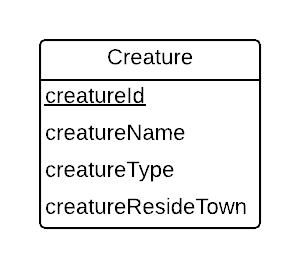

One-entity shapes: begin to consider 'how'
------------------------------------------

We use conceptual models when designing databases so that we can abstract away details of implementation and concentrate on what data we need to represent.

As a modeling and database implementation professional, after beginning your study of conceptual data modeling, it can be helpful to begin considering some of the implementation details.

* One reason for this is so that you can record possible data instances that match the model. **The SQL that we present here is not normally what you share with the users of the database.** The conceptual model is much more useful for them because it hides the detail we are about to reveal.

* Another reason for examining some implementation aspects of at least  relational databases is that when you are a practicing database professional, you will know both the conceptual modeling aspects of your work and the implementation details underneath a conceptual model. We reveal some implementation details as you study how to master conceptual models to help you see how useful it will be to separate what from how when you work with clients.

Let's start with a single entity shape from a conceptual model. If you have read the first chapter of Carlis-Maguire, this should be familiar, yet it is slightly different for now (can you spot the difference?).

As we want for conceptual modeling, this diagram does not tell us about types each of the attributes should be, or what data instances of creature would look like. Let's explore these details using the relational data model.

Creature Data Instances
------------------------

First, Let's look at some possible data instances for the creature entity.

==========   =============  ============  ============
creatureId   creatureName   creatureType  creatureResideTown
==========   =============  ============  ============
1            'Bannon'       'person'      'Philly'
2            'Myers'        'person'      'Anoka'
3            'Neff'         'person'      'Blue Earth'
4            'Neff'         'person'      'Bemidji'
5            'Mieska'       'person'      'Duluth'
6            'Carlis'       'person'      'Edina'
7            'Kermit'       'frog'        'Greenville'
8            'Godzilla'     'monster'     'Tokyo'
9            'Thor'         'superhero'   'Asgard'
==========   =============  ============  ============

The data whose type is text string is shown in quotes. The creatureId, however, is a number for this data.

Creature table creation
-----------------------

Here is how we can create a table to hold data like the above instances. Study the SQL code carefully.

.. activecode:: creature_create
   :language: sql

   DROP TABLE IF EXISTS creature;

   CREATE TABLE creature (
   creatureId          INTEGER      NOT NULL PRIMARY KEY,
   creatureName        VARCHAR(20),
   creatureType        VARCHAR(20),
   creatureResideTown  VARCHAR(20)
   );

Note that when you run this, nothing appears to happen, since all you are doing is making the table.

Populate Creature table with data instances
-------------------------------------------

.. activecode:: creature_populate
  :language: sql
  :include: creature_create

  INSERT INTO creature VALUES (1,'Bannon','person','Philly');
  INSERT INTO creature VALUES (2,'Myers','person','Anoka');
  INSERT INTO creature VALUES (3,'Neff','person','Blue Earth');
  INSERT INTO creature VALUES (4,'Neff','person','Bemidji');
  INSERT INTO creature VALUES (5,'Mieska','person','Duluth');
  INSERT INTO creature VALUES (6,'Carlis','person','Philly');
  INSERT INTO creature VALUES (7,'Kermit','frog','Greenville');
  INSERT INTO creature VALUES (8,'Godzilla','monster','Tokyo');
  INSERT INTO creature VALUES (9,'Thor','superhero','Asgard');

When you run the above code, you are placing data in the table that you created.

.. important:: Each row inserted into a table represents **one instance** of a particular entity that that table maps to.

Now with this next SQL code, you finally get something back (all instances, including every attribute's value):

.. activecode:: creature_query_a
  :language: sql
  :include: creature_create, creature_populate

  SELECT * FROM creature;

This data in relational databases is often referred to as a table, whose rows represent instances, and whose columns hold values of each attribute of an entity corresponding to the conceptual data model. (We will see later how some columns will be used in a different way to help us relate one entity to another).

With the following SQL code, we can choose a subset of data attributes from each instance. We will study the details and the pitfalls we can run into using this syntax later. For now, it will be best to stick to the asterisk notation and show all of the columns' data.

.. activecode:: creature_query_p1
  :language: sql
  :include: creature_create, creature_populate

  SELECT creatureId, creatureName, creatureResideTown
  FROM creature;

Try it yourself
---------------

You can try inserting different data instances and displaying the results by going back to the previous steps and adding INSERT commands.
