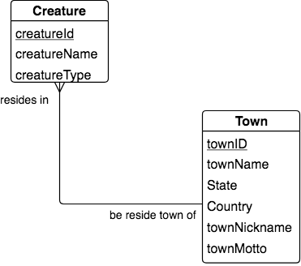

Implementing Two-entity Shapes in relational databases
------------------------------------------------------

Let's examine how the relationships shown on conceptual models can actually be implemented using relational database tables.

Suppose there was more that we wanted remember about each town besides its name. For example, the town of Bemidji, MN, USA has a nickname and motto, as seen on `its wikipedia page <https://en.wikipedia.org/wiki/Bemidji,_Minnesota>`_. This would cause us to make this evolution of our data model:

Now we would create a table in the relational database for the Town entity's instances, with columns for the extra attributes. We would also change the Creature entity so that the column that once had the town name is now replaced by the TownId column from the new Town table.

Create the new Town Table
-------------------------

.. activecode:: town_create
   :language: sql

   DROP TABLE IF EXISTS town;

   CREATE TABLE town (
   townId          VARCHAR(3)      PRIMARY KEY,
   townName        VARCHAR(20),
   State           VARCHAR(20),
   Country         VARCHAR(20),
   townNickname    VARCHAR(80),
   townMotto       VARCHAR(80)
   );

Note that when you run this, nothing appears to happen, since all you are doing is making the table.

Populate Town table with data instances
-------------------------------------------

Here are some example sample instances of town.

.. activecode:: town_populate
   :language: sql
   :include: town_create

    -- order matches table creation:
    -- id    name          state   country
    -- nickname   motto
    INSERT INTO town VALUES ('p', 'Philadelphia', 'PA', 'United States',
                             'Philly', 'Let brotherly love endure');
    INSERT INTO town VALUES ('a', 'Anoka', 'MN', 'United States',
                             'Halloween Capital of the world', NULL);
    INSERT INTO town VALUES ('be', 'Blue Earth', 'MN', 'United States',
                             'Beyond the Valley of the Jolly Green Giant',
                             'Earth so rich the city grows!');
    INSERT INTO town VALUES ('b', 'Bemidji', 'MN', 'United States',
                             'B-town', 'The first city on the Mississippi');
    INSERT INTO town VALUES ('d', 'Duluth', 'MN', 'United States',
                            'Zenith City', NULL);
    INSERT INTO town VALUES ('g', 'Greenville', 'MS', 'United States',
                             'The Heart & Soul of the Delta',
                             'The Best Food, Shopping, & Entertainment In The South');
    INSERT INTO town VALUES ('t', 'Tokyo', 'Kanto', 'Japan', NULL, NULL);
    INSERT INTO town VALUES ('as', 'Asgard', NULL, NULL,
                             'Home of Odin''s vault',
                             'Where magic and science are one in the same');

.. activecode:: town_retrieve
   :language: sql
   :include: town_create, town_populate

    -- now let's retrieve the instances
    SELECT * FROM town;

Re-create a new Creature table
-------------------------------

.. activecode:: creature_create_2
   :language: sql
   :include: town_create

   DROP TABLE IF EXISTS creature;

   CREATE TABLE creature (
   creatureId          INTEGER      PRIMARY KEY,
   creatureName        VARCHAR(20),
   creatureType        VARCHAR(20),
   townId VARCHAR(3) REFERENCES town(townId)     -- foreign key
   );

Note that when you run this, nothing appears to happen, since all you are doing is making the table.

Relating instances through data
~~~~~~~~~~~~~~~~~~~~~~~~~~~~~~~~~

Note in the above creation of the creature table we now have a column called townId, and have said that this references the townId column in the town table. Now look at the new insert commands below for instances of creature data. Notice how the creature named Bannon is declared to have townId 'p', which we know from the town data table instances indicates a town named 'Philadelphia'.

.. important:: In database terms, townId is a *foreign key* from creature into town. Notice that from the LDS data model shown above, foreign key mappings like this are made on the relationship for the **one-end opposite of the original entity called Creature**. We are adding a new column to Creature that did not appear as an attribute on the original LDS. 

Populate Creature table with data instances
-------------------------------------------

.. activecode:: creature_populate_2
   :language: sql
   :include: creature_create_2

    INSERT INTO creature VALUES (1,'Bannon','person','p');
    INSERT INTO creature VALUES (2,'Myers','person','a');
    INSERT INTO creature VALUES (3,'Neff','person','be');
    INSERT INTO creature VALUES (4,'Neff','person','b');
    INSERT INTO creature VALUES (5,'Mieska','person','d');
    INSERT INTO creature VALUES (6,'Carlis','person','p');
    INSERT INTO creature VALUES (7,'Kermit','frog','g');
    INSERT INTO creature VALUES (8,'Godzilla','monster','t');
    INSERT INTO creature VALUES (9,'Thor','superhero','as');

.. activecode:: creature_retrieve
   :language: sql
   :include: creature_create_2, creature_populate_2

    -- now let's retrieve the instances
    SELECT * FROM creature;

.. topic:: Gotcha!

    Notice that in most databases we can add a creature with a value for a townId that does not yet exist, as in the following example (an instance of town with townId 'z' has not yet been entered into the town table).

.. activecode:: creature_retrieve_2
   :language: sql
   :include: creature_create_2, creature_populate_2

   INSERT INTO creature VALUES (10,'Iron Man','superhero','z');

    -- now let's retrieve the instances
    SELECT * FROM creature;

Peek ahead: natural join
------------------------

We will explain the following query in more detail later. For now simply note that we can get creature and town data back together again. This is the whole purpose of relational databases. We should never be afraid of creating a new entity from what was once a single attribute at some point during our conceptual modeling process.

.. activecode:: creature_join_town
   :language: sql
   :include: town_create, town_populate, creature_create_2, creature_populate_2

   SELECT creatureName, townName
   FROM creature natural join town;
