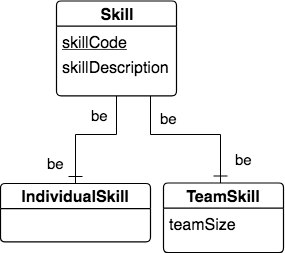

One-One to-be relationship Shape
---------------------------------

Let's take a look at a different two-entity shape: the one-to-one to-be relationship. This shape describes sets of data instances that form a categorization of one entity's instances into subgroups. Sometimes those subgroups are meant to contain separate instances, as in this example of separating skills that creatures might achieve into skills that are performed individually or with a team of creatures.

|

|

In this case, we decided to include the TeamSkill entity because there was something we wanted to remember that was particular to a team skill: the teamSize, or how many creatures are needed to perform the skill. An example instance of this is 4-person bobsledding, which of course requires 4 people.

Implementing one-to-one relationships in SQL can be done by choosing one of the links and incorporating it as a foreign key into the the table representing the opposite entity. In the above case, the bar next to TeamSkill indicates that it must be identified by the skillCode attribute of Skill. This is an indicator to us that we should include skillCode as the primary key column of the table that we would create for the TeamSkill entity. This is shown with the following SQL creation statements.

.. activecode:: skill_be_create
   :language: sql

   DROP TABLE IF EXISTS skill;

   CREATE TABLE skill (
   skillCode          VARCHAR(3)      NOT NULL PRIMARY KEY,
   skillDescription   VARCHAR(20)
   );

   Drop TABLE IF EXISTS TeamSkill;

   CREATE TABLE teamSkill (
   skillCode      VARCHAR(3)  NOT NULL PRIMARY KEY references skill (skillCode),
   teamSize       INTEGER
   );

   INSERT INTO skill VALUES ('A', 'float');
   INSERT INTO skill VALUES ('E', 'swim');
   INSERT INTO skill VALUES ('O', 'sink');
   INSERT INTO skill VALUES ('U', 'walk on water');
   INSERT INTO skill VALUES ('Z', 'gargle');
   INSERT INTO skill VALUES ('B4', '4-person bobsledding');
   INSERT INTO skill VALUES ('TR4', '400 meter track relay');
   INSERT INTO skill VALUES ('C2', '2-person canoeing');
   INSERT INTO skill VALUES ('THR', 'three-legged race');
   INSERT INTO skill VALUES ('D3', 'debate');

   INSERT INTO teamSkill VALUES ('B4', 4);
   INSERT INTO teamSkill VALUES ('TR4', 4);
   INSERT INTO teamSkill VALUES ('C2', 2);
   INSERT INTO teamSkill VALUES ('THR', 2);
   INSERT INTO teamSkill VALUES ('D3', 3);

   -- show the team skills
   SELECT * from teamSkill;

Some Notes about shape and data
~~~~~~~~~~~~~~~~~~~~~~~~~~~~~~~

We've shown implementing teamSkill as a table, but are choosing at this time not to implement individualSkill as a separate table. You could try it as an exercise. However, it is sometimes the case when there are only 2 sub groups and you do not wish to remember anything else about individual skills, you may choose to delay implementing the separate individualSkill table. As we will see later, when we know the instances in these two subgroups do not overlap and all skills are either individual skills or team skills, there will be a way to determine which skills are individual skills from the data that we created above.

.. note:: Other one-to-one shapes that are not be-be and whose entities only have attributes as identifiers (not relationships; i.e. no bar on either end of relationship) are interesting when it comes to implementation. In this case, you can create a foreign key from one table to another, but it is the implementer's choice which way to do it.
