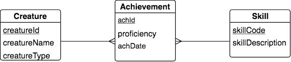

The Chicken-feet-in Shape: an intersection with arbitrary identifier
--------------------------------------------------------------------

Next let's consider the following fragment that represents an evolution of the previous example that often occurs after more careful consideration of possible instances of data that users wish to store.

|

|

What is being depicted here once again is that each creature can achieve many skills and each skill can be achieved by many creatures, so this many-many relationship was automatically changed in the conceptual model to contain an intermediate intersection entity called Achievement. Here an Achievement is still a pairing of a Creature and a Skill, but we can remember more than one occurrence of a creature achieving a particular skill, so a date attribute was added, called achDate. Because some achievements may not have a date associated with them or a creature can achieve a skill more than once on the same date, the achDate attribute cannot be used as a tiebreaker and is not part of the identifier. Instead, we need to introduce an arbitrary value to identify one achievement from another.

.. activecode:: cr_ach_arbid_skill_create
   :language: sql

   DROP TABLE IF EXISTS skill;

   CREATE TABLE skill (
   skillCode          VARCHAR(3)      NOT NULL PRIMARY KEY,
   skillDescription   VARCHAR(20)
   );

   DROP TABLE IF EXISTS creature;

   CREATE TABLE creature (
   creatureId          INTEGER      NOT NULL PRIMARY KEY,
   creatureName        VARCHAR(20),
   creatureType        VARCHAR(20),
   creatureResideTown  VARCHAR(20)
   );

   DROP TABLE IF EXISTS achievement;

   CREATE TABLE achievement (
   achId              INTEGER NOT NULL PRIMARY KEY AUTOINCREMENT,
   creatureId         INTEGER,
   skillCode          VARCHAR(3),
   proficiency        INTEGER,
   achDate            TEXT,
   FOREIGN KEY (creatureId) REFERENCES creature (creatureId),
   FOREIGN KEY (skillCode) REFERENCES skill (skillCode)
   );

Notice on line 20 how when creating achievement we have used the keyword AUTOINCREMENT to declare that the primary key identifier will be an integer that the system will automatically increment as instances are added to the database table. This syntax for the automatically incremented integer for use as a primary key will vary from database system to database system. We show it above for SQLite.

Similarly, date and time data is represented differently in almost every database system you will encounter. In SQLite, we define a date as shown above by declaring it as a 'text' datatype. Below we show how data can then be inserted using functions that convert date and time into text strings, as shown in this next example, where we use the *datetime* function.

.. activecode:: cr_acharb_skill_populate
  :language: sql
  :include: cr_ach_arbid_skill_create

  INSERT INTO creature VALUES (1,'Bannon','person','Philly');
  INSERT INTO creature VALUES (3,'Neff','person','Blue Earth');
  INSERT INTO creature VALUES (5,'Mieska','person','Duluth');

  INSERT INTO skill VALUES ('A', 'float');
  INSERT INTO skill VALUES ('E', 'swim');
  INSERT INTO skill VALUES ('O', 'sink');
  INSERT INTO skill VALUES ('U', 'walk on water');
  INSERT INTO skill VALUES ('Z', 'gargle');

  INSERT INTO achievement (creatureId, skillCode, proficiency, achDate)
                  VALUES (1, 'A', 1, datetime('now'));
  INSERT INTO achievement (creatureId, skillCode, proficiency, achDate)
                  VALUES (1, 'E', 3, datetime('2019-09-15 15:35'));
  INSERT INTO achievement (creatureId, skillCode, proficiency, achDate)
                  VALUES (5, 'Z', 3, datetime('2019-09-15 15:42:30'));
  INSERT INTO achievement (creatureId, skillCode, proficiency, achDate)
                  VALUES (3, 'Z', 1, datetime('now', 'localtime'));

  -- display to screen
  SELECT *
  FROM creature natural join achievement natural join skill;

.. important:: Because we have introduced an arbitrary identifier that will be automatically added by the system, we have to treat the inserts a bit differently, starting at line 11. In other examples, we had taken a short cut and not included the names of the columns for the data we are entering in the insert command, because we were inserting them in the same order as we created them. Note that for inserting the data into the achievement table in this case, we added which columns/attributes of data we were inserting, letting the system insert the arbitrary achId value.

Summary of Concepts Introduced
~~~~~~~~~~~~~~~~~~~~~~~~~~~~~~

We have used two interesting features found in all database systems:

1. An arbitrary identifier that can be automatically generated by the system as new data is inserted.

2. Treating a timestamp (date and time) as an important data type. SQLite does this with the use of special functions, only one of which we have illustrated (look up more references for other ways to work with dates). Other databases sometimes have date or timestamp data types that are used when the table is created.
