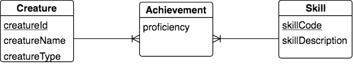

The Chicken-feet-in Shape: implementing an intersection
-------------------------------------------------------

Next let's consider the following fragment of a database about creatures and skills they have achieved.

|

|

What is being depicted here is that each creature can achieve many skills and each skill can be achieved by many creatures, so this many-many relationship was automatically changed in the conceptual model to contain an intermediate intersection entity called Achievement. To implement this depicted model fragment, it is important to realize that an Achievement is a pairing of a Creature and a Skill, and we can remember only one occurrence of a creature achieving a particular skill.

A few instances of the Skill data might look like this:

==========   =================
skillCode    skillDescription
==========   =================
A            float
E            swim
O            sink
U            walk on water
Z            gargle
==========   =================

A few instances of the Achievement data wight look like this:

==========   =============  ===========
creatureId   skillCode      proficiency
==========   =============  ===========
1            A              1
1            E              3
5            Z              3
3            Z              1
==========   =============  ===========

We read the first instance of the above table as: "the creature with creatureId of 1 has achieved the skill whose skillCode is A with proficiency of 1." The conceptual model fragment and the data indicate that an Achievement is identified by the combination of its creatureId and skillCode.

Now let's create the data tables for this situation. We repeat the creature table from earlier examples.

.. activecode:: cr_ach_skill_create
   :language: sql

   DROP TABLE IF EXISTS skill;

   CREATE TABLE skill (
   skillCode          VARCHAR(3)      NOT NUll PRIMARY KEY,
   skillDescription   VARCHAR(20)
   );

   DROP TABLE IF EXISTS creature;

   CREATE TABLE creature (
   creatureId          INTEGER      NOT NUll PRIMARY KEY,
   creatureName        VARCHAR(20),
   creatureType        VARCHAR(20),
   creatureResideTown  VARCHAR(20)
   );

   DROP TABLE IF EXISTS achievement;

   CREATE TABLE achievement (
   creatureId         INTEGER,
   skillCode          VARCHAR(3),
   proficiency        INTEGER,
   PRIMARY KEY (creatureId, skillCode),
   FOREIGN KEY (creatureId) REFERENCES creature (creatureId),
   FOREIGN KEY (skillCode) REFERENCES skill (skillCode)
   );

Note how we represent the identifier of Achievement using the *primary key* keywords as a separate declaration in the create table statement. Note also how we depict the alternative way to declare that creatureId and skillCode are foreign keys into creature and skill respectively.

Inserting data for these is just as before in other examples:

.. activecode:: cr_ach_skill_populate
  :language: sql
  :include: cr_ach_skill_create

  INSERT INTO creature VALUES (1,'Bannon','person','Philly');
  INSERT INTO creature VALUES (3,'Neff','person','Blue Earth');
  INSERT INTO creature VALUES (5,'Mieska','person','Duluth');

  INSERT INTO skill VALUES ('A', 'float');
  INSERT INTO skill VALUES ('E', 'swim');
  INSERT INTO skill VALUES ('O', 'sink');
  INSERT INTO skill VALUES ('U', 'walk on water');
  INSERT INTO skill VALUES ('Z', 'gargle');

  INSERT INTO achievement VALUES (1, 'A', 1);
  INSERT INTO achievement VALUES (1, 'E', 3);
  INSERT INTO achievement VALUES (5, 'Z', 3);
  INSERT INTO achievement VALUES (3, 'Z', 1);

  -- display to screen
  SELECT *
  FROM creature natural join achievement natural join skill;

In the next section we will examine a natural evolution of this type of intersection entity and how the SQL implementation changes.
