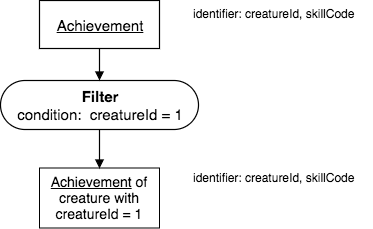

Precedence Charts
------------------

You will plan a query using operators and inputs expressed in a precedence chart. A precedence chart depicts a *partial* ordering of the work (“do this sometime before doing that”), but not a complete ordering (“do this first and that next”). The former is all you need to plan a query, and if you are thinking the latter too soon, then you are wasting your time.

You have seen a simple chart already that looks like this:

|

|

A precedence chart in this book follows these conventions:

-  Each relation name appears inside a box (suggesting the rectangular relation shape).

-  Each operator name appears inside a non-box shape.

-  Relation boxes and operator shapes are connected by arrows.

-  Any non-relation inputs appear inside the operator shape.

-  An arrow from the bottom of an operator shape to the top of a box means that the relation is the result of the operator.

-  An arrow from the bottom of a box to the top of an operator shape means that the relation is an input to the operator. Such an arrow may be labeled with an alias for a relation. An arrow to the peak of a binary operator house or triangle shape differs semantically from an arrow to a corner. (We will see examples of these later.)

When starting out to learn how the operators work, we will take care when naming the base of each relation and underlining it, and we will make note of what the identifying columns are in the input and output relation(s).

The shapes and arrows appear in patterns that will make it easy for you to discern the relationship between the bases of the input relations and the bases of the result relations.

A precedence chart has several notable characteristics.

-  Each operator, for example the above fragment, accepts one or two input relations, and so is called “Unary," or “Binary," respectively.

-  Each operator produces one relation.

-  Each relation, raw or derived, can be input to more than one operator.

-  An operator never connects to an operator; a relation never connects to a relation – “sandwich” is a useful metaphor, where bread and meat alternate.

-  Each relation name has a singular noun base that is underlined, while each operator name is a verb. Therefore, you can read off a sentence for each operator.

-  The ends of a precedence chart are always relations – a sandwich has bread on the outside.

-  A precedence chart is a directed acyclic graph; it is declarative (non-procedural), and, therefore, it **excludes notions** such as loops, conditional elements, or state. Adding such notions would turn relational algebra into a very different kind of language.

Notice that I call each precedence chart a "Fragment." Fragment implies that what is shown could be only a portion of a larger precedence chart, or be complete.
