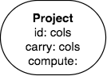
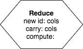
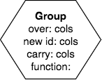
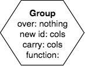

Unary Operator Introduction
----------------------------

As the name suggests, unary operators take one relation as input. As with all operators we will work with, one relation is output. Each unary operator needs some conditions to be applied to the input relation. The difference between the operators is whether they operate on the rows or columns, and whether the base of the resulting relation changes. We use different shapes for the operator to help us realize these differences.

Here are each of the operators (we will explain the conditions in each one as we explain them in the following sections):

1. **Filter**. The result relation is usually shorter than the input relation, as long as the condition supplied makes this so. The result's base does not change. In precedence charts, the filter operator looks like this:

2. **Project**. The result relation has fewer or more columns. The number of rows remains the same. The result's base does not change.

3. **Reduce**. The result relation has fewer columns. The number of rows remains the same. The result's base **does change**, so we use another shape to help us remember that:

4. **Group**. The result relation usually has fewer rows and fewer columns (if it doesn't the choice you used was probably wrong). The result's base **does change**, so we use the same shape as for Reduce. Group has two forms-- you will see the difference later. For now, here is what they look like:

|

|

Let's dive in and start using these operators!
