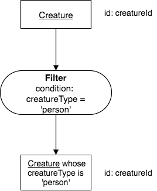
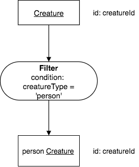
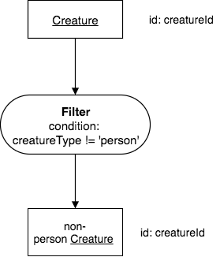
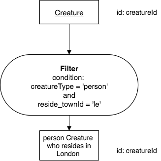
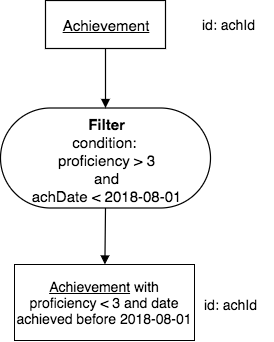

Filter
-------

Filter focuses on *one* row at a time, and, if the data in that row satisfies an input condition, puts that row into the result relation, in other words “passes it."

Filter’s result relation has these notable *name* and *structure* characteristics:

Name characteristics:

-  It has the same base as the input relation.

-  It has a row modifier that comes from the “condition” input. It has no column modifier.

Structure characteristics:

-  It has the same identifier as the input relation.

-  It is exactly as wide as the input relation.

-  Its height depends on the data. Filter often yields some of the rows, but may yield all or none of them.

Examples
~~~~~~~~

With each of the examples for the various operators in this book, we will present some of the relevant data and then an English query and its corresponding precedence chart. We will often see how we translate the query into SQL.

Let's start with the creature relation that we saw earlier when we introduced the database that we are using.

.. csv-table:: **Creature**
   :file: ../creatureData/creature.csv
   :widths: 10, 25, 25, 20, 20
   :header-rows: 1

Note that creatureId is the identifier of Creature.

A simple condition
********************

**English Query:**

    Find each person creature.

A more precise wording for this relation would be:

    Find each creature whose creatureType is 'person'.

The corresponding chart for this looks like this:

When the condition is on a column like a type, as in this example, we can often rename the result, so the chart looks like the original English query that we posed:

Get used to making sure the result name is accurate before you rename and shorten it. In this case it was easy and made sense, in other cases it may be more precise and understandable to leave it in the long form.

.. important::
    Notice that the result relation's base does not change when using the filter operator. In this case, each resulting instance is still a creature, identified by its creatureId.

Now let's see what the SQL will look like for this. You can look at the second tab to see how the data was created, but you don't have to. The main focus is the query that matches the chart versions above. An explanation of the SQL code follows this example.

.. tabbed:: filter1

    .. tab:: SQL query

      .. activecode:: person_creature
         :language: sql
         :include: creature_create_filter

         SELECT *
         FROM creature
         WHERE creatureType = 'person';

    .. tab:: SQL data

       .. activecode:: creature_create_filter
          :language: sql

          DROP TABLE IF EXISTS creature;
          CREATE TABLE creature (
          creatureId          INTEGER      NOT NUll PRIMARY KEY,
          creatureName        VARCHAR(20),
          creatureType        VARCHAR(20),
          reside_townId VARCHAR(3) REFERENCES town(townId),     -- foreign key
          idol_creatureId     INTEGER,
          FOREIGN KEY(idol_creatureId) REFERENCES creature(creatureId)
          );

          INSERT INTO creature VALUES (1,'Bannon','person','p',10);
          INSERT INTO creature VALUES (2,'Myers','person','a',9);
          INSERT INTO creature VALUES (3,'Neff','person','be',NULL);
          INSERT INTO creature VALUES (4,'Neff','person','b',3);
          INSERT INTO creature VALUES (5,'Mieska','person','d', 10);
          INSERT INTO creature VALUES (6,'Carlis','person','p',9);
          INSERT INTO creature VALUES (7,'Kermit','frog','g',8);
          INSERT INTO creature VALUES (8,'Godzilla','monster','t',6);
          INSERT INTO creature VALUES (9,'Thor','superhero','as',NULL);
          INSERT INTO creature VALUES (10,'Elastigirl','superhero','mv',13);
          INSERT INTO creature VALUES (11,'David Beckham','person','le',9);
          INSERT INTO creature VALUES (12,'Harry Kane','person','le',11);
          INSERT INTO creature VALUES (13,'Megan Rapinoe','person','sw',10);

**Explanation of the SQL query (first tab):**

The keyword *SELECT* indicates that a set of columns will appear next. In the case of filter, we are retrieving all of the original columns of the input relation. Since this is done fairly often, SQL has a shortcut for this, which is the asterisk symbol, \*. The keyword *FROM* indicates the input relation will come next, which in this case is named creature in this database. The keyword *WHERE* is followed by the condition that we want to apply. Here we want to return fewer creatures in the result relation, only those that match the conditional phrase found after the where clause. As we have seen all SQL commands end with a semi-colon ( ; ).

Another simple condition
************************

**English Query:**

    Find each non-person creature.

Corresponding chart:

Corresponding SQL:

.. activecode:: non_person_creature
   :language: sql
   :include: creature_create_filter

   SELECT *
   FROM creature
   WHERE creatureType != 'person';

The conditions you can use go beyond equality and inequality. For column values that are numbers, the following symbols also serve as relational operators:

 -  greater than: >
 -  greater than or equal to: >=
 -  less than: <
 -  less than or equal to: <=

Combining conditions
********************

The conditions can be combined in various ways, using 3 logic words that combine them together: and, or, and not.

**English Query:**

    Find each person creature who resides in London.

And more precisely using the creature relation:

    Find each creature whose creatureType is 'person' and whose reside_townId is 'le'.

The first version of the query is like how we might say it in English speech with someone, but writing the second re-written version for precision is very helpful for ensuring that you get the precedence chart correct.

Corresponding chart:

Here we show the shortened English description for the result relation.

|

|

Corresponding SQL:

.. activecode:: london_person_creature
   :language: sql
   :include: creature_create_filter

   SELECT *
   FROM creature
   WHERE creatureType = 'person' AND reside_townId = 'le';

Let's try this on another relation, Achievement:

.. csv-table:: **Achievement**
   :file: ../creatureData/achievement.csv
   :widths: 10, 10, 10, 20, 30, 20
   :header-rows: 1

**English Query:**

    Find each achievement whose proficiency is greater than 3 and that was achieved prior to August 1, 2018.

Corresponding chart:

Corresponding SQL:

.. tabbed:: filter2

    .. tab:: SQL query

      .. activecode:: above3_and_earlier_than_August2018_achievement
         :language: sql
         :include: achievement_create_filter

         SELECT *
         FROM achievement
         WHERE proficiency > 3 AND date(achDate) < date('2018-08-01');

    .. tab:: SQL data

       .. activecode:: achievement_create_filter
          :language: sql

          DROP TABLE IF EXISTS achievement;
          CREATE TABLE achievement (
          achId              INTEGER NOT NUll PRIMARY KEY AUTOINCREMENT,
          creatureId         INTEGER,
          skillCode          VARCHAR(3),
          proficiency        INTEGER,
          achDate            TEXT,
          test_townId VARCHAR(3) REFERENCES town(townId),     -- foreign key
          FOREIGN KEY (creatureId) REFERENCES creature (creatureId),
          FOREIGN KEY (skillCode) REFERENCES skill (skillCode)
          );

          -- Bannon floats in Anoka (where he aspired)
          INSERT INTO achievement (creatureId, skillCode, proficiency,
                                   achDate, test_townId)
                          VALUES (1, 'A', 3, datetime('now'), 'a');

          -- Bannon swims in Duluth (he aspired in Bemidji)
          INSERT INTO achievement (creatureId, skillCode, proficiency,
                                   achDate, test_townId)
                          VALUES (1, 'E', 3, datetime('2017-09-15 15:35'), 'd');
          -- Bannon doesn't gargle
          -- Mieska gargles in Tokyo (had no aspiration to)
          INSERT INTO achievement (creatureId, skillCode, proficiency,
                                   achDate, test_townId)
                          VALUES (5, 'Z', 6, datetime('2016-04-12 15:42:30'), 't');

          -- Neff #3 gargles in Blue Earth (but not to his aspired proficiency)
          INSERT INTO achievement (creatureId, skillCode, proficiency,
                                   achDate, test_townId)
                          VALUES (3, 'Z', 4, datetime('2018-07-15'), 'be');
          -- Neff #3 gargles in Blue Earth (but not to his aspired proficiency)
          -- on same day at same proficiency, signifying need for arbitrary id
          INSERT INTO achievement (creatureId, skillCode, proficiency,
                                   achDate, test_townId)
                          VALUES (3, 'Z', 4, datetime('2018-07-15'), 'be');

          -- Beckham achieves PK in London
          INSERT INTO achievement (creatureId, skillCode, proficiency,
                                   achDate, test_townId)
                          VALUES (11, 'PK', 10, datetime('1998-08-15'), 'le');
          -- Kane achieves PK in London
          INSERT INTO achievement (creatureId, skillCode, proficiency,
                                   achDate, test_townId)
                          VALUES (12, 'PK', 10, datetime('2016-05-24'), 'le');
          -- Rapinoe achieves PK in London
          INSERT INTO achievement (creatureId, skillCode, proficiency,
                                   achDate, test_townId)
                          VALUES (13, 'PK', 10, datetime('2012-08-06'), 'le');
          -- Godizilla achieves PK in Tokyo poorly with no date
          -- had not aspiration to do so- did it on a dare ;)
          INSERT INTO achievement (creatureId, skillCode, proficiency,
                                   achDate, test_townId)
                          VALUES (8, 'PK', 1, NULL, 't');

          -- -------------------- -------------------- -------------------
          -- Thor achieves three-legged race in Metroville (with Elastigirl)
          INSERT INTO achievement (creatureId, skillCode, proficiency,
                                   achDate, test_townId)
                          VALUES (9, 'THR', 10, datetime('2018-08-12 14:30'), 'mv');
          -- Elastigirl achieves three-legged race in Metroville (with Thor)
          INSERT INTO achievement (creatureId, skillCode, proficiency,
                                   achDate, test_townId)
                          VALUES (10, 'THR', 10, datetime('2018-08-12 14:30'), 'mv');

          -- Kermit 'pilots' 2-person bobsledding  (pilot goes into contribution)
          --       with Thor as brakeman (brakeman goes into contribution) in Duluth,
          --    achieve at 76% of maxProficiency
          INSERT INTO achievement (creatureId, skillCode, proficiency,
                                   achDate, test_townId)
                          VALUES (7, 'B2', 19, datetime('2017-01-10 16:30'), 'd');
          INSERT INTO achievement (creatureId, skillCode, proficiency,
                                   achDate, test_townId)
                          VALUES (9, 'B2', 19, datetime('2017-01-10 16:30'), 'd');

          -- 4 people form track realy team in London:
          --   Neff #4, Mieska, Myers, Bannon
          --    achieve at 85% of maxProficiency
          INSERT INTO achievement (creatureId, skillCode, proficiency,
                                   achDate, test_townId)
                          VALUES (4, 'TR4', 85, datetime('2012-07-30'), 'le');
          INSERT INTO achievement (creatureId, skillCode, proficiency,
                                   achDate, test_townId)
                          VALUES (5, 'TR4', 85, datetime('2012-07-30'), 'le');
          INSERT INTO achievement (creatureId, skillCode, proficiency,
                                   achDate, test_townId)
                          VALUES (2, 'TR4', 85, datetime('2012-07-30'), 'le');
          INSERT INTO achievement (creatureId, skillCode, proficiency,
                                   achDate, test_townId)
                          VALUES (1, 'TR4', 85, datetime('2012-07-30'), 'le');

          -- Thor, Rapinoe, and Kermit form debate team in Seattle, WA and
          -- achieve at 80% of maxProficiency
          INSERT INTO achievement (creatureId, skillCode, proficiency,
                                   achDate, test_townId)
                          VALUES (9, 'D3', 8, datetime('now', 'localtime'), 'sw');
          INSERT INTO achievement (creatureId, skillCode, proficiency,
                                   achDate, test_townId)
                          VALUES (13, 'D3', 8, datetime('now', 'localtime'), 'sw');
          INSERT INTO achievement (creatureId, skillCode, proficiency,
                                   achDate, test_townId)
                          VALUES (7, 'D3', 8, datetime('now', 'localtime'), 'sw');

The Scope and Nature of Filter
~~~~~~~~~~~~~~~~~~~~~~~~~~~~~~

.. important::
    The scope of filter is one row. The filter condition is applied to each row, one at a time, when deciding if it qualifies for the result relation.

The conditions in the previous query were applied to each row instance, so that only those instances where both conditions applied were kept, because of the boolean connector, AND. Keep this important idea in mind- it will show up in some more sophisticated queries later.

.. important::
    Filter is the only primitive operator that can perform comparisons
    that are other than exactly matching ones.

This crucial fact has significant consequences. Every other primitive operator in this chapter and the next exactly matches values or does no matching. Later we will consider other sophisticated operators: set operators and match join operators, which only use exact matching (equality comparison) in their conditions. We do not return to non-matching operators until we look at the advanced operator called compare join in a much later chapter.

Date datatype in DBMS
~~~~~~~~~~~~~~~~~~~~~

The examples in this book that create and manipulate date data values work for SQLite, but will be different for other database systems. You will need to change the SQL examples when trying these in another database. It is good practice to try this, so you are aware of the differences.

For SQLite, one important detail to note is that the month and day portions of the date in singe quotes must begin with a 0 if they are less than 10. The overall format is 'YYYY-MM-DD HH:MM:SS'.

The great advantage of using precedence charts to plan your query first is that these will look the same regardless of the database: you can use whatever phrase suits what you want to find in the condition in the operator oval. You can get the query correct first before worrying about the SQL implementation details.

A word about phrasing
~~~~~~~~~~~~~~~~~~~~~

The result relation name, like the input name, is singular in this book. The English queries also have a particular style, which begins "Find each ... ". This is purposeful and you should follow this pattern. When using this format, we are making it clear that the result relation contains zero or more instances, each of which meet the conditions we are looking for. The result relation is a set of individual things, one row per thing.

Exercises
~~~~~~~~~~

Try creating the precedence charts for these queries. Use a drawing tool such as draw.io.

  1. Find each achievement whose proficiency is greater than 3 and not equal to 6.
  2. Find each achievement whose skillCode is 'Z'.
  3. Find each superhero creature.
  4. Find each skill originating in a town whose townId is 'd'. (Hint: skill relation has a column called origin_townId, which is a foreign key into the town relation. You do not need town, only skill, to write the chart).
  5. Devise one of your own queries in English and draw the chart.
