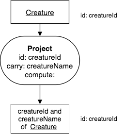
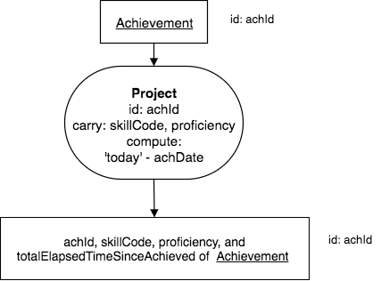

Project
--------

Project (the verb, pronounced /prəˈjekt/, stemming from the word projection) is the simplest operator. It takes as input one relation, and a list of columns. It forms a result relation with *all* of the input relation’s rows, but just the specified columns. That relation must contain **all of the input relation’s identifying columns** with *some*, *none* or *all* of its non-identifying columns, and, perhaps, some computed columns. *One* result relation row corresponds to *one* input relation row.

A Project’s result relation has these notable name and structure characteristics:

Name characteristics:

-  Its base is the same as the input relation’s base.

-  It has no row modifier.

-  Its column modifier depends on what columns you name.

Structure characteristics:

-  Its identifier, a set of column names, is the same as the input relation’s identifier.

-  It is as wide as the number of columns named (which must include each identifying column).

-  It is exactly as tall as the original relation

.. important:: Masters know how each operator’s result relation base relates to the base of the input relation’s base. For Project the bases and identifiers are the same.

Examples
~~~~~~~~

Let's start with the creature relation once again, which has these rows:

.. csv-table:: **Creature**
   :file: ../creatureData/creature.csv
   :widths: 10, 25, 25, 20, 20
   :header-rows: 1

Note that creatureId is the identifier of Creature.

Project some of the columns
****************************

**English Query:**

    Find the identifier and name of each Creature.

The corresponding chart for this looks like this:

|

|

Note what is shown in the operator: the identifying column (can be columns), additional columns that are carried along in the result (written after the word carry), and in this case no additional computed columns are given. We will see how that is used shortly.

Corresponding SQL:

.. tabbed:: project1

    .. tab:: SQL query

      .. activecode:: creature_project_1
         :language: sql
         :include: creature_create_project

         SELECT creatureId, creatureName
         FROM creature;

    .. tab:: SQL data

       .. activecode:: creature_create_project
          :language: sql

          DROP TABLE IF EXISTS creature;
          CREATE TABLE creature (
          creatureId          INTEGER      NOT NUll PRIMARY KEY,
          creatureName        VARCHAR(20),
          creatureType        VARCHAR(20),
          reside_townId VARCHAR(3) REFERENCES town(townId),     -- foreign key
          idol_creatureId     INTEGER,
          FOREIGN KEY(idol_creatureId) REFERENCES creature(creatureId)
          );

          INSERT INTO creature VALUES (1,'Bannon','person','p',10);
          INSERT INTO creature VALUES (2,'Myers','person','a',9);
          INSERT INTO creature VALUES (3,'Neff','person','be',NULL);
          INSERT INTO creature VALUES (4,'Neff','person','b',3);
          INSERT INTO creature VALUES (5,'Mieska','person','d', 10);
          INSERT INTO creature VALUES (6,'Carlis','person','p',9);
          INSERT INTO creature VALUES (7,'Kermit','frog','g',8);
          INSERT INTO creature VALUES (8,'Godzilla','monster','t',6);
          INSERT INTO creature VALUES (9,'Thor','superhero','as',NULL);
          INSERT INTO creature VALUES (10,'Elastigirl','superhero','mv',13);
          INSERT INTO creature VALUES (11,'David Beckham','person','le',9);
          INSERT INTO creature VALUES (12,'Harry Kane','person','le',11);
          INSERT INTO creature VALUES (13,'Megan Rapinoe','person','sw',10);

**Explanation of the SQL query (first tab):**

The columns we wish to keep in the result are in a comma-separated list after the keyword SELECT. The input relation, in this case creature, is shown after the keyword FROM.

Projecting computed columns
****************************

**English Query:**

    For each achievement, find each achId, skillCode, proficiency, and total elapsed time since the achievement.

The corresponding chart for this looks like this:

|

|

Corresponding SQL:

.. tabbed:: project2

    .. tab:: SQL query

      .. activecode:: achievement_project_elapsed
         :language: sql
         :include: achievement_create_project

         SELECT achId, skillCode, proficiency,
                julianday('now') - julianday(achDate)
         FROM achievement;

    .. tab:: SQL data

       .. activecode:: achievement_create_project
          :language: sql

          DROP TABLE IF EXISTS achievement;
          CREATE TABLE achievement (
          achId              INTEGER NOT NUll PRIMARY KEY AUTOINCREMENT,
          creatureId         INTEGER,
          skillCode          VARCHAR(3),
          proficiency        INTEGER,
          achDate            TEXT,
          test_townId VARCHAR(3) REFERENCES town(townId),     -- foreign key
          FOREIGN KEY (creatureId) REFERENCES creature (creatureId),
          FOREIGN KEY (skillCode) REFERENCES skill (skillCode)
          );

          -- Bannon floats in Anoka (where he aspired)
          INSERT INTO achievement (creatureId, skillCode, proficiency,
                                   achDate, test_townId)
                          VALUES (1, 'A', 3, datetime('now'), 'a');

          -- Bannon swims in Duluth (he aspired in Bemidji)
          INSERT INTO achievement (creatureId, skillCode, proficiency,
                                   achDate, test_townId)
                          VALUES (1, 'E', 3, datetime('2017-09-15 15:35'), 'd');
          -- Bannon floats in Anoka (where he aspired)
          INSERT INTO achievement (creatureId, skillCode, proficiency,
                                   achDate, test_townId)
                          VALUES (1, 'A', 3, datetime('2018-07-14 14:00'), 'a');

          -- Bannon swims in Duluth (he aspired in Bemidji)
          INSERT INTO achievement (creatureId, skillCode, proficiency,
                                   achDate, test_townId)
                          VALUES (1, 'E', 3, datetime('now'), 'd');
          -- Bannon doesn't gargle
          -- Mieska gargles in Tokyo (had no aspiration to)
          INSERT INTO achievement (creatureId, skillCode, proficiency,
                                   achDate, test_townId)
                          VALUES (5, 'Z', 6, datetime('2016-04-12 15:42:30'), 't');

          -- Neff #3 gargles in Blue Earth (but not to his aspired proficiency)
          INSERT INTO achievement (creatureId, skillCode, proficiency,
                                   achDate, test_townId)
                          VALUES (3, 'Z', 4, datetime('2018-07-15'), 'be');
          -- Neff #3 gargles in Blue Earth (but not to his aspired proficiency)
          -- on same day at same proficiency, signifying need for arbitrary id
          INSERT INTO achievement (creatureId, skillCode, proficiency,
                                   achDate, test_townId)
                          VALUES (3, 'Z', 4, datetime('2018-07-15'), 'be');

          -- Beckham achieves PK in London
          INSERT INTO achievement (creatureId, skillCode, proficiency,
                                   achDate, test_townId)
                          VALUES (11, 'PK', 10, datetime('1998-08-15'), 'le');
          -- Kane achieves PK in London
          INSERT INTO achievement (creatureId, skillCode, proficiency,
                                   achDate, test_townId)
                          VALUES (12, 'PK', 10, datetime('2016-05-24'), 'le');
          -- Rapinoe achieves PK in London
          INSERT INTO achievement (creatureId, skillCode, proficiency,
                                   achDate, test_townId)
                          VALUES (13, 'PK', 10, datetime('2012-08-06'), 'le');
          -- Godizilla achieves PK in Tokyo poorly with no date
          -- had not aspiration to do so- did it on a dare ;)
          INSERT INTO achievement (creatureId, skillCode, proficiency,
                                   achDate, test_townId)
                          VALUES (8, 'PK', 1, NULL, 't');

          -- -------------------- -------------------- -------------------
          -- Thor achieves three-legged race in Metroville (with Elastigirl)
          INSERT INTO achievement (creatureId, skillCode, proficiency,
                                   achDate, test_townId)
                          VALUES (9, 'THR', 10, datetime('2018-08-12 14:30'), 'mv');
          -- Elastigirl achieves three-legged race in Metroville (with Thor)
          INSERT INTO achievement (creatureId, skillCode, proficiency,
                                   achDate, test_townId)
                          VALUES (10, 'THR', 10, datetime('2018-08-12 14:30'), 'mv');

          -- Kermit 'pilots' 2-person bobsledding  (pilot goes into contribution)
          --       with Thor as brakeman (brakeman goes into contribution) in Duluth,
          --    achieve at 76% of maxProficiency
          INSERT INTO achievement (creatureId, skillCode, proficiency,
                                   achDate, test_townId)
                          VALUES (7, 'B2', 19, datetime('2017-01-10 16:30'), 'd');
          INSERT INTO achievement (creatureId, skillCode, proficiency,
                                   achDate, test_townId)
                          VALUES (9, 'B2', 19, datetime('2017-01-10 16:30'), 'd');

          -- 4 people form track realy team in London:
          --   Neff #4, Mieska, Myers, Bannon
          --    achieve at 85% of maxProficiency
          INSERT INTO achievement (creatureId, skillCode, proficiency,
                                   achDate, test_townId)
                          VALUES (4, 'TR4', 85, datetime('2012-07-30'), 'le');
          INSERT INTO achievement (creatureId, skillCode, proficiency,
                                   achDate, test_townId)
                          VALUES (5, 'TR4', 85, datetime('2012-07-30'), 'le');
          INSERT INTO achievement (creatureId, skillCode, proficiency,
                                   achDate, test_townId)
                          VALUES (2, 'TR4', 85, datetime('2012-07-30'), 'le');
          INSERT INTO achievement (creatureId, skillCode, proficiency,
                                   achDate, test_townId)
                          VALUES (1, 'TR4', 85, datetime('2012-07-30'), 'le');

          -- Thor, Rapinoe, and Kermit form debate team in Seattle, WA and
          -- achieve at 80% of maxProficiency
          INSERT INTO achievement (creatureId, skillCode, proficiency,
                                   achDate, test_townId)
                          VALUES (9, 'D3', 8, datetime('now', 'localtime'), 'sw');
          INSERT INTO achievement (creatureId, skillCode, proficiency,
                                   achDate, test_townId)
                          VALUES (13, 'D3', 8, datetime('now', 'localtime'), 'sw');
          INSERT INTO achievement (creatureId, skillCode, proficiency,
                                   achDate, test_townId)
                          VALUES (7, 'D3', 8, datetime('now', 'localtime'), 'sw');

**Explanation of the SQL query (first tab):**

The columns we wish to keep in the result are in a comma-separated list after the keyword SELECT, as is a new column that gets computed. In this case, in SQLite the function julianday() applied to each of two dates represented as text and used with the minus operator will compute the number of days between the two dates. As mentioned in the previous section, other databases will do this differently. The input relation, in this case achievement, is shown after the keyword FROM.

.. important::
    **The scope of computing columns in Project is one row.**

The above is a **crucial fact**. Its consequence is that the expression producing a computed value in a row can use only data values from that *one* row. You cannot use Project, for example, to compute the average Score achieved by a Creature, because those Scores are not all in one row. Often you will execute other operators to place some values in a row so that you can compute desired expressions.

You can also add a constant column that has the same value in every row, such as the current year, or some value that you may want to use in a computation in a further step.

What expressions can you compute with a one-row scope? In short, a lot. SQL provides a large set of arithmetic and text manipulation operators and built-in functions that you can use in forming expressions on the data in a row. You should study your DBMS manual to determine what is available.

Some notes about the project operator
~~~~~~~~~~~~~~~~~~~~~~~~~~~~~~~~~~~~~~~

You should expect to spend some time deciding on a consistent style for specifying required columns in the narrative, and for the column modifier in the result relation. A naming style that sounds all right for the small example database might sound awkward with your data.

Here are some things to consider about columns:

-  When talking about a query sometimes you will find it inconvenient to name all of the to-be-Projected columns, and will focus on the ones not in the result and will say “Project away these columns," or “Project all but these columns.”

-  The above notion leads to this: you might choose to form the result relation name using a complementary style using, for example, “all but creatureType of Creature” as the result relation name. (You might prefer “all columns but creatureType of Creature.”)

-  You will choose among long and short ways of specifying columns, e.g., shorten creatureId to simply id.

When first starting out, it is better to be fairly specific about what is in your result so that you can easily see how the result can be used for the next operation that you want to perform.

.. note:: Before reading on, think about these questions about extremes: What are the minimum and maximum number of result relation columns and rows for a Project?

Exercises
~~~~~~~~~~

Try charts for these as practice:

  1. Find the skillCode and skillDescription of each Skill.

  2. Find the creatureId, skillCode, and aspiredProficiency of Aspiration.

  3. Find the skillCode of each TeamSkill.

  4. Find each skillCode, skillDescription of Skill, and the possible number of different values of proficiency that can be applied.

For the last one, here is a suggestion: Knowing proficiency values are integers, how can you compute the total number of possible integer values that could be used? Recall that the Skill relation is this (id is skillCode):

.. csv-table:: **Skill**
   :file: ../creatureData/skill.csv
   :widths: 10, 30, 20, 20, 20
   :header-rows: 1

|
