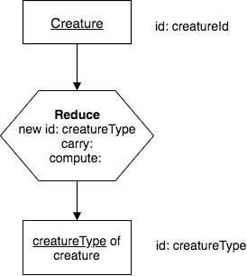
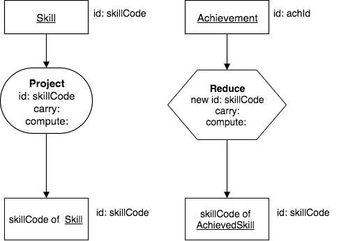
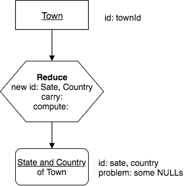

Reduce
-------

Reduce is a unary operator that, like Project, is column oriented. Unlike Project, Reduce produces a result relation with a *different* base and identifier than its input relation’s base and identifier. With Reduce you specify one or two lists of column names as inputs:

-  The columns (original or computed) forming the result relation’s identifier.

-  The other, non-identifying (original or computed) columns, if any, you want to carry along. (I call them “carry” columns.)

A Reduce's result relation has these notable name and structure characteristics:

Name characteristics:

-  Its identifier is formed from the specified columns. Its identifier must differ from the input relation’s identifier. (If they were the same then you would be Projecting. Also, renaming identifying columns is “not same” too.)

-  Its base must differ from the input relation’s base.

-  Its row modifier is formed from the input relation's base.

-  Its column modifier is formed from the specified columns.

Structure characteristics:

-  It is as *wide* as the number of columns named together in the lists.

-  It is generally *shorter* than the input relation, but in some cases may be just as tall. It cannot be a zero-row relation unless the input relation has zero rows.

.. important:: The first bullet is important. Unlike for Project where the bases and identifiers must be the same, for Reduce **they must differ**. Some novices never distinguish between Project and Reduce, and so fail to progress towards mastery.

Example
~~~~~~~~

We will continue using our old friend, the creature relation:

.. csv-table:: **Creature**
   :file: ../creatureData/creature.csv
   :widths: 10, 25, 25, 20, 20
   :header-rows: 1

**English Query:**

   Find the creatureType of each Creature.

The corresponding chart for this looks like this:

|

|

Note what is shown in the operator: the new identifying column (can be columns) is creatureType, no additional columns are carried along in the result (because nothing is written after the word carry), and no additional computed columns are needed.

Also note how we changed the base noun of the result relation. Deciding what this should be can be tricky. You need to think carefully about what is now identifying the resulting relation. Using the phrase 'of creature' is important so that you know where the column value came from. Such precision seems overkill in simple examples, but is invaluable in real situations with dozens or hundreds of raw and result relations.

An alternate name for the result relation is "creatureType of one or more Creatures." The latter name is longer, but it makes explicit what the former only implies.

Corresponding SQL:

.. tabbed:: reduce1

   .. tab:: SQL query relation

     .. activecode:: creature_reduce_1
        :language: sql
        :include: creature_create_reduce

        SELECT distinct creatureType
        FROM creature;

   .. tab:: SQL query table

     .. activecode:: creature_reduce_2
        :language: sql
        :include: creature_create_reduce

        SELECT creatureType
        FROM creature;

   .. tab:: SQL data

     .. activecode:: creature_create_reduce
        :language: sql

        DROP TABLE IF EXISTS creature;
        CREATE TABLE creature (
        creatureId          INTEGER      NOT NULL PRIMARY KEY,
        creatureName        VARCHAR(20),
        creatureType        VARCHAR(20),
        reside_townId VARCHAR(3) REFERENCES town(townId),     -- foreign key
        idol_creatureId     INTEGER,
        FOREIGN KEY(idol_creatureId) REFERENCES creature(creatureId)
        );

        INSERT INTO creature VALUES (1,'Bannon','person','p',10);
        INSERT INTO creature VALUES (2,'Myers','person','a',9);
        INSERT INTO creature VALUES (3,'Neff','person','be',NULL);
        INSERT INTO creature VALUES (4,'Neff','person','b',3);
        INSERT INTO creature VALUES (5,'Mieska','person','d', 10);
        INSERT INTO creature VALUES (6,'Carlis','person','p',9);
        INSERT INTO creature VALUES (7,'Kermit','frog','g',8);
        INSERT INTO creature VALUES (8,'Godzilla','monster','t',6);
        INSERT INTO creature VALUES (9,'Thor','superhero','as',NULL);
        INSERT INTO creature VALUES (10,'Elastigirl','superhero','mv',13);
        INSERT INTO creature VALUES (11,'David Beckham','person','le',9);
        INSERT INTO creature VALUES (12,'Harry Kane','person','le',11);
        INSERT INTO creature VALUES (13,'Megan Rapinoe','person','sw',10);

**Explanation of the SQL queries:**

The query in the first tab displays a correct result relation. Why 4 rows? The reason is that in Creature there are 13 creatureType values, but there are only 4 distinct ones, and Reduce should remove duplicate rows automatically. It must do so because, if it did not, as in the table (not relation) shown in the second tab, then the result could not be a relation, because it violates the rules for identifier – more than one row contains "person." You might imagine that Reduce using the distinct keyword in SQL first sorts the rows into like-valued bunches, then works on each bunch of perhaps- *many* duplicate rows and put one copy in the result relation.

Thus, in the first tab, the keyword DISTINCT is absolutely necessary. The columns we wish to keep in the result are in a comma-separated list after the keywords SELECT DISTINCT. The input relation, in this case creature, is shown after the keyword FROM.

Let's think about this operator
~~~~~~~~~~~~~~~~~~~~~~~~~~~~~~~

Many times the result is shorter than the original input after removing duplicates, but not always. Let's look at the data for the *Contribution* relation:

.. csv-table:: **Contribution**
   :file: ../creatureData/contribution.csv
   :widths: 25, 25, 25, 25
   :header-rows: 1

The nature of this data at this particular time would given us a result with the same height if we asked this:

  Find each roleName of Contribution.

Make sure you see why this is- this can happen.

Comparing Reduce to Project
~~~~~~~~~~~~~~~~~~~~~~~~~~~~~

Look at these two precedence charts as a means to solidify the difference between the Project and Reduce operators.

|

|

Note how the base of the result relation changes with reduce, along with what identifies it. We use a different symbol for the reduce operator so that we see this more readily. Note how each of them results in a relation with skills in them, represented by their skillCode. But the one on the left is all the skills, and the name of the one on the right needed to be changed to make it clear that it only contains achieved skills.

Naming the result relation
~~~~~~~~~~~~~~~~~~~~~~~~~~~

Here is another reduce query:

  Find each creatureName of one or more creatures

Draw this one for yourself.You might have been tempted to keep Creature as its base but cannot because creatureName is *not* Creature’s identifier.

.. important:: Seeing the difference between bases is necessary for mastery. Beware, some students skim this crucial notion to get to the snazzier operators and never grasp the fundamental importance of choosing precise names. You need to become sensitive to language and, in particular, to internalize that Reduce yields a different base than the input relation, while Project yields the same base.

Bad Case: Reduce is dangerous!
~~~~~~~~~~~~~~~~~~~~~~~~~~~~~~~

Consider what happens if you Reduce a relation and specify an identifying column with a NULL value in it. Let's use the town relation from our small database as an example. Here is what is currently in it.

.. csv-table:: **Town**
   :file: ../creatureData/town.csv
   :widths: 10, 10, 10, 15, 25, 30
   :header-rows: 1

The following query and its chart cannot result in a relation (so it is drawn with a rounded rectangle to represent a table). When you try the SQL code, you get an SQL table-- note the row with null values.

English query:

    Find each state and country of town.

|

|

.. tabbed:: reduce_bad

   .. tab:: SQL query table

     .. activecode:: town_reduce_bad_1
        :language: sql
        :include: town_create_reduce

        SELECT distinct State, Country
        FROM town;

   .. tab:: SQL data

     .. activecode:: town_create_reduce
        :language: sql

        DROP TABLE IF EXISTS town;

        CREATE TABLE town (
        townId          VARCHAR(3)      NOT NULL PRIMARY KEY,
        townName        VARCHAR(20),
        State           VARCHAR(20),
        Country         VARCHAR(20),
        townNickname    VARCHAR(80),
        townMotto       VARCHAR(80)
        );

        -- order matches table creation:
        -- id    name          state   country
        -- nickname   motto
        INSERT INTO town VALUES ('p', 'Philadelphia', 'PA', 'United States',
                                 'Philly', 'Let brotherly love endure');
        INSERT INTO town VALUES ('a', 'Anoka', 'MN', 'United States',
                                 'Halloween Capital of the world', NULL);
        INSERT INTO town VALUES ('be', 'Blue Earth', 'MN', 'United States',
                                 'Beyond the Valley of the Jolly Green Giant',
                                 'Earth so rich the city grows!');
        INSERT INTO town VALUES ('b', 'Bemidji', 'MN', 'United States',
                                 'B-town', 'The first city on the Mississippi');
        INSERT INTO town VALUES ('d', 'Duluth', 'MN', 'United States',
                                'Zenith City', NULL);
        INSERT INTO town VALUES ('g', 'Greenville', 'MS', 'United States',
                                 'The Heart & Soul of the Delta',
                                 'The Best Food, Shopping, & Entertainment In The South');
        INSERT INTO town VALUES ('t', 'Tokyo', 'Kanto', 'Japan', NULL, NULL);
        INSERT INTO town VALUES ('as', 'Asgard', NULL, NULL,
                                 'Home of Odin''s vault',
                                 'Where magic and science are one in the same');
        INSERT INTO town VALUES ('mv', 'Metroville', NULL, NULL,
                                'Home of the Incredibles',
                                'Still Standing');
        INSERT INTO town VALUES ('le', 'London', 'England', 'United Kingdom',
                                'The Smoke',
                                'Domine dirige nos');
        INSERT INTO town VALUES ('sw', 'Seattle', 'Washington', 'United States',
                                'The Emerald City',
                                'The City of Goodwill');

Bad Case: Computed columns in Reduce are dangerous.
~~~~~~~~~~~~~~~~~~~~~~~~~~~~~~~~~~~~~~~~~~~~~~~~~~~

A Reduce, like a Project, can compute columns, although this is a convenience, not a necessity, because a Project preceding the Reduce can serve to compute columns. Such computed columns are dangerous, since they could have NULL, or non-singleton values. It is best to avoid this practice unless you are absolutely certain neither of these is the case. For most data, you never can be sure of that some value somewhere is NULL or that when you reduced you eliminated some duplicates, rendering a computation in error.

Exercises
~~~~~~~~~~

Work on precedence charts for these. Decide which of these is bad. Note that for each one of these, there will be one input relation and one result relation from the Reduce operator.  

**Beware:** though you may be tempted to just write SQL, show some restraint and simply draw the charts. To help with this, try making a copy of 
`this drawio operator template <https://drive.google.com/file/d/1AduoHhvr7ve4gVrcl-9nnoHR1Yne4WQH/view?usp=sharing>`_ in your browser. To do this, you will need to access this Google Drive file and make a copy in your own Google Drive space. You can use it in diagrams.net.

  1. Find each country of town.

  2. Find each creatureName of creature.

  3. Find each creatureId of creature who has achieved.

  4. Find each achieved skillCode.

  5. Find each Achieved skill of creature with its proficiency (id: skillCode, creatureId).

If you haven't yet, you can download :download:`This Small Creature Database Schema<../08TinyDB/smallCreatureDB_LDS.pdf>` and keep a copy for your own reference as you work on the precedence charts.
