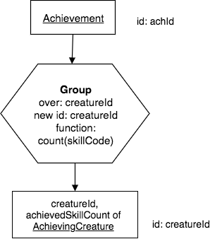
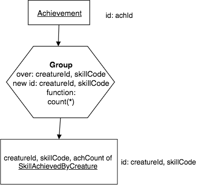
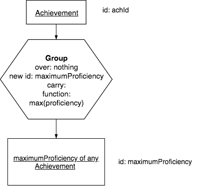
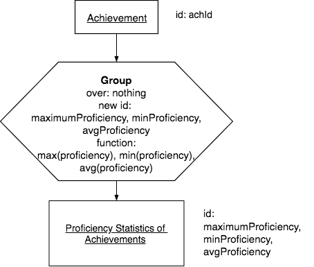

Group
-------

Group is the fourth unary operator. It calculates aggregate values (simple statistics) from its input relation's cell values. About Group there are four key notions to learn. Read these now, then review them later after you study the examples that follow.

1. Group has 2 circumstances where a statistic or statistics are calculated by:

a. Partitioning (or grouping – thus the operator name) the input relation into *one* set of rows, Grouping over *no* columns. An example English query for this circumstance is:

    "Find the count of all creatures."

b. Partitioning the input relation into *many* sets of rows, Grouping over one or a few columns that have the same value(s). An example English query for this circumstance is:

    "For each creatureId, count the number of its achievements"

2. Every Group has a non-relation input which is a list of aggregate functions with result column names, for example, "achievementCount" for 1.b. above. The aggregate functions specifiable in SQL include: **Sum, Count, Minimum, Maximum, Average, Variance, and Standard Deviation**. In computing these aggregates, SQL generally ignores NULL values. However, Count has two forms. You can specify Count(*) , or Count(<column-name>). For each group of rows, the former ignores cell values and just counts the number of rows, while the latter counts the number of non-NULL cell values in that column.

3. Group’s computed columns differ from computed columns in Project. When you compute values with a Project you think *horizontally*. A Project computed column “numProficiencyValues = maxProficiency - minProficiency” uses values within *one* row (horizontally related) to compute a new column. You think about scalar variables, constants, and simple arithmetic functions. However, with Group you think *vertically,* and “achievementCount = count(*)” computes a value for each group of *many* vertically-related rows. In programming terms, you think about array or vector, not scalar arithmetic.

.. important:: Group seems “easy." However, some novices never master it. I think that failure often can be attributed to not learning to think vertically.

4. Grouping over one or a few columns emerges from Reduce. Look at the relation in the first example SQL result below and cover the computed aggregate column. What remains visible is what would result if you Reduce Achievement to creatureId. You can more quickly master Group if you see a Reduce lurking within it. Because it is like Reduce, Group is dangerous in much the same ways that Reduce was. Because it is like Reduce, the symbol that was use in precedence charts is the same.

Example 1: Group over one column
~~~~~~~~~~~~~~~~~~~~~~~~~~~~~~~~~

Let's remember what is in the achievement data relation, since we will try some queries on it.

.. csv-table:: **Achievement**
   :file: ../creatureData/achievement.csv
   :widths: 10, 10, 10, 20, 30, 20
   :header-rows: 1

.. note:: Some creatures, such as that with creatureId=1, have achieved some skills more than once.

English Query:

  For each creatureId, find the count of its achieved skills.

Note that this is different than counting all of a particular creature's achievements, even if the same skill was achieved more than once.

Precedence Chart:

|

|

Corresponding SQL:

.. tabbed:: group1

    .. tab:: SQL query

        .. activecode:: creature_ach_count
           :language: sql
           :include: achievement_create_group

           SELECT creatureId,
                  count(distinct skillCode) AS achievedSkillCount
           FROM achievement
           GROUP BY creatureId;

    .. tab:: SQL data

       .. activecode:: achievement_create_group
          :language: sql

          DROP TABLE IF EXISTS achievement;
          CREATE TABLE achievement (
          achId              INTEGER NOT NUll PRIMARY KEY AUTOINCREMENT,
          creatureId         INTEGER,
          skillCode          VARCHAR(3),
          proficiency        INTEGER,
          achDate            TEXT,
          test_townId VARCHAR(3) REFERENCES town(townId),     -- foreign key
          FOREIGN KEY (creatureId) REFERENCES creature (creatureId),
          FOREIGN KEY (skillCode) REFERENCES skill (skillCode)
          );

          -- Bannon floats in Anoka (where he aspired)
          INSERT INTO achievement (creatureId, skillCode, proficiency,
                                   achDate, test_townId)
                          VALUES (1, 'A', 3, datetime('now'), 'a');

          -- Bannon swims in Duluth (he aspired in Bemidji)
          INSERT INTO achievement (creatureId, skillCode, proficiency,
                                   achDate, test_townId)
                          VALUES (1, 'E', 3, datetime('2017-09-15 15:35'), 'd');
          -- Bannon floats in Anoka (where he aspired)
          INSERT INTO achievement (creatureId, skillCode, proficiency,
                                   achDate, test_townId)
                          VALUES (1, 'A', 3, datetime('2018-07-14 14:00'), 'a');

          -- Bannon swims in Duluth (he aspired in Bemidji)
          INSERT INTO achievement (creatureId, skillCode, proficiency,
                                   achDate, test_townId)
                          VALUES (1, 'E', 3, datetime('now'), 'd');

          -- Bannon doesn't gargle
          -- Mieska gargles in Tokyo (had no aspiration to)
          INSERT INTO achievement (creatureId, skillCode, proficiency,
                                   achDate, test_townId)
                          VALUES (5, 'Z', 6, datetime('2016-04-12 15:42:30'), 't');

          -- Neff #3 gargles in Blue Earth (but not to his aspired proficiency)
          INSERT INTO achievement (creatureId, skillCode, proficiency,
                                   achDate, test_townId)
                          VALUES (3, 'Z', 4, datetime('2018-07-15'), 'be');
          -- Neff #3 gargles in Blue Earth (but not to his aspired proficiency)
          -- on same day at same proficiency, signifying need for arbitrary id
          INSERT INTO achievement (creatureId, skillCode, proficiency,
                                   achDate, test_townId)
                          VALUES (3, 'Z', 4, datetime('2018-07-15'), 'be');

          -- Beckham achieves PK in London
          INSERT INTO achievement (creatureId, skillCode, proficiency,
                                   achDate, test_townId)
                          VALUES (11, 'PK', 10, datetime('1998-08-15'), 'le');
          -- Kane achieves PK in London
          INSERT INTO achievement (creatureId, skillCode, proficiency,
                                   achDate, test_townId)
                          VALUES (12, 'PK', 10, datetime('2016-05-24'), 'le');
          -- Rapinoe achieves PK in London
          INSERT INTO achievement (creatureId, skillCode, proficiency,
                                   achDate, test_townId)
                          VALUES (13, 'PK', 10, datetime('2012-08-06'), 'le');
          -- Godizilla achieves PK in Tokyo poorly with no date
          -- had not aspiration to do so- did it on a dare ;)
          INSERT INTO achievement (creatureId, skillCode, proficiency,
                                   achDate, test_townId)
                          VALUES (8, 'PK', 1, NULL, 't');

          -- -------------------- -------------------- -------------------
          -- Thor achieves three-legged race in Metroville (with Elastigirl)
          INSERT INTO achievement (creatureId, skillCode, proficiency,
                                   achDate, test_townId)
                          VALUES (9, 'THR', 10, datetime('2018-08-12 14:30'), 'mv');
          -- Elastigirl achieves three-legged race in Metroville (with Thor)
          INSERT INTO achievement (creatureId, skillCode, proficiency,
                                   achDate, test_townId)
                          VALUES (10, 'THR', 10, datetime('2018-08-12 14:30'), 'mv');

          -- Kermit 'pilots' 2-person bobsledding  (pilot goes into contribution)
          --       with Thor as brakeman (brakeman goes into contribution) in Duluth,
          --    achieve at 76% of maxProficiency
          INSERT INTO achievement (creatureId, skillCode, proficiency,
                                   achDate, test_townId)
                          VALUES (7, 'B2', 19, datetime('2017-01-10 16:30'), 'd');
          INSERT INTO achievement (creatureId, skillCode, proficiency,
                                   achDate, test_townId)
                          VALUES (9, 'B2', 19, datetime('2017-01-10 16:30'), 'd');

          -- 4 people form track realy team in London:
          --   Neff #4, Mieska, Myers, Bannon
          --    achieve at 85% of maxProficiency
          INSERT INTO achievement (creatureId, skillCode, proficiency,
                                   achDate, test_townId)
                          VALUES (4, 'TR4', 85, datetime('2012-07-30'), 'le');
          INSERT INTO achievement (creatureId, skillCode, proficiency,
                                   achDate, test_townId)
                          VALUES (5, 'TR4', 85, datetime('2012-07-30'), 'le');
          INSERT INTO achievement (creatureId, skillCode, proficiency,
                                   achDate, test_townId)
                          VALUES (2, 'TR4', 85, datetime('2012-07-30'), 'le');
          INSERT INTO achievement (creatureId, skillCode, proficiency,
                                   achDate, test_townId)
                          VALUES (1, 'TR4', 85, datetime('2012-07-30'), 'le');

          -- Thor, Rapinoe, and Kermit form debate team in Seattle, WA and
          -- achieve at 80% of maxProficiency
          INSERT INTO achievement (creatureId, skillCode, proficiency,
                                   achDate, test_townId)
                          VALUES (9, 'D3', 8, datetime('now', 'localtime'), 'sw');
          INSERT INTO achievement (creatureId, skillCode, proficiency,
                                   achDate, test_townId)
                          VALUES (13, 'D3', 8, datetime('now', 'localtime'), 'sw');
          INSERT INTO achievement (creatureId, skillCode, proficiency,
                                   achDate, test_townId)
                          VALUES (7, 'D3', 8, datetime('now', 'localtime'), 'sw');

The keyword *distinct* in the query above is important. Notice what happens to creatureId 1's count if you remove it and run it again. In the latter case, you are simply counting all achievements, regardless of whether the same skill is duplicated because it was achieved twice or more by some creature.

Example 2: Group over multiple columns
~~~~~~~~~~~~~~~~~~~~~~~~~~~~~~~~~~~~~~

English Query:

  For each creatureId and skillCode, find the count of how many times the creature achieved the skill.

Note that if the same skill was achieved more than once, we can now count how many times that happened.

Precedence Chart:

|

|

Corresponding SQL:

.. activecode:: ach_cr_skill_count
   :language: sql
   :include: achievement_create_group

   SELECT creatureId, skillCode,
          count(*) AS numberOfTimesSkillAchieved
   FROM achievement
   GROUP BY creatureId, skillCode;

Note that we can simply count the number of rows by using an asterisk, '*' inside the function parentheses, as shown in the above example.

Example 3: Group over no columns
~~~~~~~~~~~~~~~~~~~~~~~~~~~~~~~~~

English Query:

  Find the maximum proficiency of any achieved skill.

.. note:: It is important that you realize that this query returns a single cell value in one row and one column in the result relation.

Precedence Chart:

|

|

.. note:: **Think:** In this above chart, contemplate why the result relation is named the way it is. In these cases, the base becomes a somewhat long name so that it accurately reflects the single statistic that will be computed.

Corresponding SQL:

.. activecode:: ach_max_proficiency
   :language: sql
   :include: achievement_create_group

   SELECT max(proficiency) AS maximumAchievedProficiency
   FROM achievement;

.. note:: If you scroll back up and look at the achievement relation's data, the only column on which we could compute a function like max, min, sum, or average is proficiency, because it contains an integer value. In some systems you can consider using max and min on date values, but that is highly system dependent.

You can also compute several of the statistics at once, like this:

Precedence Chart:

|

|

.. note:: **Think:** In this above chart, once again contemplate why the result relation is named the way it is (and that it is different than the previous example). As before, the base has a somewhat long name so that it accurately reflects what will be computed.

**You try.** Here is the previous query in SQL. You try adding to it to get the minimum and the average proficiency also.

.. activecode:: ach_proficiency_stats
   :language: sql
   :include: achievement_create_group

   SELECT max(proficiency) AS maximumAchievedProficiency
   FROM achievement;

Summary of Group Characteristics
~~~~~~~~~~~~~~~~~~~~~~~~~~~~~~~~

As you have seen, the nature of the result relation is quite different between the two kinds of group. Let's summarize the characteristics of each.

Group over no columns
*********************

For a Group over no columns circumstance: you specify a list of aggregate function – column name pairs; and the entire input relation is treated as *one* set of rows to aggregate over. The result relation has these notable name and structure characteristics.

Name characteristics:

-  Its base comes from the specified function columns.

-  It has a row modifier formed from the input relation’s name.

-  It has no column modifier.

-  The result relation’s identifier consists of *all* of its function columns.

Structure characteristics:

-  The result relation is *one* row tall, unless the input relation has zero rows.

-  It is as wide as the number of function columns specified.

Group over one or more columns
*******************************

For a Group over one or a few columns circumstance, you specify, as before, an input relation, and a list of aggregate functions. Now you also specify one or a few columns to Group over. The result relation has these notable name and structure characteristics:

Name characteristics:

-  Its base comes from the specified Over columns.

-  It has a row modifier formed from the input relation’s name.

-  It has a column modifier formed from the function column names.

-  The result relation’s identifier consists of its Over columns.

Structure characteristics:

-  The result relation is as tall as the number of distinct rows there are when looking at just the Over columns.

-  It is as wide as the number of Over and function columns specified.

Bad Cases: Group, like Reduce, is dangerous!
~~~~~~~~~~~~~~~~~~~~~~~~~~~~~~~~~~~~~~~~~~~~~

There are two ways in which a *bad group* can arise.

1. **Group with bad Over column.** An Over column of a Group cannot have a NULL value in it because such a column is an identifying one in the result relation. For example, Grouping over idol_creatureId in Creature (shown below) yields a table, not a relation.

.. csv-table:: **Creature**
   :file: ../creatureData/creature.csv
   :widths: 10, 25, 25, 20, 20
   :header-rows: 1

.. tabbed:: group_creature_idol

   .. tab:: SQL query

     .. activecode:: creature_group_idol
        :language: sql
        :include: creature_create_group

        SELECT idol_creatureId, count(creatureId) AS idoledByCreatureCount
        FROM creature
        GROUP BY idol_creatureId;

   .. tab:: SQL data

      .. activecode:: creature_create_group
         :language: sql

         DROP TABLE IF EXISTS creature;
         CREATE TABLE creature (
         creatureId          INTEGER      NOT NUll PRIMARY KEY,
         creatureName        VARCHAR(20),
         creatureType        VARCHAR(20),
         reside_townId VARCHAR(3) REFERENCES town(townId),     -- foreign key
         idol_creatureId     INTEGER,
         FOREIGN KEY(idol_creatureId) REFERENCES creature(creatureId)
         );

         INSERT INTO creature VALUES (1,'Bannon','person','p',10);
         INSERT INTO creature VALUES (2,'Myers','person','a',9);
         INSERT INTO creature VALUES (3,'Neff','person','be',NULL);
         INSERT INTO creature VALUES (4,'Neff','person','b',3);
         INSERT INTO creature VALUES (5,'Mieska','person','d', 10);
         INSERT INTO creature VALUES (6,'Carlis','person','p',9);
         INSERT INTO creature VALUES (7,'Kermit','frog','g',8);
         INSERT INTO creature VALUES (8,'Godzilla','monster','t',6);
         INSERT INTO creature VALUES (9,'Thor','superhero','as',NULL);
         INSERT INTO creature VALUES (10,'Elastigirl','superhero','mv',13);
         INSERT INTO creature VALUES (11,'David Beckham','person','le',9);
         INSERT INTO creature VALUES (12,'Harry Kane','person','le',11);
         INSERT INTO creature VALUES (13,'Megan Rapinoe','person','sw',10);

.. note:: Run the above query. Notice how idol_creatureId should be the identifier of the new result, but one of its values is null.

2. **Group with carry columns.** For a Group with Over columns, carry columns are dangerous. You can avoid errors if you learn to see a Reduce within a Group. For example, if you look at the Creature relation above, imagine if we Reduce to creatureType. When grouping over creatureType, you might be tempted to want to carry a column like reside_townId, but what should it contain? The following code runs in SQLite, but is a dangerous, misleading result- try it.

.. activecode:: creature_group_bad_carry
   :language: sql
   :include: creature_create_group

   SELECT creatureType, reside_townId, count(creatureId)
   FROM creature
   GROUP BY creatureType;

.. important:: Though some systems allow this bad query, you really should avoid it in practice.

Carry columns are also dangerous for a Group with no Over columns. In general, it is once again simply a bad practice to try it.

Exercises
~~~~~~~~~

When working on precedence charts for these, recognize which ones are grouping over one or more columns and which ones are grouping over nothing. Which one is a potentially bad group?

  1. How many towns are there?

  2. Count each type of creature.

  3. Count achieved skillCode of skills per tested town of achievement.

  4. Count skillCode per originTownId of skill.

  5. Count creatureId per resideTownId of creature.

  6. Find the count of the number of creatures.

  7. Find the count of the number of skills.

  8. Find the highest maximumProficiency of any of the skills.

  9. Find the skillDescription and lowest maximumProficiency of any of the skills.

Once you have a chart, try some SQL for 7 - 9 above. Here is what the Skill relation data looks like. Then below is a place for you to try completing the query. See whether the potentially bad query is indeed bad.

.. csv-table:: **Skill**
   :file: ../creatureData/skill.csv
   :widths: 10, 30, 20, 20, 20
   :header-rows: 1

.. tabbed:: group_skill_exercise

  .. tab:: SQL query

    .. activecode:: skill_group
       :language: sql
       :include: skill_create_group

       SELECT
       FROM skill
       ;

  .. tab:: SQL data

    .. activecode:: skill_create_group
       :language: sql

        DROP TABLE IF EXISTS skill;

        CREATE TABLE skill (
        skillCode          VARCHAR(3)      NOT NUll PRIMARY KEY,
        skillDescription   VARCHAR(40),
        maxProficiency     INTEGER,     -- max score that can be achieved for this skill
        minProficiency     INTEGER,     -- min score that can be achieved for this skill
        origin_townId      VARCHAR(3)     REFERENCES town(townId)     -- foreign key
        );

        INSERT INTO skill VALUES ('A', 'float', 10, -1,'b');
        INSERT INTO skill VALUES ('E', 'swim', 5, 0,'b');
        INSERT INTO skill VALUES ('O', 'sink', 10, -1,'b');
        INSERT INTO skill VALUES ('U', 'walk on water', 5, 1,'d');
        INSERT INTO skill VALUES ('Z', 'gargle', 5, 1,'a');
        INSERT INTO skill VALUES ('B2', '2-crew bobsledding', 25, 0,'d');
        INSERT INTO skill VALUES ('TR4', '4x100 meter track relay', 100, 0,'be');
        INSERT INTO skill VALUES ('C2', '2-person canoeing', 12, 1,'t');
        INSERT INTO skill VALUES ('THR', 'three-legged race', 10, 0,'g');
        INSERT INTO skill VALUES ('D3', 'Australasia debating', 10, 1,NULL);
        INSERT INTO skill VALUES ('PK', 'soccer penalty kick', 10, 1, 'le');

.. reveal:: reveal_bad_group_exercise
    :showtitle: Reveal Bad Group Query
    :hidetitle: Hide Bad Group Query

    Here is the bad group query, which asks for a carry column, skillDescription. Study the output to see what it is bad and misleading.

    9. Find the skillDescription and lowest maximumProficiency of any of the skills.

    .. activecode:: skill_group_bad
       :language: sql
       :include: skill_create_group

         SELECT min(maxProficiency), skillDescription
         FROM skill
         ;

|
