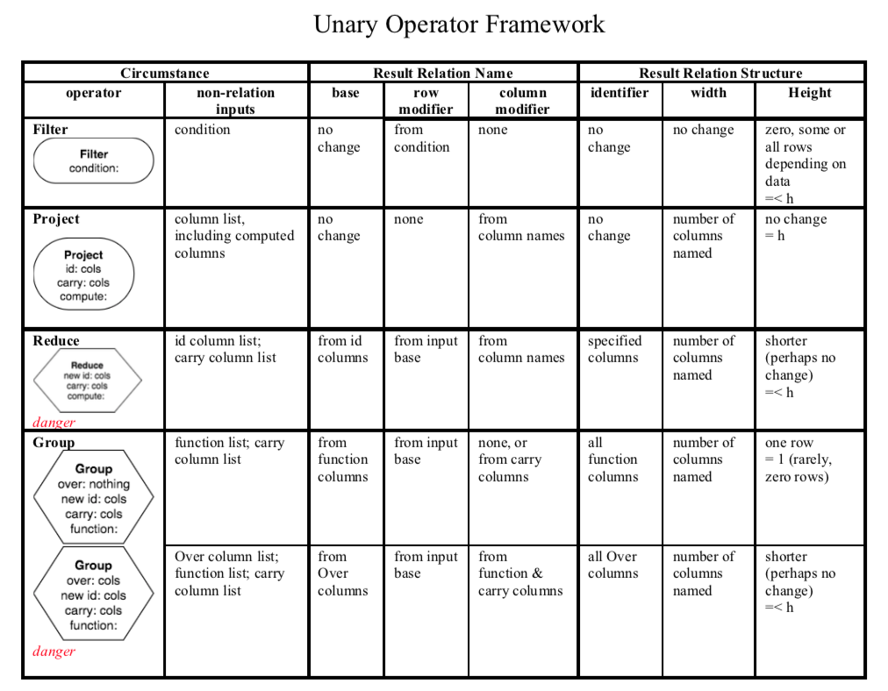

Summary of Unary Operators
---------------------------

The following table shows the various circumstances for all of the unary operators illustrated in this chapter.

|

|

You can download :download:`The Unary Framework Document <UnaryFramework.pdf>` and keep a copy for your own reference. It is useful to refer to how each operator should work as you practice on the previous examples or on your own data.

|
