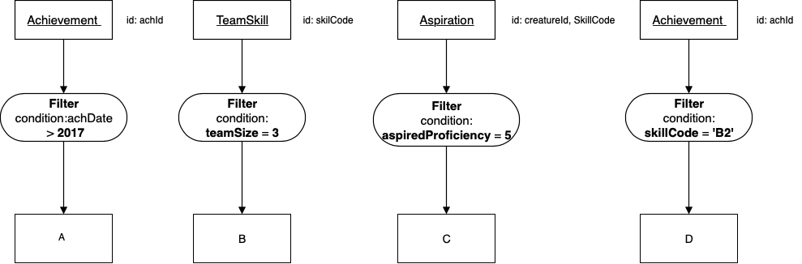
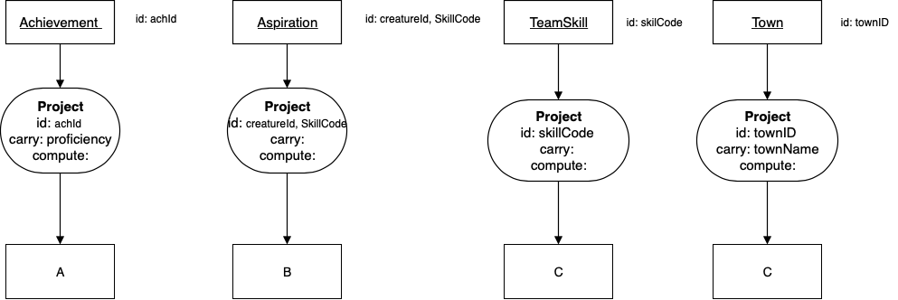
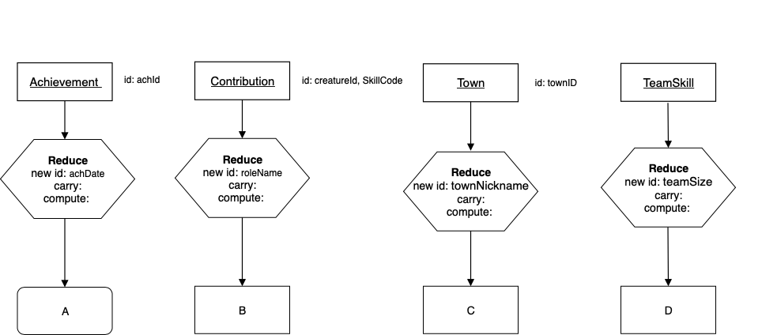

Exercises for Unary Operators
------------------------------

Try as few or as much as you want.

Filter
~~~~~~~~~~~~~~~~~~~~~~~~~~

What would be the result relation name of each of the following charts?

Click show to see the answer and to practice knowing what the identifier of the result is.

|

|

The result relation name A is:

.. reveal:: u-ex1

   Achievement with its achDate  > 2017.

    .. fillintheblank:: unary-ex1
       :casei:

       Please fill in the blanks in the following sentence:

       The identifier of the result relation is  ``|blank|``.
       The base of the result relation is ``|blank|``.

       -   :achId: Correct.
           :x: Incorrect. Should be 'achId'.
       -   :away: Correct.
           :x: Incorrect. Should be 'achievement'.

The result relation name B is:

.. reveal:: u-ex2

    TeamSkill whose teamSize is 3.

   .. fillintheblank:: unary-ex2
      :casei:

      Please fill in the blanks in the following sentence:

      The identifier of the result relation is  ``|blank|``.
      The base of the result relation is ``|blank|``.

      -   :skillCode: Correct.
          :x: Incorrect. Should be 'skillCode'.
      -   :Skill: Correct.
          :TeamSkill: Correct.
          :x: Incorrect. Should be 'teamSkill or skill'.

The result relation name C is:

.. reveal:: u-ex3

    Aspiration with its aspiredProficiency being '5'.

   .. fillintheblank:: unary-ex3
      :casei:

      Please fill in the blanks in the following sentence:

      The identifier of the result relation is  ``|blank|``.
      The base of the result relation is ``|blank|``.

      -   :creatureId, SkillCode: Correct.
          :SkillCode, creatureId: Correct.
          :creatureId and SkillCode: Correct.
          :SkillCode and creatureId: Correct.
          :x: Incorrect. Should be 'skillCode'.
      -   :aspiration: Correct.
          :x: Incorrect. Should be 'aspiration'.

The result relation name D is:

.. reveal:: u-ex4

    Achievement with its skillCode being 'B2'.

   .. fillintheblank:: unary-ex4
      :casei:

      Please fill in the blanks in the following sentence:

      The identifier of the result relation is  ``|blank|``.
      The base of the result relation is ``|blank|``.

      -   :achId: Correct.
          :x: Incorrect. Should be 'achId'.
      -   :achievement: Correct.
          :x: Incorrect. Should be 'achievement'.

Project
~~~~~~~~~~~~~~~~~~~~~~~~~~

What would be the result relation name of each of the following charts?

|

|

The result relation name A is:

.. reveal:: u-ex5

    achId and proficiency of Achievement

    .. fillintheblank:: unary-ex5
       :casei:

       Please fill in the blanks in the following sentence:

       The identifier of the result relation is  ``|blank|``.
       The base of the result relation is ``|blank|``.

       -   :achId: Correct.
           :x: Incorrect. Should be 'achId'.
       -   :achievement: Correct.
           :x: Incorrect. Should be 'achievement'.

The result relation name B is:

.. reveal:: u-ex6

   creatureId, SkillCode of Aspiration

   .. fillintheblank:: unary-ex6
      :casei:

      Please fill in the blanks in the following sentence:

      The identifier of the result relation is  ``|blank|``.
      The base of the result relation is ``|blank|``.

      -   :creatureId, SkillCode: Correct.
          :SkillCode, creatureId: Correct.
          :creatureId and SkillCode: Correct.
          :SkillCode and creatureId: Correct.
          :x: Incorrect. Should be 'creatureId, SkillCode'.
      -   :aspiration: Correct.
          :x: Incorrect. Should be 'aspiration'.

The result relation name C is:

.. reveal:: u-ex7

    SkillCode of TeamSkill

   .. fillintheblank:: unary-ex7
     :casei:

     Please fill in the blanks in the following sentence:

     The identifier of the result relation is  ``|blank|``.
     The base of the result relation is ``|blank|``.

     -   :skillCode: Correct.
         :x: Incorrect. Should be 'skillCode'.
     -   :Skill: Correct.
         :TeamSkill: Correct.
         :x: Incorrect. Should be 'teamSkill or skill'.

The result relation name D is:

.. reveal:: u-ex8

    townName and townID of Town

  .. fillintheblank:: unary-ex8
     :casei:

     Please fill in the blanks in the following sentence:

     The identifier of the result relation is  ``|blank|``.
     The base of the result relation is ``|blank|``.

     -   :townID: Correct.
         :x: Incorrect. Should be 'townID'.
     -   :town: Correct.
         :x: Incorrect. Should be 'town'.

Reduce
~~~~~~~~~~~~~~~~~~~~~~~~~~

Next, let us practice some naming of result relations for reduce.

.. tip::
      No columns in an identifier of a result relation can be null. Note below what the achievement data contains.

.. tabbed:: group1

  .. tab:: SQL query

      .. activecode:: ach_practice_unary
         :language: sql
         :include: achievement_practice_unary

         SELECT *
         FROM achievement;

  .. tab:: SQL data

      .. activecode:: achievement_practice_unary
          :language: sql

          DROP TABLE IF EXISTS achievement;
          CREATE TABLE achievement (
          achId              INTEGER NOT NUll PRIMARY KEY AUTOINCREMENT,
          creatureId         INTEGER,
          skillCode          VARCHAR(3),
          proficiency        INTEGER,
          achDate            TEXT,
          test_townId VARCHAR(3) REFERENCES town(townId),     -- foreign key
          FOREIGN KEY (creatureId) REFERENCES creature (creatureId),
          FOREIGN KEY (skillCode) REFERENCES skill (skillCode)
          );

          -- Bannon floats in Anoka (where he aspired)
          INSERT INTO achievement (creatureId, skillCode, proficiency,
                                   achDate, test_townId)
                          VALUES (1, 'A', 3, datetime('now'), 'a');

          -- Bannon swims in Duluth (he aspired in Bemidji)
          INSERT INTO achievement (creatureId, skillCode, proficiency,
                                   achDate, test_townId)
                          VALUES (1, 'E', 3, datetime('2017-09-15 15:35'), 'd');
          -- Bannon floats in Anoka (where he aspired)
          INSERT INTO achievement (creatureId, skillCode, proficiency,
                                   achDate, test_townId)
                          VALUES (1, 'A', 3, datetime('2018-07-14 14:00'), 'a');

          -- Bannon swims in Duluth (he aspired in Bemidji)
          INSERT INTO achievement (creatureId, skillCode, proficiency,
                                   achDate, test_townId)
                          VALUES (1, 'E', 3, datetime('now'), 'd');

          -- Bannon doesn't gargle
          -- Mieska gargles in Tokyo (had no aspiration to)
          INSERT INTO achievement (creatureId, skillCode, proficiency,
                                   achDate, test_townId)
                          VALUES (5, 'Z', 6, datetime('2016-04-12 15:42:30'), 't');

          -- Neff #3 gargles in Blue Earth (but not to his aspired proficiency)
          INSERT INTO achievement (creatureId, skillCode, proficiency,
                                   achDate, test_townId)
                          VALUES (3, 'Z', 4, datetime('2018-07-15'), 'be');
          -- Neff #3 gargles in Blue Earth (but not to his aspired proficiency)
          -- on same day at same proficiency, signifying need for arbitrary id
          INSERT INTO achievement (creatureId, skillCode, proficiency,
                                   achDate, test_townId)
                          VALUES (3, 'Z', 4, datetime('2018-07-15'), 'be');

          -- Beckham achieves PK in London
          INSERT INTO achievement (creatureId, skillCode, proficiency,
                                   achDate, test_townId)
                          VALUES (11, 'PK', 10, datetime('1998-08-15'), 'le');
          -- Kane achieves PK in London
          INSERT INTO achievement (creatureId, skillCode, proficiency,
                                   achDate, test_townId)
                          VALUES (12, 'PK', 10, datetime('2016-05-24'), 'le');
          -- Rapinoe achieves PK in London
          INSERT INTO achievement (creatureId, skillCode, proficiency,
                                   achDate, test_townId)
                          VALUES (13, 'PK', 10, datetime('2012-08-06'), 'le');
          -- Godizilla achieves PK in Tokyo poorly with no date
          -- had not aspiration to do so- did it on a dare ;)
          INSERT INTO achievement (creatureId, skillCode, proficiency,
                                   achDate, test_townId)
                          VALUES (8, 'PK', 1, NULL, 't');

          -- -------------------- -------------------- -------------------
          -- Thor achieves three-legged race in Metroville (with Elastigirl)
          INSERT INTO achievement (creatureId, skillCode, proficiency,
                                   achDate, test_townId)
                          VALUES (9, 'THR', 10, datetime('2018-08-12 14:30'), 'mv');
          -- Elastigirl achieves three-legged race in Metroville (with Thor)
          INSERT INTO achievement (creatureId, skillCode, proficiency,
                                   achDate, test_townId)
                          VALUES (10, 'THR', 10, datetime('2018-08-12 14:30'), 'mv');

          -- Kermit 'pilots' 2-person bobsledding  (pilot goes into contribution)
          --       with Thor as brakeman (brakeman goes into contribution) in Duluth,
          --    achieve at 76% of maxProficiency
          INSERT INTO achievement (creatureId, skillCode, proficiency,
                                   achDate, test_townId)
                          VALUES (7, 'B2', 19, datetime('2017-01-10 16:30'), 'd');
          INSERT INTO achievement (creatureId, skillCode, proficiency,
                                   achDate, test_townId)
                          VALUES (9, 'B2', 19, datetime('2017-01-10 16:30'), 'd');

          -- 4 people form track realy team in London:
          --   Neff #4, Mieska, Myers, Bannon
          --    achieve at 85% of maxProficiency
          INSERT INTO achievement (creatureId, skillCode, proficiency,
                                   achDate, test_townId)
                          VALUES (4, 'TR4', 85, datetime('2012-07-30'), 'le');
          INSERT INTO achievement (creatureId, skillCode, proficiency,
                                   achDate, test_townId)
                          VALUES (5, 'TR4', 85, datetime('2012-07-30'), 'le');
          INSERT INTO achievement (creatureId, skillCode, proficiency,
                                   achDate, test_townId)
                          VALUES (2, 'TR4', 85, datetime('2012-07-30'), 'le');
          INSERT INTO achievement (creatureId, skillCode, proficiency,
                                   achDate, test_townId)
                          VALUES (1, 'TR4', 85, datetime('2012-07-30'), 'le');

          -- Thor, Rapinoe, and Kermit form debate team in Seattle, WA and
          -- achieve at 80% of maxProficiency
          INSERT INTO achievement (creatureId, skillCode, proficiency,
                                   achDate, test_townId)
                          VALUES (9, 'D3', 8, datetime('now', 'localtime'), 'sw');
          INSERT INTO achievement (creatureId, skillCode, proficiency,
                                   achDate, test_townId)
                          VALUES (13, 'D3', 8, datetime('now', 'localtime'), 'sw');
          INSERT INTO achievement (creatureId, skillCode, proficiency,
                                   achDate, test_townId)
                          VALUES (7, 'D3', 8, datetime('now', 'localtime'), 'sw');

|

|

The name A is:

.. reveal:: u-ex9

    Since achievement’s date contains some NULLs, this is a bad reduce producing a table.
    (If there were not NULLs in achData column, A would be achDate of Achievement)

The result relation name B is:

.. reveal:: u-ex10

    roleName of Contribution

  .. fillintheblank:: unary-ex10
     :casei:

     Please fill in the blanks in the following sentence:

     The identifier of the result relation is  ``|blank|``.
     The base of the result relation is ``|blank|``.

     -   :roleName: Correct.
         :x: Incorrect. Should be 'roleName'.
     -   :roleName of Contribution: Correct.
         :x: Incorrect. Should be 'roleName of Contribution'.

The result relation name C is:

.. reveal:: u-ex11

   townNickname of Town

  .. fillintheblank:: unary-ex11
    :casei:

    Please fill in the blanks in the following sentence:

    The identifier of the result relation is  ``|blank|``.
    The base of the result relation is ``|blank|``.

    -   :townNickname: Correct.
        :x: Incorrect. Should be 'townNickname'.
    -   :townNickname of Town: Correct.
        :x: Incorrect. Should be 'townNickname of Town'.

The result relation name D is:

.. reveal:: u-ex12

   TeamSize of TeamSkill

 .. fillintheblank:: unary-ex12
    :casei:

    Please fill in the blanks in the following sentence:

    The identifier of the result relation is  ``|blank|``.
    The base of the result relation is ``|blank|``.

    -   :TeamSize: Correct.
        :x: Incorrect. Should be 'TeamSize'.
    -   :TeamSize of TeamSkill: Correct.
        :x: Incorrect. Should be 'TeamSize of TeamSkill'.

Group
~~~~~~~~~~~~~~~~~~~~~~~~~~

|

.. image:: ../img/UnaryExercises/g1.png

|

.. shortanswer:: short-ex1

  The result relation name A is:

The correct answer:
  .. reveal:: u-ex13

      CreatureCount, Proficiency of Achievement

      .. fillintheblank:: unary-ex13
         :casei:

         Please fill in the blanks in the following sentence:

         The identifier of the result relation is  ``|blank|``.
         The base of the result relation is ``|blank|``.

         -   :proficiency: Correct.
             :x: Incorrect. Should be 'proficiency'.
         -   :Proficiency of Achievement: Correct.
             :x: Incorrect. Should be 'Proficiency of Achievement'.

|

.. image:: ../img/UnaryExercises/g2.png

|

.. shortanswer:: short-ex2

  The result relation name B is:

The correct answer:
  .. reveal:: u-ex14

      roleCount, roleNme of Contribution

   .. fillintheblank:: unary-ex14
      :casei:

      Please fill in the blanks in the following sentence:

      The identifier of the result relation is  ``|blank|``.
      The base of the result relation is ``|blank|``.

      -   :roleName: Correct.
          :x: Incorrect. Should be 'roleName'.
      -   :roleNme of Contribution: Correct.
          :x: Incorrect. Should be 'roleNme of Contribution'.

|

.. image:: ../img/UnaryExercises/g3.png

|

.. shortanswer:: short-ex3

  The result relation name C is:

The correct answer:
  .. reveal:: u-ex15

      averageTeamSize of TeamSkill

   .. fillintheblank:: unary-ex15
      :casei:

      Please fill in the blanks in the following sentence:

      The identifier of the result relation is  ``|blank|``.
      The base of the result relation is ``|blank|``.

      -   :averageTeamSize: Correct.
          :x: Incorrect. Should be 'averageTeamSize'.
      -   :averageTeamSize of TeamSkill: Correct.
          :x: Incorrect. Should be 'averageTeamSize of TeamSkill'.

|

.. image:: ../img/UnaryExercises/g4.png

|

.. shortanswer:: short-ex4

  The result relation name D is:

The correct answer:
  .. reveal:: u-ex16

      CreatureCount, Country of Town

   .. fillintheblank:: unary-ex16
      :casei:

      Please fill in the blanks in the following sentence:

      The identifier of the result relation is  ``|blank|``.
      The base of the result relation is ``|blank|``.

      -   :country: Correct.
          :x: Incorrect. Should be 'country'.
      -   :Country of Town: Correct.
          :x: Incorrect. Should be 'Country of Town'.

|

.. image:: ../img/UnaryExercises/g5.png

|

.. fillintheblank:: unary-ex17
  :casei:

  Please fill in the blanks in the following sentence:

  E is ``|blank|``.

  F is  ``|blank|``.

  -   :creatureId: Correct.
      :x: Incorrect. Should be 'creatureId'.
  -   :count(creatureId): Correct.
      :x: Incorrect. Should be 'count(creatureId)'.

|

.. image:: ../img/UnaryExercises/g6.png

|

.. fillintheblank:: unary-ex18
  :casei:

  Please fill in the blanks in the following sentence:

  The identifier of the result relation is creatureCount.

  G is ``|blank|``.

  H is  ``|blank|``.

  The base of the result relation is ``|blank|``.

  -   :Nothing: Correct.
      :x: Incorrect. Should be 'Nothing'.
  -   :Count of number of Creatures: Correct.
      :creatureCount of Creatures: Correct.
      :x: Should be 'Count of number of Creatures'.
  -   :CreatureCountOfCreature: Correct.
      :Creature Count Of Creature: Correct.
      :CreatureCount Of Creature: Correct.
      :x: Should be 'CreatureCount of Creature'.

|

.. image:: ../img/UnaryExercises/g7.png

|

.. shortanswer:: short-ex5

  The name I is:

.. tip::
      No columns in an identifier of a result relation can be null. Note below what the achievement data contains.

.. tabbed:: group_practice

  .. tab:: SQL query

      .. activecode:: ach_practice_group
         :language: sql
         :include: achievement_practice_group

         SELECT *
         FROM achievement;

  .. tab:: SQL data

      .. activecode:: achievement_practice_group
          :language: sql

          DROP TABLE IF EXISTS achievement;
          CREATE TABLE achievement (
          achId              INTEGER NOT NUll PRIMARY KEY AUTOINCREMENT,
          creatureId         INTEGER,
          skillCode          VARCHAR(3),
          proficiency        INTEGER,
          achDate            TEXT,
          test_townId VARCHAR(3) REFERENCES town(townId),     -- foreign key
          FOREIGN KEY (creatureId) REFERENCES creature (creatureId),
          FOREIGN KEY (skillCode) REFERENCES skill (skillCode)
          );

          -- Bannon floats in Anoka (where he aspired)
          INSERT INTO achievement (creatureId, skillCode, proficiency,
                                   achDate, test_townId)
                          VALUES (1, 'A', 3, datetime('now'), 'a');

          -- Bannon swims in Duluth (he aspired in Bemidji)
          INSERT INTO achievement (creatureId, skillCode, proficiency,
                                   achDate, test_townId)
                          VALUES (1, 'E', 3, datetime('2017-09-15 15:35'), 'd');
          -- Bannon floats in Anoka (where he aspired)
          INSERT INTO achievement (creatureId, skillCode, proficiency,
                                   achDate, test_townId)
                          VALUES (1, 'A', 3, datetime('2018-07-14 14:00'), 'a');

          -- Bannon swims in Duluth (he aspired in Bemidji)
          INSERT INTO achievement (creatureId, skillCode, proficiency,
                                   achDate, test_townId)
                          VALUES (1, 'E', 3, datetime('now'), 'd');

          -- Bannon doesn't gargle
          -- Mieska gargles in Tokyo (had no aspiration to)
          INSERT INTO achievement (creatureId, skillCode, proficiency,
                                   achDate, test_townId)
                          VALUES (5, 'Z', 6, datetime('2016-04-12 15:42:30'), 't');

          -- Neff #3 gargles in Blue Earth (but not to his aspired proficiency)
          INSERT INTO achievement (creatureId, skillCode, proficiency,
                                   achDate, test_townId)
                          VALUES (3, 'Z', 4, datetime('2018-07-15'), 'be');
          -- Neff #3 gargles in Blue Earth (but not to his aspired proficiency)
          -- on same day at same proficiency, signifying need for arbitrary id
          INSERT INTO achievement (creatureId, skillCode, proficiency,
                                   achDate, test_townId)
                          VALUES (3, 'Z', 4, datetime('2018-07-15'), 'be');

          -- Beckham achieves PK in London
          INSERT INTO achievement (creatureId, skillCode, proficiency,
                                   achDate, test_townId)
                          VALUES (11, 'PK', 10, datetime('1998-08-15'), 'le');
          -- Kane achieves PK in London
          INSERT INTO achievement (creatureId, skillCode, proficiency,
                                   achDate, test_townId)
                          VALUES (12, 'PK', 10, datetime('2016-05-24'), 'le');
          -- Rapinoe achieves PK in London
          INSERT INTO achievement (creatureId, skillCode, proficiency,
                                   achDate, test_townId)
                          VALUES (13, 'PK', 10, datetime('2012-08-06'), 'le');
          -- Godizilla achieves PK in Tokyo poorly with no date
          -- had not aspiration to do so- did it on a dare ;)
          INSERT INTO achievement (creatureId, skillCode, proficiency,
                                   achDate, test_townId)
                          VALUES (8, 'PK', 1, NULL, 't');

          -- -------------------- -------------------- -------------------
          -- Thor achieves three-legged race in Metroville (with Elastigirl)
          INSERT INTO achievement (creatureId, skillCode, proficiency,
                                   achDate, test_townId)
                          VALUES (9, 'THR', 10, datetime('2018-08-12 14:30'), 'mv');
          -- Elastigirl achieves three-legged race in Metroville (with Thor)
          INSERT INTO achievement (creatureId, skillCode, proficiency,
                                   achDate, test_townId)
                          VALUES (10, 'THR', 10, datetime('2018-08-12 14:30'), 'mv');

          -- Kermit 'pilots' 2-person bobsledding  (pilot goes into contribution)
          --       with Thor as brakeman (brakeman goes into contribution) in Duluth,
          --    achieve at 76% of maxProficiency
          INSERT INTO achievement (creatureId, skillCode, proficiency,
                                   achDate, test_townId)
                          VALUES (7, 'B2', 19, datetime('2017-01-10 16:30'), 'd');
          INSERT INTO achievement (creatureId, skillCode, proficiency,
                                   achDate, test_townId)
                          VALUES (9, 'B2', 19, datetime('2017-01-10 16:30'), 'd');

          -- 4 people form track realy team in London:
          --   Neff #4, Mieska, Myers, Bannon
          --    achieve at 85% of maxProficiency
          INSERT INTO achievement (creatureId, skillCode, proficiency,
                                   achDate, test_townId)
                          VALUES (4, 'TR4', 85, datetime('2012-07-30'), 'le');
          INSERT INTO achievement (creatureId, skillCode, proficiency,
                                   achDate, test_townId)
                          VALUES (5, 'TR4', 85, datetime('2012-07-30'), 'le');
          INSERT INTO achievement (creatureId, skillCode, proficiency,
                                   achDate, test_townId)
                          VALUES (2, 'TR4', 85, datetime('2012-07-30'), 'le');
          INSERT INTO achievement (creatureId, skillCode, proficiency,
                                   achDate, test_townId)
                          VALUES (1, 'TR4', 85, datetime('2012-07-30'), 'le');

          -- Thor, Rapinoe, and Kermit form debate team in Seattle, WA and
          -- achieve at 80% of maxProficiency
          INSERT INTO achievement (creatureId, skillCode, proficiency,
                                   achDate, test_townId)
                          VALUES (9, 'D3', 8, datetime('now', 'localtime'), 'sw');
          INSERT INTO achievement (creatureId, skillCode, proficiency,
                                   achDate, test_townId)
                          VALUES (13, 'D3', 8, datetime('now', 'localtime'), 'sw');
          INSERT INTO achievement (creatureId, skillCode, proficiency,
                                   achDate, test_townId)
                          VALUES (7, 'D3', 8, datetime('now', 'localtime'), 'sw');

.. reveal:: u-ex18

    So this is a bad group.

    The table name could be:

.. reveal:: u-ex19

      T creatureId, Count of number of skills of creature with test_towinId

|

.. image:: ../img/UnaryExercises/g8.png

|

.. shortanswer:: short-ex6

  The result relation name J is:

The correct answer:
  .. reveal:: u-ex20

      creatureId, test_townId, Count of number of skills achieved by creature in a test_town

   .. fillintheblank:: unary-ex20
      :casei:

      Please fill in the blanks in the following sentence:

      The identifier of the result relation is  ``|blank|``.
      The base of the result relation is ``|blank|``.

      -   :creatureId, test_townId: Correct.
          :creatureId and test_townId: Correct.
          :x: Should be 'creatureId, test_townId'.
      -   :creature in a test_town: Correct.
          :x: I Should be 'creature in a test_town'.
