Exercises for Unary Operators
------------------------------

Here are some exercises to ensure mastery of what you have read so far. For each one, first try to write down in the short answer box the name of each result relation. Then use the show button to reveal what we called them. If we don't match, consider whether your version is reasonable or whether the one given is more precise. After that, you can practice determining the identifier and the base of each result relation.

Try as few or as many as you wish for practice, but be sure to try at least one from each operator.

Filter
~~~~~~~~~~~~~~~~~~~~~~~~~~

What would be the result relation name of each of the following charts?

Click show to see the answer and then practice knowing what the identifier of the result is.

The following image of 4 precedence charts using Filter will be repeated again below.

|

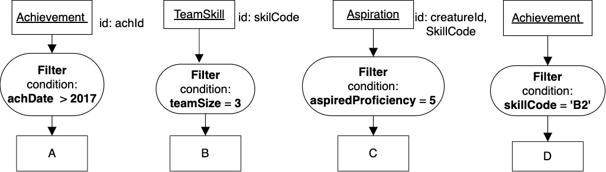

|

.. shortanswer:: filter_ex_A_D
    :optional:

    Write the result relation name for A, B, C, and D

Now check yours with our versions by showing them. Note that there are multiple ways to be precise or accurate, so your answers may be just fine even if they are not just like those you see revealed. Notice haw we even showed different ways of describing equality in A versus C and D. Also, I personally prefer the use of 'whose' in A and B revealed below; what about you?

.. reveal:: u-ex-filter-result

   A. Achievement whose achDate  > 2017.
   B. TeamSkill whose teamSize is 3.
   C. Aspiration with its aspiredProficiency being '5'.
   D. Achievement with its skillCode being 'B2'.

Here are the above 4 charts again:

|

|

Now practice knowing the base noun and the identifying attributes that are indicative of that base. Show each question to try the exercise for each result relation. (This is so you can hide and effectively collapse them out of the way.)

Result relation A:

.. reveal:: u-ex-filterA

    .. fillintheblank:: unary-ex1
        :casei:

        Please fill in the blanks in the following sentence:

        The identifier of the result relation A is  ``|blank|``.
        The base of the result relation A is ``|blank|``.

        -   :achId: Correct.
            :x: Identifier Incorrect. Should be 'achId'.
        -   :Achievement: Correct.
            :x: Base Incorrect. Should be 'Achievement'.

Result relation B:

.. reveal:: u-ex-filterB

    .. fillintheblank:: unary-ex2
        :casei:

        Please fill in the blanks in the following sentence:

        The identifier of the result relation B is  ``|blank|``.
        The base of the result relation B is ``|blank|``.

        -   :skillCode: Correct.
            :x: Identifier Incorrect. Should be 'skillCode'.
        -   :TeamSkill: Correct.
            :x: Base Incorrect. Should be 'TeamSkill'.

Result relation C:

.. reveal:: u-ex-filterC

    .. fillintheblank:: unary-ex3
        :casei:

        Please fill in the blanks in the following sentence:

        The identifier of the result relation C is  ``|blank|``.
        The base of the result relation C is ``|blank|``.

        -   :creatureId, SkillCode: Correct.
            :SkillCode, creatureId: Correct.
            :creatureId and SkillCode: Correct.
            :SkillCode and creatureId: Correct.
            :x: Identifier Incorrect. Should be 'skillCode'.
        -   :aspiration: Correct.
            :x: Base Incorrect. Should be 'Aspiration'.

Result relation D:

.. reveal:: u-ex-filterD

    .. fillintheblank:: unary-ex4
        :casei:

        Please fill in the blanks in the following sentence:

        The identifier of the result relation D is  ``|blank|``.
        The base of the result relation D is ``|blank|``.

        -   :achId: Correct.
            :x: Identifier Incorrect. Should be 'achId'.
        -   :achievement: Correct.
            :x: Base Incorrect. Should be 'Achievement'.

.. note:: The key idea you should be **owning** after these exercises is that the base of the result relation after a Filter does not change, and thus neither does its identifier, made up of the input relation's identifying attributes(s).

Project
~~~~~~~~~~~~~~~~~~~~~~~~~~

What would be the result relation name of each of the following charts?

|

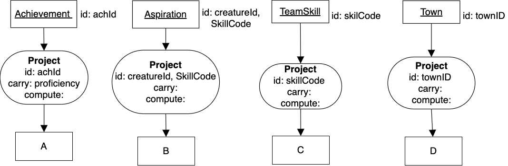

|

.. shortanswer:: project_ex_A_D
    :optional:

    Write the result relation name for A, B, C, and D

Now check yours with our versions by showing them. Note that there is one straightforward pattern for a precise name for the result with Project, so your answers should be just like ours.

.. reveal:: u-ex-proj-result

   A. achId and proficiency of Achievement.
   B. creatureId, SkillCode of Aspiration.
   C. SkillCode of TeamSkill.
   D. townName of Town.

Here are the above 4 charts again:

|

|

Now practice knowing the base noun and the identifying attributes that are indicative of that base. Show each one to try it.

Result relation A:

.. reveal:: u-ex-projectA

    .. fillintheblank:: unary-ex5
        :casei:

        Please fill in the blanks in the following sentence:

        The identifier of the result relation A is  ``|blank|``.
        The base of the result relation A is ``|blank|``.

        -   :achId: Correct.
            :x: Identifier Incorrect. Should be 'achId'.
        -   :achievement: Correct.
            :x: Base Incorrect. Should be 'Achievement'.

Result relation B:

.. reveal:: u-ex-projectB

    .. fillintheblank:: unary-ex6
        :casei:

        Please fill in the blanks in the following sentence:

        The identifier of the result relation B is  ``|blank|``.
        The base of the result relation B is ``|blank|``.

        -   :creatureId, SkillCode: Correct.
            :SkillCode, creatureId: Correct.
            :creatureId and SkillCode: Correct.
            :SkillCode and creatureId: Correct.
            :x: Identifier Incorrect. Should be 'creatureId, SkillCode'.
        -   :aspiration: Correct.
            :x: Base Incorrect. Should be 'Aspiration'.

Result relation C:

.. reveal:: u-ex-projectC

    .. fillintheblank:: unary-ex7
        :casei:

        Please fill in the blanks in the following sentence:

        The identifier of the result relation C is  ``|blank|``.
        The base of the result relation C is ``|blank|``.

        -   :skillCode: Correct.
            :x: Identifier Incorrect. Should be 'skillCode'.
        -   :Skill: Correct.
            :TeamSkill: Correct.
            :x: Base Incorrect. Should be 'TeamSkill'.

Result relation D:

.. reveal:: u-ex-projectD

    .. fillintheblank:: unary-ex8
        :casei:

        Please fill in the blanks in the following sentence:

        The identifier of the result relation D is  ``|blank|``.
        The base of the result relation D is ``|blank|``.

        -   :townID: Correct.
            :x: Identifier Incorrect. Should be 'townID'.
        -   :town: Correct.
            :x: Base Incorrect. Should be 'Town'.

.. note:: The key idea you should be **owning** after these exercises is that the base of the result relation after a Project does not change, and thus neither does its identifier, made up of the input relation's identifying attributes(s).

Reduce
~~~~~~~~~~~~~~~~~~~~~~~~~~

Next, let us practice some naming of result relations for reduce.

.. tip::
      Because with Reduce we will now be declaring new identifying columns, we must remember this: No columns in an identifier of a result relation can be null. Note below what the achievement data, which will be used in some of the following examples, contains:

      .. csv-table:: **Achievement**
        :file: ../creatureData/achievement.csv
        :widths: 10, 10, 10, 20, 30, 20
        :header-rows: 1

|

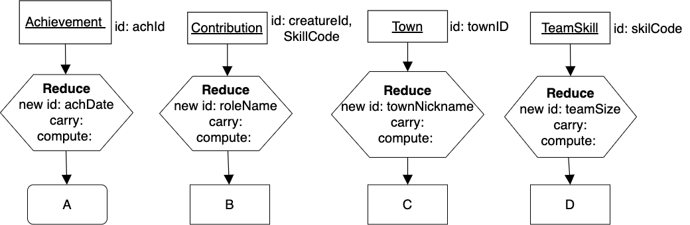

|

.. shortanswer:: reduce_ex_name_A
    :optional:

    Why is the shape of the result labeled A different than the others? How might your try to name it?

Click Show to compare your answer to our reason.

.. reveal:: u-ex9

    Since Achievement’s achDate contains some NULLs and identifier data values cannot be null, this is a bad reduce producing a table with no identifier that is tricky to name. Perhaps something like this:
    "Possibly null achDate of Achievement table".
    (If there were not NULLs in the achDate column, A would be achDate of Achievement and would be a square box.)

.. shortanswer:: reduce_ex_name_B_D
    :optional:

    What are the names of result relations B, C, and D?

Click show to see what we suggest.

.. reveal:: u-ex10

    B. roleName of Contribution
    C. townNickname of Town
    D. TeamSize of one or more TeamSkills

    In the above names for the result relations, notice how we could have stated A and B like D. The version in D makes it easier to see that there may be fewer rows in the result relation than in the original input relation.

Here are the above 4 charts again:

|

|

Now practice knowing the base noun and the identifying attributes that are indicative of that base. Show each one to try it.

Result relation B:

.. reveal:: u-ex-reduceB

  .. fillintheblank:: unary-ex10
     :casei:

     Please fill in the blanks in the following sentence:

     The identifier of the result relation B is  ``|blank|``.
     The base of the result relation B is ``|blank|``.

     -   :roleName: Correct.
         :x: Identifier Incorrect. Should be 'roleName'.
     -   :roleName of Contribution: Correct.
         :x: Base Incorrect. Should be 'roleName of Contribution'.

Result relation C:

.. reveal:: u-ex-reduceC

  .. fillintheblank:: unary-ex11
    :casei:

    Please fill in the blanks in the following sentence:

    The identifier of the result relation C is  ``|blank|``.
    The base of the result relation C is ``|blank|``.

    -   :townNickname: Correct.
        :x: Incorrect. Should be 'townNickname'.
    -   :townNickname of Town: Correct.
        :x: Incorrect. Should be 'townNickname of Town'.

Result relation D:

.. reveal:: u-ex-reduceD

 .. fillintheblank:: unary-ex12
    :casei:

    Please fill in the blanks in the following sentence:

    The identifier of the result relation D is  ``|blank|``.
    The base of the result relation D is ``|blank|``.

    -   :TeamSize: Correct.
        :x: Incorrect. Should be 'TeamSize'.
    -   :TeamSize of TeamSkill: Correct.
        :x: Incorrect. Should be 'TeamSize of TeamSkill'.

.. note:: The concepts to master by doing these exercises are that the base of the result relation always changes from that of the input relation when doing a Reduce operation and there are cases we can try that result in a *Bad Reduce* if we are not careful about the columns we choose to identify the result relation.

Group
~~~~~~~~~~~~~~~~~~~~~~~~~~

With the following Group exercises, we have several cases, so we will display them one at a time, rather than together as we did for the previous examples.

**Case 1:**

|

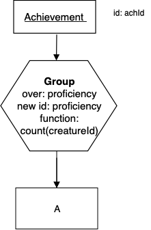

|

.. shortanswer:: short-ex-group1
    :optional:

    The result relation name A is:

The correct answer:

.. reveal:: u-ex13

    Proficiency, CreatureCount of AchievementProficiency

.. fillintheblank:: unary-ex13
    :casei:

    Please fill in the blanks in the following sentence:

    The identifier of the result relation A is  ``|blank|``.
    The base of the result relation A is ``|blank|``.

    -   :proficiency: Correct.
        :x: Incorrect. Should be 'proficiency'.
    -   :Proficiency of Achievement: Correct.
        :AchievementProficiency: Correct.
        :Achievement Proficiency: Correct.
        :x: Incorrect. Should be 'Proficiency of Achievement or AchievementProficiency or Achievement Proficiency'.

**Case 2:**

|

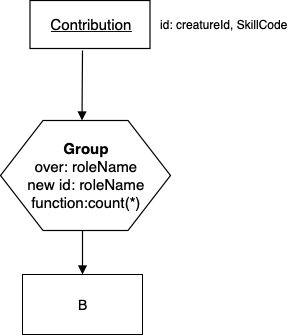

|

.. shortanswer:: short-ex-group2
    :optional:

    The result relation name B is:

The correct answer:
  .. reveal:: u-ex14

      roleName, roleCount of ContributionRoleName

.. fillintheblank:: unary-ex14
    :casei:

    Please fill in the blanks in the following sentence:

    The identifier of the result relation B is  ``|blank|``.
    The base of the result relation B is ``|blank|``.

    -   :roleName: Correct.
        :x: Incorrect. Should be 'roleName'.
    -   :roleName of Contribution: Correct.
        :ContributionRoleName: Correct.
        :Contribution roleName: Correct.
        :x: Incorrect. Should be 'roleName of Contribution or ContributionRoleName or Contribution roleName'.

**Case 3:**

|

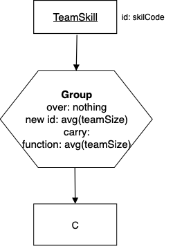

|

.. shortanswer:: short-ex-group3
    :optional:

    The result relation name C is:

The correct answer:

.. reveal:: u-ex15

      averageTeamSize of TeamSkill

.. fillintheblank:: unary-ex15
    :casei:

    Please fill in the blanks in the following sentence:

    The identifier of the result relation is  ``|blank|``.
    The base of the result relation is ``|blank|``.

    -   :averageTeamSize: Correct.
        :x: Incorrect. Should be 'averageTeamSize'.
    -   :averageTeamSize of TeamSkill: Correct.
        :x: Incorrect. Should be 'averageTeamSize of TeamSkill'.

**Case 4:**

|

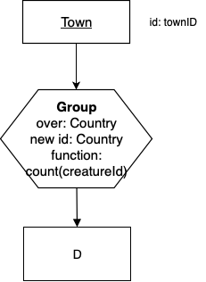

|

.. shortanswer:: short-ex4
    :optional:

    The result relation name D is:

The correct answer:
  .. reveal:: u-ex16

      country, creatureCount of TownCountry

.. fillintheblank:: unary-ex16
    :casei:

    Please fill in the blanks in the following sentence:

    The identifier of the result relation is  ``|blank|``.
    The base of the result relation is ``|blank|``.

    -   :country: Correct.
        :x: Incorrect. Should be 'country'.
    -   :Country of Town: Correct.
        :TownCountry: Correct.
        :Town Country: Correct.
        :x: Incorrect. Should be 'Country of Town, or TownCountry, or Town Country'.

**Case 5:** Let's try something just a bit different.

|

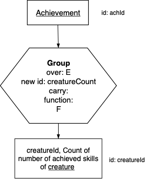

|

.. fillintheblank:: unary-ex17
   :casei:

   Please fill in the blanks in the following sentence:

   E is ``|blank|``.

   F is  ``|blank|``.

   -   :creatureId: Correct.
       :x: Incorrect. Should be 'creatureId'.
   -   :count(skillCode): Correct.
       :x: Incorrect. Should be 'count(skillCode)'.

**Case 6:**

|

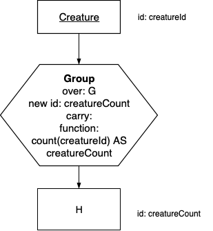

|

.. fillintheblank:: unary-ex18
   :casei:

   Note that he identifier of the result relation is creatureCount. Please fill in the blanks in the following:

   G is ``|blank|``.

   -   :Nothing: Correct.
       :x: Incorrect. Should be 'Nothing'.
    
.. mchoice:: mc-unary-ex18
   :answer_a: count of Creatures
   :answer_b: Creature
   :answer_c: creatureCount of Creature
   :answer_d: creatureCountOfCreature
   :correct: a,c,d 
   :feedback_a: 'count of Creatures' is pithy and reasonably correct way of expressing the result relation, though C and D are nice because it provides a column name that you can use for further analysis, which often happens.
   :feedback_b: The result relation from a group is never the same as the input relation.
   :feedback_c: Giving a name of creatureCount to the single resulting column is helpful for future use of that result relation as an input relation.
   :feedback_d: Some analysts prefer one single long name, since this is returning a single-column relation.

   Which of these is a reasonable name for H (there is more than one correct answer)?

.. mchoice:: tf-unary-ex18
   :answer_a: True
   :answer_b: False
   :correct: a
   :feedback_a: Yes- the point is that the whole name is the base and will be underlined because the result relation contains one column with one row.
   :feedback_b: Review the examples of group over nothing in section 9.7 and notice how we underlined the whole name of the result.

   The base of the result relation is the same as the answer for the previous question.

**Case 7:**

|

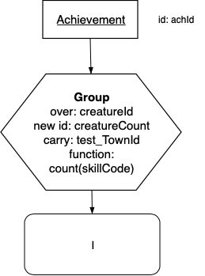

|

.. shortanswer:: short-ex5
    :optional:

  The name I is:

Choose Show to reveal a possible way to name the above result.

.. reveal:: short-ex5-answer

    This is an example of a bad carry in a Group. This makes it hard to name the resulting table, especially because of what the DBMS will likely produce. Something like this might be somewhat accurate, but not a sensical result to give a client:

    creatureId, countOFAchievedSkills, townOfFirstAchievedSkill of AchievingCreature.

    You could try the SQL for this bad carry example in the SQL query box below to see what happens for creatures with more than one achieved skill.

    .. tabbed:: group_practice

        .. tab:: SQL query

            .. activecode:: ex_ach_bad_group
                :language: sql
                :include: ex_achievement_bad_group

                SELECT creatureId, test_townId, count(skillCode)
                FROM achievement
                GROUP BY creatureId;

        .. tab:: Achievement data values

            .. csv-table:: **Achievement**
                :file: ../creatureData/achievement.csv
                :widths: 10, 10, 10, 20, 30, 20
                :header-rows: 1

        .. tab:: SQL data

            .. activecode:: ex_achievement_bad_group
                :language: sql

                DROP TABLE IF EXISTS achievement;
                CREATE TABLE achievement (
                achId              INTEGER NOT NULL PRIMARY KEY AUTOINCREMENT,
                creatureId         INTEGER,
                skillCode          VARCHAR(3),
                proficiency        INTEGER,
                achDate            TEXT,
                test_townId VARCHAR(3) REFERENCES town(townId),     -- foreign key
                FOREIGN KEY (creatureId) REFERENCES creature (creatureId),
                FOREIGN KEY (skillCode) REFERENCES skill (skillCode)
                );

                -- Bannon floats in Anoka (where he aspired)
                INSERT INTO achievement (creatureId, skillCode, proficiency,
                                        achDate, test_townId)
                                VALUES (1, 'A', 3, datetime('now'), 'a');

                -- Bannon swims in Duluth (he aspired in Bemidji)
                INSERT INTO achievement (creatureId, skillCode, proficiency,
                                        achDate, test_townId)
                                VALUES (1, 'E', 3, datetime('2017-09-15 15:35'), 'd');
                -- Bannon floats in Anoka (where he aspired)
                INSERT INTO achievement (creatureId, skillCode, proficiency,
                                        achDate, test_townId)
                                VALUES (1, 'A', 3, datetime('2018-07-14 14:00'), 'a');

                -- Bannon swims in Duluth (he aspired in Bemidji)
                INSERT INTO achievement (creatureId, skillCode, proficiency,
                                        achDate, test_townId)
                                VALUES (1, 'E', 3, datetime('now'), 'd');

                -- Bannon doesn't gargle
                -- Mieska gargles in Tokyo (had no aspiration to)
                INSERT INTO achievement (creatureId, skillCode, proficiency,
                                        achDate, test_townId)
                                VALUES (5, 'Z', 6, datetime('2016-04-12 15:42:30'), 't');

                -- Neff #3 gargles in Blue Earth (but not to his aspired proficiency)
                INSERT INTO achievement (creatureId, skillCode, proficiency,
                                        achDate, test_townId)
                                VALUES (3, 'Z', 4, datetime('2018-07-15'), 'be');
                -- Neff #3 gargles in Blue Earth (but not to his aspired proficiency)
                -- on same day at same proficiency, signifying need for arbitrary id
                INSERT INTO achievement (creatureId, skillCode, proficiency,
                                        achDate, test_townId)
                                VALUES (3, 'Z', 4, datetime('2018-07-15'), 'be');

                -- Beckham achieves PK in London
                INSERT INTO achievement (creatureId, skillCode, proficiency,
                                        achDate, test_townId)
                                VALUES (11, 'PK', 10, datetime('1998-08-15'), 'le');
                -- Kane achieves PK in London
                INSERT INTO achievement (creatureId, skillCode, proficiency,
                                        achDate, test_townId)
                                VALUES (12, 'PK', 10, datetime('2016-05-24'), 'le');
                -- Rapinoe achieves PK in London
                INSERT INTO achievement (creatureId, skillCode, proficiency,
                                        achDate, test_townId)
                                VALUES (13, 'PK', 10, datetime('2012-08-06'), 'le');
                -- Godizilla achieves PK in Tokyo poorly with no date
                -- had not aspiration to do so- did it on a dare ;)
                INSERT INTO achievement (creatureId, skillCode, proficiency,
                                        achDate, test_townId)
                                VALUES (8, 'PK', 1, NULL, 't');

                -- -------------------- -------------------- -------------------
                -- Thor achieves three-legged race in Metroville (with Elastigirl)
                INSERT INTO achievement (creatureId, skillCode, proficiency,
                                        achDate, test_townId)
                                VALUES (9, 'THR', 10, datetime('2018-08-12 14:30'), 'mv');
                -- Elastigirl achieves three-legged race in Metroville (with Thor)
                INSERT INTO achievement (creatureId, skillCode, proficiency,
                                        achDate, test_townId)
                                VALUES (10, 'THR', 10, datetime('2018-08-12 14:30'), 'mv');

                -- Kermit 'pilots' 2-person bobsledding  (pilot goes into contribution)
                --       with Thor as brakeman (brakeman goes into contribution) in Duluth,
                --    achieve at 76% of maxProficiency
                INSERT INTO achievement (creatureId, skillCode, proficiency,
                                        achDate, test_townId)
                                VALUES (7, 'B2', 19, datetime('2017-01-10 16:30'), 'd');
                INSERT INTO achievement (creatureId, skillCode, proficiency,
                                        achDate, test_townId)
                                VALUES (9, 'B2', 19, datetime('2017-01-10 16:30'), 'd');

                -- 4 people form track realy team in London:
                --   Neff #4, Mieska, Myers, Bannon
                --    achieve at 85% of maxProficiency
                INSERT INTO achievement (creatureId, skillCode, proficiency,
                                        achDate, test_townId)
                                VALUES (4, 'TR4', 85, datetime('2012-07-30'), 'le');
                INSERT INTO achievement (creatureId, skillCode, proficiency,
                                        achDate, test_townId)
                                VALUES (5, 'TR4', 85, datetime('2012-07-30'), 'le');
                INSERT INTO achievement (creatureId, skillCode, proficiency,
                                        achDate, test_townId)
                                VALUES (2, 'TR4', 85, datetime('2012-07-30'), 'le');
                INSERT INTO achievement (creatureId, skillCode, proficiency,
                                        achDate, test_townId)
                                VALUES (1, 'TR4', 85, datetime('2012-07-30'), 'le');

                -- Thor, Rapinoe, and Kermit form debate team in Seattle, WA and
                -- achieve at 80% of maxProficiency
                INSERT INTO achievement (creatureId, skillCode, proficiency,
                                        achDate, test_townId)
                                VALUES (9, 'D3', 8, datetime('now', 'localtime'), 'sw');
                INSERT INTO achievement (creatureId, skillCode, proficiency,
                                        achDate, test_townId)
                                VALUES (13, 'D3', 8, datetime('now', 'localtime'), 'sw');
                INSERT INTO achievement (creatureId, skillCode, proficiency,
                                        achDate, test_townId)
                                VALUES (7, 'D3', 8, datetime('now', 'localtime'), 'sw');

**Case 8:**

.. tip::
      Remember: No columns in an identifier of a result relation can be null. Note above when you show the answer, the middle data values tab can remind you what the achievement data contains.

|

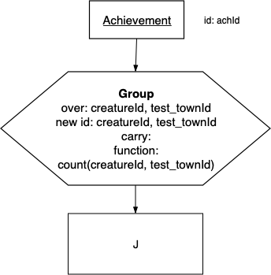

|

.. shortanswer:: short-ex6

  The result relation name J is:

The correct answer:
  .. reveal:: u-ex20

      creatureId, test_townId, Count of number of skills achieved by creature in a test_town

   .. fillintheblank:: unary-ex20
      :casei:

      Please fill in the blanks in the following sentence:

      The identifier of the result relation is  ``|blank|``.
      The base of the result relation is ``|blank|``.

      -   :creatureId, test_townId: Correct.
          :creatureId and test_townId: Correct.
          :x: Should be 'creatureId, test_townId'.
      -   :creature in a test_town: Correct.
          :creature in a test town: Correct.
          :x: J Should be 'creature in a test_town'.

For this interesting query, it would be good for you to practice the SQL version. Change the basic SQL query below to match this precedence chart.

.. tabbed:: group_practice

  .. tab:: SQL query

      .. activecode:: ach_practice_group
         :language: sql
         :include: achievement_practice_group

         SELECT *
         FROM achievement;

  .. tab:: SQL data

      .. activecode:: achievement_practice_group
          :language: sql

          DROP TABLE IF EXISTS achievement;
          CREATE TABLE achievement (
          achId              INTEGER NOT NULL PRIMARY KEY AUTOINCREMENT,
          creatureId         INTEGER,
          skillCode          VARCHAR(3),
          proficiency        INTEGER,
          achDate            TEXT,
          test_townId VARCHAR(3) REFERENCES town(townId),     -- foreign key
          FOREIGN KEY (creatureId) REFERENCES creature (creatureId),
          FOREIGN KEY (skillCode) REFERENCES skill (skillCode)
          );

          -- Bannon floats in Anoka (where he aspired)
          INSERT INTO achievement (creatureId, skillCode, proficiency,
                                   achDate, test_townId)
                          VALUES (1, 'A', 3, datetime('now'), 'a');

          -- Bannon swims in Duluth (he aspired in Bemidji)
          INSERT INTO achievement (creatureId, skillCode, proficiency,
                                   achDate, test_townId)
                          VALUES (1, 'E', 3, datetime('2017-09-15 15:35'), 'd');
          -- Bannon floats in Anoka (where he aspired)
          INSERT INTO achievement (creatureId, skillCode, proficiency,
                                   achDate, test_townId)
                          VALUES (1, 'A', 3, datetime('2018-07-14 14:00'), 'a');

          -- Bannon swims in Duluth (he aspired in Bemidji)
          INSERT INTO achievement (creatureId, skillCode, proficiency,
                                   achDate, test_townId)
                          VALUES (1, 'E', 3, datetime('now'), 'd');

          -- Bannon doesn't gargle
          -- Mieska gargles in Tokyo (had no aspiration to)
          INSERT INTO achievement (creatureId, skillCode, proficiency,
                                   achDate, test_townId)
                          VALUES (5, 'Z', 6, datetime('2016-04-12 15:42:30'), 't');

          -- Neff #3 gargles in Blue Earth (but not to his aspired proficiency)
          INSERT INTO achievement (creatureId, skillCode, proficiency,
                                   achDate, test_townId)
                          VALUES (3, 'Z', 4, datetime('2018-07-15'), 'be');
          -- Neff #3 gargles in Blue Earth (but not to his aspired proficiency)
          -- on same day at same proficiency, signifying need for arbitrary id
          INSERT INTO achievement (creatureId, skillCode, proficiency,
                                   achDate, test_townId)
                          VALUES (3, 'Z', 4, datetime('2018-07-15'), 'be');

          -- Beckham achieves PK in London
          INSERT INTO achievement (creatureId, skillCode, proficiency,
                                   achDate, test_townId)
                          VALUES (11, 'PK', 10, datetime('1998-08-15'), 'le');
          -- Kane achieves PK in London
          INSERT INTO achievement (creatureId, skillCode, proficiency,
                                   achDate, test_townId)
                          VALUES (12, 'PK', 10, datetime('2016-05-24'), 'le');
          -- Rapinoe achieves PK in London
          INSERT INTO achievement (creatureId, skillCode, proficiency,
                                   achDate, test_townId)
                          VALUES (13, 'PK', 10, datetime('2012-08-06'), 'le');
          -- Godizilla achieves PK in Tokyo poorly with no date
          -- had not aspiration to do so- did it on a dare ;)
          INSERT INTO achievement (creatureId, skillCode, proficiency,
                                   achDate, test_townId)
                          VALUES (8, 'PK', 1, NULL, 't');

          -- -------------------- -------------------- -------------------
          -- Thor achieves three-legged race in Metroville (with Elastigirl)
          INSERT INTO achievement (creatureId, skillCode, proficiency,
                                   achDate, test_townId)
                          VALUES (9, 'THR', 10, datetime('2018-08-12 14:30'), 'mv');
          -- Elastigirl achieves three-legged race in Metroville (with Thor)
          INSERT INTO achievement (creatureId, skillCode, proficiency,
                                   achDate, test_townId)
                          VALUES (10, 'THR', 10, datetime('2018-08-12 14:30'), 'mv');

          -- Kermit 'pilots' 2-person bobsledding  (pilot goes into contribution)
          --       with Thor as brakeman (brakeman goes into contribution) in Duluth,
          --    achieve at 76% of maxProficiency
          INSERT INTO achievement (creatureId, skillCode, proficiency,
                                   achDate, test_townId)
                          VALUES (7, 'B2', 19, datetime('2017-01-10 16:30'), 'd');
          INSERT INTO achievement (creatureId, skillCode, proficiency,
                                   achDate, test_townId)
                          VALUES (9, 'B2', 19, datetime('2017-01-10 16:30'), 'd');

          -- 4 people form track realy team in London:
          --   Neff #4, Mieska, Myers, Bannon
          --    achieve at 85% of maxProficiency
          INSERT INTO achievement (creatureId, skillCode, proficiency,
                                   achDate, test_townId)
                          VALUES (4, 'TR4', 85, datetime('2012-07-30'), 'le');
          INSERT INTO achievement (creatureId, skillCode, proficiency,
                                   achDate, test_townId)
                          VALUES (5, 'TR4', 85, datetime('2012-07-30'), 'le');
          INSERT INTO achievement (creatureId, skillCode, proficiency,
                                   achDate, test_townId)
                          VALUES (2, 'TR4', 85, datetime('2012-07-30'), 'le');
          INSERT INTO achievement (creatureId, skillCode, proficiency,
                                   achDate, test_townId)
                          VALUES (1, 'TR4', 85, datetime('2012-07-30'), 'le');

          -- Thor, Rapinoe, and Kermit form debate team in Seattle, WA and
          -- achieve at 80% of maxProficiency
          INSERT INTO achievement (creatureId, skillCode, proficiency,
                                   achDate, test_townId)
                          VALUES (9, 'D3', 8, datetime('now', 'localtime'), 'sw');
          INSERT INTO achievement (creatureId, skillCode, proficiency,
                                   achDate, test_townId)
                          VALUES (13, 'D3', 8, datetime('now', 'localtime'), 'sw');
          INSERT INTO achievement (creatureId, skillCode, proficiency,
                                   achDate, test_townId)
                          VALUES (7, 'D3', 8, datetime('now', 'localtime'), 'sw');

.. note:: The concepts to master by doing these exercises are that the base of the result relation always changes from that of the input relation when doing a Group operation and there are cases we can try that result in a *Bad Group* if we are not careful about the columns we choose to identify the result relation.