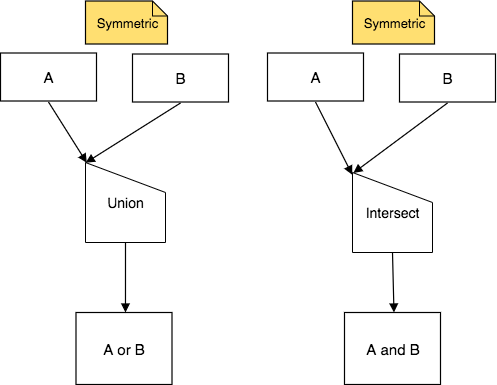
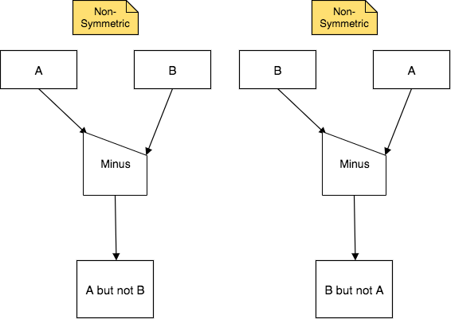
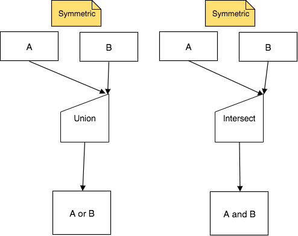
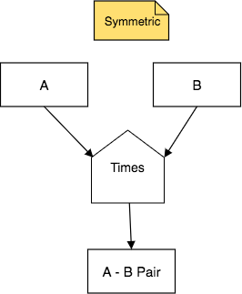

Introduction to the Binary Set Operations
------------------------------------------

This chapter presents four primitive binary "set" operators. These are the first of the binary operators: two result relations are needed as input. When we speak generically, we will refer to these relations as 'A' and 'B'.

The operators have the same names as familiar corresponding set theory operators do and often perform just like they do: Union, Intersect, Minus, and Times. However, "set" is in quotes because in some cases they perform differently. This is so because, while the set theory operators process sets of simple elements, these operators process relations of rows, rather than simple elements.

Union and Intersect: the Symmetric Operators
~~~~~~~~~~~~~~~~~~~~~~~~~~~~~~~~~~~~~~~~~~~~~~

Here is the generic form of the first two of the set operators, Union and Intersect:

|

|

Minus: the Non-Symmetric Operator
~~~~~~~~~~~~~~~~~~~~~~~~~~~~~~~~~~

Here is the generic form of the third set operator, Minus:

|

|

Important Points about Union, Intersect, and Minus
~~~~~~~~~~~~~~~~~~~~~~~~~~~~~~~~~~~~~~~~~~~~~~~~~~

Some very important aspects of these three operators and their input relations are as follows. You may want to refer back to this information again as you practice working with these.

- The input relations are treated as sets of instances. Because of this, to properly compare instances, or rows, **each of the two input relations must have the same number of columns and the types of those columns must match in order.**

.. tip:: The above point is easy to overlook at first reading of this information. Stop and soak this one in and recall it as we present examples- these operators do not work and produce errors in SQL if you do not ensure that A and B have the same structure.

- Because of the above restriction, the result relation also has the same number of columns as each of the two input relations.

- The input relations are rarely, if ever, original relations in your database. You most often use these operators on relations that were created by using other operators first.

- Intersect and Union are **symmetric**, meaning that the order of the input relations named A and B above does not matter- the result relation will be the same. The way that both arrows point to the upper corner of the half-house shape indicate the non-symmetry. Because of this symmetry, you might for convenience want to draw them with the upper corner on the right, like this:

- One of the operators, Minus, is **non-symmetric**, because the order of the input relations matters. The way that the arrows point to upper and lower corners of the half-house shape indicate the non-symmetry. A Minus B is different than B Minus A.

- There is an easy pattern to naming the result relation from each of these operators. You can see it in the generic charts above. When you work, simply replace A and B with the input relation names (e.g. "swimming achieving creature but not gargling achieving creature", or shortened to "swimming but not gargling achieving creature"). Here is a summary for naming using these operators with A and B:

+---------+------------+--------+----------------+
| Input   | Operator   | Input  | Generic Phrase |
+=========+============+========+================+
| A       |Union       |  B     | A or B         |
+---------+------------+--------+----------------+
| A       |Intersect   |  B     | A and B        |
+---------+------------+--------+----------------+
| A       |Minus       |  B     | A but not B    |
+---------+------------+--------+----------------+
| B       |Minus       |  A     | B but not A    |
+---------+------------+--------+----------------+

Times, another Symmetric Operator
~~~~~~~~~~~~~~~~~~~~~~~~~~~~~~~~~

Here is the generic form of the fourth operator, Times, which is like a cartesian product:

|

|

Some important aspects of this operator are:

- The input relations can be any relation, whether it was originally in your database, or was derived as a result relation from previous operations.

- The input relations can have differing numbers of columns and often do, but they can have the same number of columns or even be the same relation.

- Times is **symmetric**, meaning that the order of the input relations named A and B above does not matter- the result relation will be the same.

- The number of columns in the result relation from times is the number of columns of A plus the number of columns of B. This is a reason that the shape is a full house- it is helping to remind you that the result is wider.

- Times is the basis of other more complex binary operators that we will see in subsequent chapters. This is why it is important to understand what it does.

|

We will next provide examples of each of these operators in action, along with illustrations to help you visualize how the result relations are obtained. We start with Union, Intersect, and Minus, with simple and more complex examples. Then we will show examples of Times, which is decidedly different that the other three.

|
