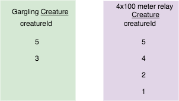
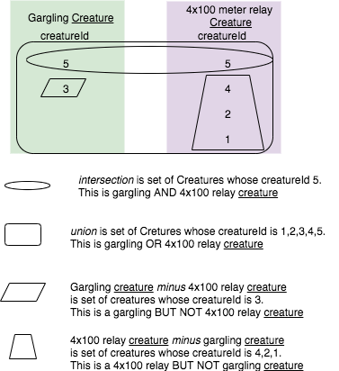
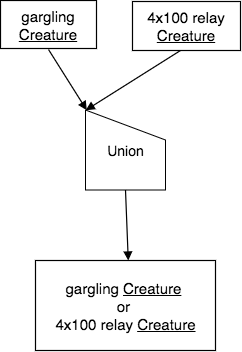
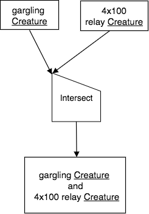
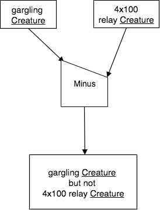

Simplest Examples of Union, Intersect, and Minus
---------------------------------------------------

We will start with very simple input relations in this section as a means to visualize and understand how the first three set operators work.

Visualize an Example
~~~~~~~~~~~~~~~~~~~~

In the previous section, one important point about the first three of these set operators is that the input relations are usually a result relation from performing another operation, for example a Filter and a Reduce. Let us use two such relations for our first example:

1. Gargling Creature, or in a longer form: creatureId of Creature who has achieved gargling skill, whose skillCode is 'Z'.

2. 4x100 relay Creature, or in a longer form: creatureId of Creature who has achieved 4x100 meter track relay skill, whose skillCode is 'TR4'.

These two 1-column relations, which are result relations from performing a Filter on Achievement followed by a Reduce, can be drawn as if each row is an element in the set that makes up each relation, like this:

|

|

.. note:: Notice how these two relations each have one column and it's the same in each: creatureId.

Now let's imagine the result of each of the three set operations on these two input relations. This can be illustrated by indicating what will be in the result for each operator, like this

|

|

Study the above picture carefully to see what should result from each of the operators. We will examine the English query, the relational algebra precedence chart, and the SQL for each operator.

Union example
~~~~~~~~~~~~~

The English query is:

    Find each gargling or 4x100 relay achieving creature.

The precedence chart for Union using the two intermediate relations mentioned above is:

|

|

The SQL for this query is:

.. tabbed:: union1

    .. tab:: SQL query gargling or 4x100 relay

        .. activecode:: gargling_or_4x100relay_achieveing_creature
           :language: sql
           :include: achievement_create_set, 4x100relay_creature, gargling_creature
           :showlastsql:

           DROP TABLE IF EXISTS garglingOr4x100RelayCreature;

           CREATE TABLE garglingOr4x100RelayCreature AS
           SELECT creatureId
           FROM garglingCreature
           UNION
           SELECT creatureId
           FROM relay4x100Creature;

           SELECT * FROM garglingOr4x100RelayCreature;

    .. tab:: SQL query gargling

        .. activecode:: gargling_creature
           :language: sql
           :include: achievement_create_set
           :showlastsql:

           DROP TABLE IF EXISTS garglingCreature;

           CREATE TABLE garglingCreature AS
           SELECT creatureId
           FROM achievement
           WHERE skillCode = 'Z';

    .. tab:: SQL query 4x100

       .. activecode:: 4x100relay_creature
          :language: sql
          :include: achievement_create_set
          :showlastsql:

          DROP TABLE IF EXISTS relay4x100Creature;

          CREATE TABLE relay4x100Creature AS
          SELECT creatureId
          FROM achievement
          WHERE skillCode = 'TR4';

    .. tab:: SQL data

       .. activecode:: achievement_create_set
          :language: sql

          DROP TABLE IF EXISTS achievement;
          CREATE TABLE achievement (
          achId              INTEGER NOT NULL PRIMARY KEY AUTOINCREMENT,
          creatureId         INTEGER,
          skillCode          VARCHAR(3),
          proficiency        INTEGER,
          achDate            TEXT,
          test_townId VARCHAR(3) REFERENCES town(townId),     -- foreign key
          FOREIGN KEY (creatureId) REFERENCES creature (creatureId),
          FOREIGN KEY (skillCode) REFERENCES skill (skillCode)
          );

          -- Bannon floats in Anoka (where he aspired)
          INSERT INTO achievement (creatureId, skillCode, proficiency,
                                   achDate, test_townId)
                          VALUES (1, 'A', 3, datetime('now'), 'a');

          -- Bannon swims in Duluth (he aspired in Bemidji)
          INSERT INTO achievement (creatureId, skillCode, proficiency,
                                   achDate, test_townId)
                          VALUES (1, 'E', 3, datetime('2017-09-15 15:35'), 'd');
          -- Bannon floats in Anoka (where he aspired)
          INSERT INTO achievement (creatureId, skillCode, proficiency,
                                   achDate, test_townId)
                          VALUES (1, 'A', 3, datetime('2018-07-14 14:00'), 'a');

          -- Bannon swims in Duluth (he aspired in Bemidji)
          INSERT INTO achievement (creatureId, skillCode, proficiency,
                                   achDate, test_townId)
                          VALUES (1, 'E', 3, datetime('now'), 'd');

          -- Bannon doesn't gargle
          -- Mieska gargles in Tokyo (had no aspiration to)
          INSERT INTO achievement (creatureId, skillCode, proficiency,
                                   achDate, test_townId)
                          VALUES (5, 'Z', 6, datetime('2016-04-12 15:42:30'), 't');

          -- Neff #3 gargles in Blue Earth (but not to his aspired proficiency)
          INSERT INTO achievement (creatureId, skillCode, proficiency,
                                   achDate, test_townId)
                          VALUES (3, 'Z', 4, datetime('2018-07-15'), 'be');
          -- Neff #3 gargles in Blue Earth (but not to his aspired proficiency)
          -- on same day at same proficiency, signifying need for arbitrary id
          INSERT INTO achievement (creatureId, skillCode, proficiency,
                                   achDate, test_townId)
                          VALUES (3, 'Z', 4, datetime('2018-07-15'), 'be');

          -- Beckham achieves PK in London
          INSERT INTO achievement (creatureId, skillCode, proficiency,
                                   achDate, test_townId)
                          VALUES (11, 'PK', 10, datetime('1998-08-15'), 'le');
          -- Kane achieves PK in London
          INSERT INTO achievement (creatureId, skillCode, proficiency,
                                   achDate, test_townId)
                          VALUES (12, 'PK', 10, datetime('2016-05-24'), 'le');
          -- Rapinoe achieves PK in London
          INSERT INTO achievement (creatureId, skillCode, proficiency,
                                   achDate, test_townId)
                          VALUES (13, 'PK', 10, datetime('2012-08-06'), 'le');
          -- Godizilla achieves PK in Tokyo poorly with no date
          -- had not aspiration to do so- did it on a dare ;)
          INSERT INTO achievement (creatureId, skillCode, proficiency,
                                   achDate, test_townId)
                          VALUES (8, 'PK', 1, NULL, 't');

          -- -------------------- -------------------- -------------------
          -- Thor achieves three-legged race in Metroville (with Elastigirl)
          INSERT INTO achievement (creatureId, skillCode, proficiency,
                                   achDate, test_townId)
                          VALUES (9, 'THR', 10, datetime('2018-08-12 14:30'), 'mv');
          -- Elastigirl achieves three-legged race in Metroville (with Thor)
          INSERT INTO achievement (creatureId, skillCode, proficiency,
                                   achDate, test_townId)
                          VALUES (10, 'THR', 10, datetime('2018-08-12 14:30'), 'mv');

          -- Kermit 'pilots' 2-person bobsledding  (pilot goes into contribution)
          --       with Thor as brakeman (brakeman goes into contribution) in Duluth,
          --    achieve at 76% of maxProficiency
          INSERT INTO achievement (creatureId, skillCode, proficiency,
                                   achDate, test_townId)
                          VALUES (7, 'B2', 19, datetime('2017-01-10 16:30'), 'd');
          INSERT INTO achievement (creatureId, skillCode, proficiency,
                                   achDate, test_townId)
                          VALUES (9, 'B2', 19, datetime('2017-01-10 16:30'), 'd');

          -- 4 people form track realy team in London:
          --   Neff #4, Mieska, Myers, Bannon
          --    achieve at 85% of maxProficiency
          INSERT INTO achievement (creatureId, skillCode, proficiency,
                                   achDate, test_townId)
                          VALUES (4, 'TR4', 85, datetime('2012-07-30'), 'le');
          INSERT INTO achievement (creatureId, skillCode, proficiency,
                                   achDate, test_townId)
                          VALUES (5, 'TR4', 85, datetime('2012-07-30'), 'le');
          INSERT INTO achievement (creatureId, skillCode, proficiency,
                                   achDate, test_townId)
                          VALUES (2, 'TR4', 85, datetime('2012-07-30'), 'le');
          INSERT INTO achievement (creatureId, skillCode, proficiency,
                                   achDate, test_townId)
                          VALUES (1, 'TR4', 85, datetime('2012-07-30'), 'le');

          -- Thor, Rapinoe, and Kermit form debate team in Seattle, WA and
          -- achieve at 80% of maxProficiency
          INSERT INTO achievement (creatureId, skillCode, proficiency,
                                   achDate, test_townId)
                          VALUES (9, 'D3', 8, datetime('now', 'localtime'), 'sw');
          INSERT INTO achievement (creatureId, skillCode, proficiency,
                                   achDate, test_townId)
                          VALUES (13, 'D3', 8, datetime('now', 'localtime'), 'sw');
          INSERT INTO achievement (creatureId, skillCode, proficiency,
                                   achDate, test_townId)
                          VALUES (7, 'D3', 8, datetime('now', 'localtime'), 'sw');

Notice how we have a convenient keyword called UNION in this case. In the second and third tabs above we created intermediate relations to hold 'gargling creature' and '4x100 relay creature'. We then used those relations in the first tab. We will use these relations again when illustrating Intersect and Minus next.

.. note:: The Union operator *automatically removes duplicate rows*. Notice how creature 5 appears only once in the result relation, making it a relation.

Intersect example
~~~~~~~~~~~~~~~~~~

The English query is:

    Find each gargling and 4x100 relay achieving creature.

The precedence chart for Intersect using the two intermediate relations mentioned above is:

|

|

The SQL for this query uses the data and intermediate relations from the Union example, and is very similar to it:

.. activecode:: gargling_and_4x100relay_achieveing_creature
   :language: sql
   :include: achievement_create_set, 4x100relay_creature, gargling_creature
   :showlastsql:

   DROP TABLE IF EXISTS garglingAnd4x100RelayCreature;

   CREATE TABLE garglingAnd4x100RelayCreature AS
   SELECT creatureId
   FROM garglingCreature
   INTERSECT
   SELECT creatureId
   FROM relay4x100Creature;

   SELECT * FROM garglingAnd4x100RelayCreature;

.. note:: The Intersect operator *automatically removes duplicate rows*. Notice how creature 5 appears only once in the result relation, making it a relation.

Minus examples
~~~~~~~~~~~~~~~~~~

The first English query is:

    Find each gargling but not 4x100 relay achieving creature.

The precedence chart for Minus using the two intermediate relations mentioned above is:

|

|

The SQL for this query uses the data and intermediate relations from the Union example, and is very similar to it:

.. activecode:: gargling_ButNot_4x100relay_achieveing_creature
   :language: sql
   :include: achievement_create_set, 4x100relay_creature, gargling_creature
   :showlastsql:

   DROP TABLE IF EXISTS garglingButNot4x100RelayCreature;

   CREATE TABLE garglingButNot4x100RelayCreature AS
   SELECT creatureId
   FROM garglingCreature
   EXCEPT
   SELECT creatureId
   FROM relay4x100Creature;

   SELECT * FROM garglingButNot4x100RelayCreature;

This second English query is also needed because Minus in non-symmetric:

   Find each 4x100 relay but not gargling achieving creature.

The precedence chart for Intersect using the two intermediate relations mentioned above is:

|

.. image:: ../img/SetExamples/SimpleMinus2.png

|

The SQL for this query again uses the data and intermediate relations from the Union example, and is very similar to it:

.. activecode:: relay4x100_ButNot_gargling_achieveing_creature
  :language: sql
  :include: achievement_create_set, 4x100relay_creature, gargling_creature
  :showlastsql:

  DROP TABLE IF EXISTS Relay4x100ButNotgarglingCreature;

  CREATE TABLE Relay4x100ButNotgarglingCreature AS
  SELECT creatureId
  FROM relay4x100Creature
  EXCEPT
  SELECT creatureId
  FROM garglingCreature;

  SELECT * FROM Relay4x100ButNotgarglingCreature;

.. warning:: The SQL for the Minus operator varies for each DBMS. In Oracle, the keyword is MINUS rather than SQLite's EXCEPT shown above. In MySQL there is no single keyword syntax, and there is more than one way to get the job done. Here is one, using the phrase 'NOT IN' and some syntax known as an inner query (in the parentheses).

.. code-block:: SQL

  -- Minus in MySQL using NOT IN
  --
  SELECT A.creatureId from relay4x100Creature A
  WHERE (A.creatureId)  NOT IN
  (SELECT B.creatureId from garglingCreature B)
  ;

Exercises
~~~~~~~~~~

Try creating the precedence charts for these queries. Use a drawing tool such as draw.net.
Try charts for these below as practice. 

.. tip:: 
   Before sending two relations into the set operation, you will first need to use other unary operators that you have already practiced. You will need to ensure that the two input relations to Union, Intersect, and Minus each have the same number an type of columns.

   Recall this summary from the beginning of this chapter for which operations go with words used in the queries:

   +---------+------------+--------+----------------+
   | Input   | Operator   | Input  | Generic Phrase |
   +=========+============+========+================+
   | A       |Union       |  B     | A or B         |
   +---------+------------+--------+----------------+
   | A       |Intersect   |  B     | A and B        |
   +---------+------------+--------+----------------+
   | A       |Minus       |  B     | A but not B    |
   +---------+------------+--------+----------------+
   | B       |Minus       |  A     | B but not A    |
   +---------+------------+--------+----------------+

   Not every English query below has these words- you can practice re-wording those to help guide you.

`This drawio operator template <https://drive.google.com/file/d/1AduoHhvr7ve4gVrcl-9nnoHR1Yne4WQH/view?usp=sharing>`_ has an additional tab for binary set ops that can serve as a template for drawing the precedence charts. If you dowloaded this and used it already, you just have to go find the extra tab with a new drawing.

**English Query:**

  1. Find each skillCode, test_townId of achievement but not skillCode, origin_townId of skill.

  2. Find each Skill originating in one town but not achieved in that town.

  3. Find each Skill originating in one town or achieved in any town.

  4. Find each Skill that has not been achieved (find each unachieved skill).

  5. Find each Creature who has not achieved (find each non-achieving creature).

  6. Find each Town with no achieved Skills.

  7. Find each Town with no aspired to Skills.
