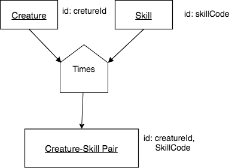
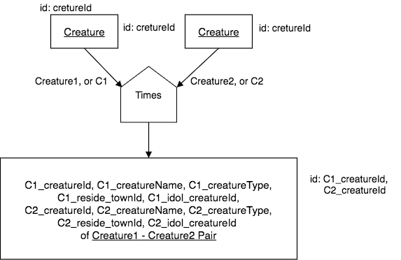

Times
-------

In this section we present a simple, yet powerful primitive set operator, Times. Its power comes because it is the basis of the exactly-matching binary operators we present later, and is also used in the very interesting compare-join operator, which will appear near the end of this book.

Times works on no columns and accepts *any* two input relations A and B – different bases, same base, or same relation. To produce the result relation Times does no matching but instead merely juxtaposes each row of one input relation against each row of the other input relation. It is like the mathematical cartesian product set function, and is often called cartesian product or cross-join by database theorists and practitioners.

Why learn Times? Well, an understanding of what Times does and when to use it underpins your mastery of of the the rest of the non-Primitive exactly matching operators and a not-exactly matching operator, compare join. While you may hear other people say, or may have thoughts yourself, such as “Wow, Times is expensive, so don’t use it," this is flawed logic. Understanding and using times opens the door to some amazingly interesting analyses on relational databases. So let's see how it works.

The result relation’s name and structure for a Times are straightforward.

Name characteristics- the result relation has:

-  No row modifier.

-  No column modifier.

-  An identifier consisting of A’s identifying columns plus B’s identifying columns.

Structure characteristics- the result relation has:

-  A column corresponding to each A relation column plus each B relation column.

-  As many rows as the product of the number of rows of the input relations.

Example 1: different bases as input relations
~~~~~~~~~~~~~~~~~~~~~~~~~~~~~~~~~~~~~~~~~~~~~

The input relations can be the same relation, same base, or different base. We will first provide a different base example.

English query

  Find each Creature-Skill pair.

It is important to understand that this query is finding the universe of all possible creatures paired with all possible skills. The result relation has many more rows than, for example, the Achievement relation in the small creature database.

Precedence Chart

The chart for this query looks like this:

|

|

The SQL to complete the times is also quite simple:

.. tabbed:: times1

    .. tab:: SQL query

      .. activecode:: creature_skill_times
         :language: sql
         :include: creature_skill_create_times

         SELECT creature.*, skill.*
         FROM creature, skill;

    .. tab:: SQL query save result

      .. activecode:: creature_skill_times_save
         :language: sql
         :include: creature_skill_create_times

         DROP TABLE IF EXISTS Creature_Skill_Pair;

         CREATE TABLE Creature_Skill_Pair AS
         SELECT creature.*, skill.*
         FROM creature, skill;

    .. tab:: SQL count

      .. activecode:: creature_skill_pair_count
         :language: sql
         :include: creature_skill_create_times, creature_skill_times_save

         SELECT count(*)
         FROM Creature_Skill_Pair;

    .. tab:: SQL data

       .. activecode:: creature_skill_create_times
          :language: sql

          DROP TABLE IF EXISTS creature;
          CREATE TABLE creature (
          creatureId          INTEGER      NOT NUll PRIMARY KEY,
          creatureName        VARCHAR(20),
          creatureType        VARCHAR(20),
          reside_townId VARCHAR(3) REFERENCES town(townId),     -- foreign key
          idol_creatureId     INTEGER,
          FOREIGN KEY(idol_creatureId) REFERENCES creature(creatureId)
          );

          INSERT INTO creature VALUES (1,'Bannon','person','p',10);
          INSERT INTO creature VALUES (2,'Myers','person','a',9);
          INSERT INTO creature VALUES (3,'Neff','person','be',NULL);
          INSERT INTO creature VALUES (4,'Neff','person','b',3);
          INSERT INTO creature VALUES (5,'Mieska','person','d', 10);
          INSERT INTO creature VALUES (6,'Carlis','person','p',9);
          INSERT INTO creature VALUES (7,'Kermit','frog','g',8);
          INSERT INTO creature VALUES (8,'Godzilla','monster','t',6);
          INSERT INTO creature VALUES (9,'Thor','superhero','as',NULL);
          INSERT INTO creature VALUES (10,'Elastigirl','superhero','mv',13);
          INSERT INTO creature VALUES (11,'David Beckham','person','le',9);
          INSERT INTO creature VALUES (12,'Harry Kane','person','le',11);
          INSERT INTO creature VALUES (13,'Megan Rapinoe','person','sw',10);

          DROP TABLE IF EXISTS skill;

          CREATE TABLE skill (
          skillCode          VARCHAR(3)      NOT NUll PRIMARY KEY,
          skillDescription   VARCHAR(40),
          maxProficiency     INTEGER,     -- max score that can be achieved for this skill
          minProficiency     INTEGER,     -- min score that can be achieved for this skill
          origin_townId      VARCHAR(3)     REFERENCES town(townId)     -- foreign key
          );

          INSERT INTO skill VALUES ('A', 'float', 10, -1,'b');
          INSERT INTO skill VALUES ('E', 'swim', 5, 0,'b');
          INSERT INTO skill VALUES ('O', 'sink', 10, -1,'b');
          INSERT INTO skill VALUES ('U', 'walk on water', 5, 1,'d');
          INSERT INTO skill VALUES ('Z', 'gargle', 5, 1,'a');
          INSERT INTO skill VALUES ('B2', '2-crew bobsledding', 25, 0,'d');
          INSERT INTO skill VALUES ('TR4', '4x100 meter track relay', 100, 0,'be');
          INSERT INTO skill VALUES ('C2', '2-person canoeing', 12, 1,'t');
          INSERT INTO skill VALUES ('THR', 'three-legged race', 10, 0,'g');
          INSERT INTO skill VALUES ('D3', 'Australasia debating', 10, 1,NULL);
          INSERT INTO skill VALUES ('PK', 'soccer penalty kick', 10, 1, 'le');

The result relation has more rows than the embedded version of SQLite in this web-based book will let us display, as you will see when you run the tab named SQL Query. The next tab to its right shows how we can save the result. The tab labeled 'SQL count' will show you how many total rows are in the result.

This universe of all possible pairings of a creature with a skill can be useful to compare to what is in Achievement or Aspiration, which also have the base noun *Creature-Skill Pair*  in their alternative names (Achieving Creature-SKill Pair and Aspiring Creature-Skill pair, respectively).

Other pairings the result from Times are also extremely useful: we will see an example in the next chapter, which provides an example of Times followed by Filter and Project. This turns out to be a very prevalent pattern in queries.

Example 2: Same relation inputs
~~~~~~~~~~~~~~~~~~~~~~~~~~~~~~~

This example may seem odd at first, but as we continue our study later with match join examples, you will see where this Times example leads to interesting queries that start with this as the first underlying step of the join.

English query

  Find each Creature-Creature pair.

Precedence Chart

The chart for this query looks like this:

|

|

The chart above and the following SQL for this query represent a challenge that arises with Times that we must consider. When there are like-named columns in the two input relations (this is the extreme case of that where each pair of columns coming from the inputs are named the same), the result relation must have new names for those columns. Note that we also *apply a tag near the arrow going out of each input relation* that is essentially renaming each input so that we can keep track of each one.

In the query below, notice how the keyword AS is being used to rename each column from each of the two relations. Also note how those relations are renamed to C1 and C2 in the FROM clause.

Since there are 13 creatures, the result has 13 * 13 rows, or 169 rows, including each creature paired with itself. In the first tab, the displayed result is again truncated to 100 rows. In the other tabs, you can see how an intermediate table is created and its rows can be counted to see that it indeed has 169 rows.

.. important:: It is also important to realize that the result of this type of Times operation when the two inputs are the same relation is **an ordered pair.**. In this case it is an ordered pair of creatures. Convince yourself of why this is by looking at the partial result before moving on.

.. tabbed:: times2

    .. tab:: SQL query

      .. activecode:: creature_creature_times
         :language: sql
         :include: creature_skill_create_times

          SELECT C1.creatureId AS C1_creatureId,
                 C1.creatureName AS C1_creatureName,
                 C1.creatureType AS C1_creatureType,
                 C1.reside_townId AS C1_reside_townId,
                 C1.idol_creatureId AS C1_idol_creatureId,
                 C2.creatureId AS C2_creatureId,
                 C2.creatureName AS C2_creatureName,
                 C2.creatureType AS C2_creatureType,
                 C2.reside_townId AS C2_reside_townId,
                 C2.idol_creatureId AS C2_idol_creatureId
          FROM creature C1, creature C2;

    .. tab:: SQL query save result

      .. activecode:: creature_creature_times_save
         :language: sql
         :include: creature_skill_create_times

           DROP TABLE IF EXISTS Creature_Creature_Pair;

           CREATE TABLE Creature_Creature_Pair AS
           SELECT C1.creatureId AS C1_creatureId,
                  C1.creatureName AS C1_creatureName,
                  C1.creatureType AS C1_creatureType,
                  C1.reside_townId AS C1_reside_townId,
                  C1.idol_creatureId AS C1_idol_creatureId,
                  C2.creatureId AS C2_creatureId,
                  C2.creatureName AS C2_creatureName,
                  C2.creatureType AS C2_creatureType,
                  C2.reside_townId AS C2_reside_townId,
                  C2.idol_creatureId AS C2_idol_creatureId
          FROM creature C1, creature C2;

    .. tab:: SQL count

      .. activecode:: creature_creature_pair_count
         :language: sql
         :include: creature_skill_create_times, creature_creature_times_save

           SELECT count(*)
           FROM Creature_Creature_Pair;

What is the base?
~~~~~~~~~~~~~~~~~

Determining the base of the result relation from a times seems straightforward from these two examples, which I will now slightly rephrase here, given the important aspect of the second same-relation Times example mentioned above:

1. Creature-Skill pair.
2. Ordered Creature1-Creature2 pair.

The identifying columns of the new result relation are the combination of the identifying columns of the two input relations (note this in the charts for these examples if you did not catch that).

However, the naming becomes more difficult when the inputs are longer intermediate relations from other operations. Go to the next section to see an interesting combination of the operators we have seen so far where this becomes apparent.

|

Exercises
~~~~~~~~~~
Try creating the precedence charts for these queries. Use a drawing tool such as draw.io.

**English Query:**

  1. Ordered creature – skill pair where each creature has achieved the same skill

  2. Ordered creature – town pair

  3. Ordered skill – town pair
