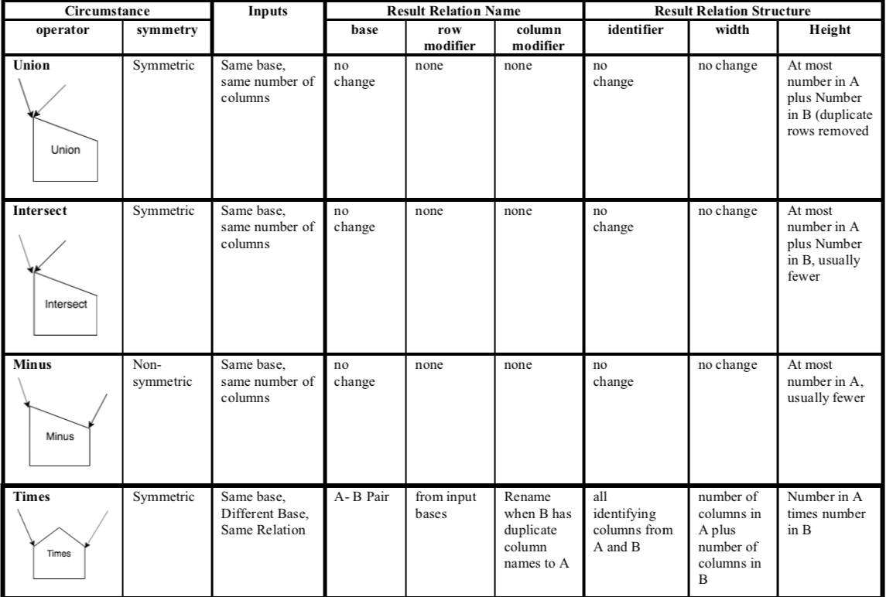

Summary of Binary Set Operators
--------------------------------

The table below shows the various circumstances for all of the binary set  operators illustrated in this chapter. We can think of this as the framework for how the set operations work.

With 2 input relations, A and B, we introduce new considerations:

- A new notion of the *symmetry* of the operator.  This is an indicator of whether the order of input relations A and B has a difference on the result relation’s contents. If symmetric, the order does not matter. If non-symmetric, the order of A and B matters (Minus is the one operator where this matters among these set operators).

- We also begin now to consider the base of each input relation A and B: are they

  1.	the same base,
  2.	different bases,
  3.	the same relation.

We do not yet consider what columns are ‘worked on’ with these set operators, because it is always all of them. This why we call these ‘primitive’ binary operators.

|

    The Primitive Binary Set Operator Framework

|

You can download :download:`The Primitive Set Ops Framework Document <SetOpsFramework.pdf>` and keep a copy for your own reference. It is useful to refer to how each operator should work as you practice on the previous examples or on your own data.

|
