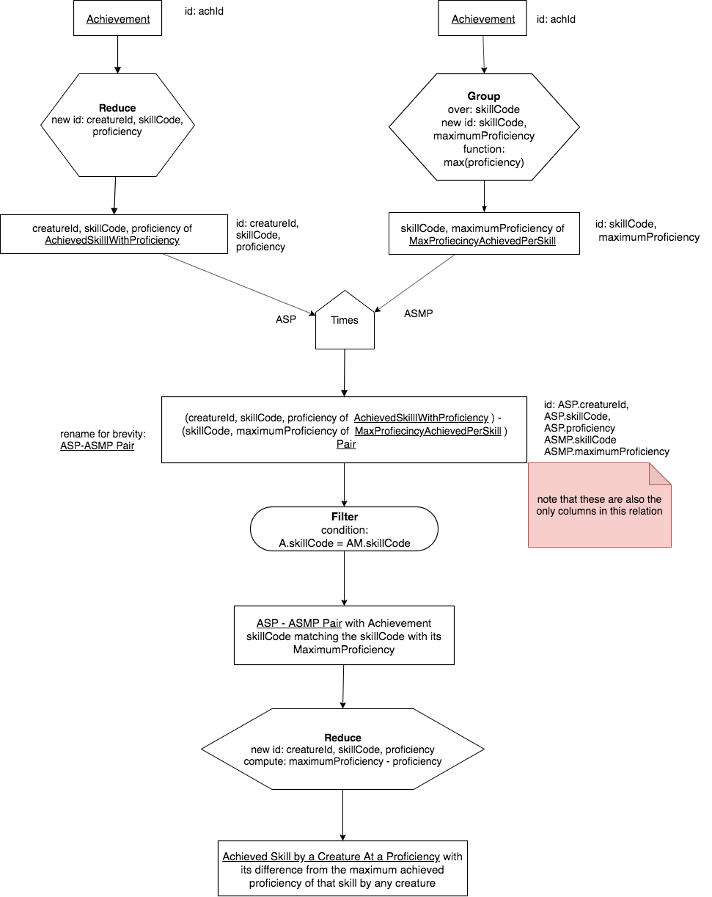

An often-used Combination
--------------------------

In this brief interlude we will see a pattern that occurs fairly often in many queries. It combines all of the unary operators and Times. Try to study it to be certain that you understand what is in each result (I have made a note to help in one case). Note what an interesting result we can obtain.

**The English query is:**

    How does each creature's achieved skill proficiency compare to other creatures who have achieved the best proficiency at that skill?

Note here that we will need to know what the maximum score achieved per skill was (implying group). The words "compare to" in the query require us to interpret them in some way. In this case, I chose to compute the difference between each creature's achievement proficiency at that skill and the maximum achieved for that skill by any creature (this implies a computed column, which we interesting will add to a reduce- check that out below). A value of zero means that creature achieved the maximum, and the higher the value, the farther from the maximum they were.

**The Precedence Chart**

Here is our longest precedence chart so far- it does get the job done and demonstrates the power of what you can do with relational algebra.

|

|

In this chart, I chose to show achievement twice at the top. It could be included once- it wouldn't change the query. I chose this way of visualizing it because when we convert it into SQL, the top left portion and the top right portion before the times are best completed as separate queries where an intermediate relation is produced. The two intermediate relations then are used in the Times to create another intermediate relation.

.. tip:: Notice in the chart above that the result relation name after the Times gets long, and in is useful to put the A and B input relation names in parentheses. Then to the left of the entity I chose to shorten the name going forward in the chart. This is a practice that I use most of the time on bigger charts: show the detail inside the relation box just after the operation like Times, then shorten it going forward.

**The longer SQL query with intermediate relations:**

In the following SQL code tabs, the creation of the intermediate relations is in the second tab. **Study this code carefully and compare it to the chart above.**

.. tip:: The use of intermediate relations to complete a longer query like this makes the result possible to attain with fewer errors. It is sometimes possible to create single long complex SQL queries for some charts, but debugging them and reading them later is very hard. The use of intermediate relations that match points in the precedence chart like we have done here makes producing correct results the first time much easier.

.. tabbed:: after_set_query

  .. tab:: SQL show

      .. activecode:: Show_Skill_Prof_Difference
         :language: sql
         :include: achievement_after_set_create, after_set_intermediate

         SELECT *
         FROM AchSkillByCreatureDifferenceFromMax;

  .. tab:: SQL Intermediate

     .. activecode:: after_set_intermediate
        :language: sql
        :include: achievement_after_set_create

        -- top left side of chart
        DROP TABLE IF EXISTS AchievedSkillWithProficiency;
        CREATE TABLE AchievedSkillWithProficiency AS
        SELECT distinct creatureId, skillCode, proficiency
        FROM achievement;

        -- top right side of chart
        DROP TABLE IF EXISTS MaxProficiencyAchievedPerSkill;
        CREATE TABLE MaxProficiencyAchievedPerSkill AS
        SELECT skillCode, max(proficiency) AS maxProficiency
        FROM achievement
        GROUP BY skillCode;

        -- Times (duplicate skillCode renamed)
        DROP TABLE IF EXISTS AchievedSkill_MaxProficiency_Pair;
        CREATE TABLE AchievedSkill_MaxProficiency_Pair AS
        SELECT A.*, B.skillCode AS maxSkillCode, B.maxProficiency
        FROM AchievedSkillWithProficiency A,
             MaxProficiencyAchievedPerSkill B;

        -- Filter, reduce and compute proficiencyDifference
        DROP TABLE IF EXISTS AchSkillByCreatureDifferenceFromMax;
        CREATE TABLE AchSkillByCreatureDifferenceFromMax AS
        SELECT creatureId, skillCode,
                maxProficiency - proficiency AS proficiencyDifference
        FROM AchievedSkill_MaxProficiency_Pair
        WHERE skillCode = maxSkillCode;

  .. tab:: SQL data

     .. activecode:: achievement_after_set_create
        :language: sql

        DROP TABLE IF EXISTS achievement;
        CREATE TABLE achievement (
        achId              INTEGER NOT NUll PRIMARY KEY AUTOINCREMENT,
        creatureId         INTEGER,
        skillCode          VARCHAR(3),
        proficiency        INTEGER,
        achDate            TEXT,
        test_townId VARCHAR(3) REFERENCES town(townId),     -- foreign key
        FOREIGN KEY (creatureId) REFERENCES creature (creatureId),
        FOREIGN KEY (skillCode) REFERENCES skill (skillCode)
        );

        -- Bannon floats in Anoka (where he aspired)
        INSERT INTO achievement (creatureId, skillCode, proficiency,
                                 achDate, test_townId)
                        VALUES (1, 'A', 3, datetime('now'), 'a');

        -- Bannon swims in Duluth (he aspired in Bemidji)
        INSERT INTO achievement (creatureId, skillCode, proficiency,
                                 achDate, test_townId)
                        VALUES (1, 'E', 3, datetime('2017-09-15 15:35'), 'd');
        -- Bannon floats in Anoka (where he aspired)
        INSERT INTO achievement (creatureId, skillCode, proficiency,
                                 achDate, test_townId)
                        VALUES (1, 'A', 3, datetime('2018-07-14 14:00'), 'a');

        -- Bannon swims in Duluth (he aspired in Bemidji)
        INSERT INTO achievement (creatureId, skillCode, proficiency,
                                 achDate, test_townId)
                        VALUES (1, 'E', 3, datetime('now'), 'd');

        -- Bannon doesn't gargle
        -- Mieska gargles in Tokyo (had no aspiration to)
        INSERT INTO achievement (creatureId, skillCode, proficiency,
                                 achDate, test_townId)
                        VALUES (5, 'Z', 6, datetime('2016-04-12 15:42:30'), 't');

        -- Neff #3 gargles in Blue Earth (but not to his aspired proficiency)
        INSERT INTO achievement (creatureId, skillCode, proficiency,
                                 achDate, test_townId)
                        VALUES (3, 'Z', 4, datetime('2018-07-15'), 'be');
        -- Neff #3 gargles in Blue Earth (but not to his aspired proficiency)
        -- on same day at same proficiency, signifying need for arbitrary id
        INSERT INTO achievement (creatureId, skillCode, proficiency,
                                 achDate, test_townId)
                        VALUES (3, 'Z', 4, datetime('2018-07-15'), 'be');

        -- Beckham achieves PK in London
        INSERT INTO achievement (creatureId, skillCode, proficiency,
                                 achDate, test_townId)
                        VALUES (11, 'PK', 10, datetime('1998-08-15'), 'le');
        -- Kane achieves PK in London
        INSERT INTO achievement (creatureId, skillCode, proficiency,
                                 achDate, test_townId)
                        VALUES (12, 'PK', 10, datetime('2016-05-24'), 'le');
        -- Rapinoe achieves PK in London
        INSERT INTO achievement (creatureId, skillCode, proficiency,
                                 achDate, test_townId)
                        VALUES (13, 'PK', 10, datetime('2012-08-06'), 'le');
        -- Godizilla achieves PK in Tokyo poorly with no date
        -- had not aspiration to do so- did it on a dare ;)
        INSERT INTO achievement (creatureId, skillCode, proficiency,
                                 achDate, test_townId)
                        VALUES (8, 'PK', 1, NULL, 't');

        -- -------------------- -------------------- -------------------
        -- Thor achieves three-legged race in Metroville (with Elastigirl)
        INSERT INTO achievement (creatureId, skillCode, proficiency,
                                 achDate, test_townId)
                        VALUES (9, 'THR', 10, datetime('2018-08-12 14:30'), 'mv');
        -- Elastigirl achieves three-legged race in Metroville (with Thor)
        INSERT INTO achievement (creatureId, skillCode, proficiency,
                                 achDate, test_townId)
                        VALUES (10, 'THR', 10, datetime('2018-08-12 14:30'), 'mv');

        -- Kermit 'pilots' 2-person bobsledding  (pilot goes into contribution)
        --       with Thor as brakeman (brakeman goes into contribution) in Duluth,
        --    achieve at 76% of maxProficiency
        INSERT INTO achievement (creatureId, skillCode, proficiency,
                                 achDate, test_townId)
                        VALUES (7, 'B2', 19, datetime('2017-01-10 16:30'), 'd');
        INSERT INTO achievement (creatureId, skillCode, proficiency,
                                 achDate, test_townId)
                        VALUES (9, 'B2', 19, datetime('2017-01-10 16:30'), 'd');

        -- 4 people form track realy team in London:
        --   Neff #4, Mieska, Myers, Bannon
        --    achieve at 85% of maxProficiency
        INSERT INTO achievement (creatureId, skillCode, proficiency,
                                 achDate, test_townId)
                        VALUES (4, 'TR4', 85, datetime('2012-07-30'), 'le');
        INSERT INTO achievement (creatureId, skillCode, proficiency,
                                 achDate, test_townId)
                        VALUES (5, 'TR4', 85, datetime('2012-07-30'), 'le');
        INSERT INTO achievement (creatureId, skillCode, proficiency,
                                 achDate, test_townId)
                        VALUES (2, 'TR4', 85, datetime('2012-07-30'), 'le');
        INSERT INTO achievement (creatureId, skillCode, proficiency,
                                 achDate, test_townId)
                        VALUES (1, 'TR4', 85, datetime('2012-07-30'), 'le');

        -- Thor, Rapinoe, and Kermit form debate team in Seattle, WA and
        -- achieve at 80% of maxProficiency
        INSERT INTO achievement (creatureId, skillCode, proficiency,
                                 achDate, test_townId)
                        VALUES (9, 'D3', 8, datetime('now', 'localtime'), 'sw');
        INSERT INTO achievement (creatureId, skillCode, proficiency,
                                 achDate, test_townId)
                        VALUES (13, 'D3', 8, datetime('now', 'localtime'), 'sw');
        INSERT INTO achievement (creatureId, skillCode, proficiency,
                                 achDate, test_townId)
                        VALUES (7, 'D3', 8, datetime('now', 'localtime'), 'sw');
