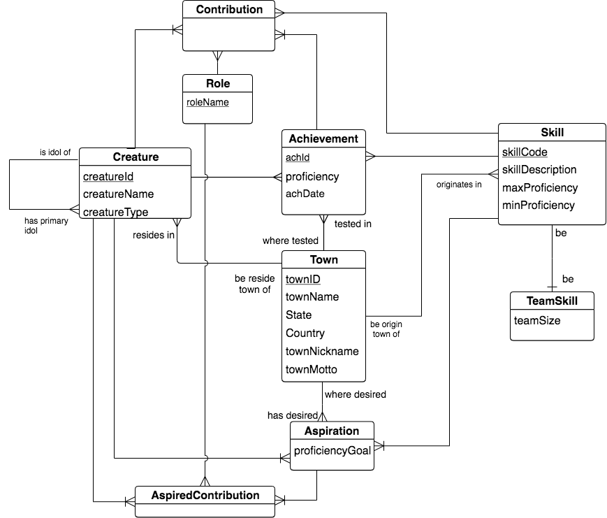
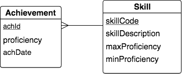
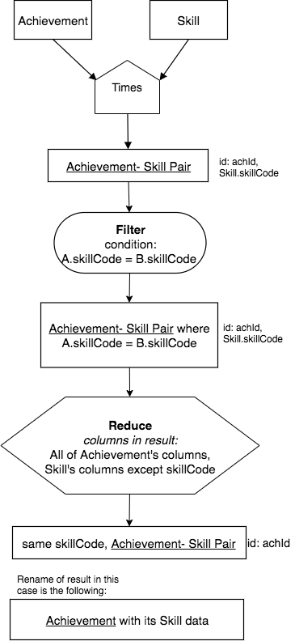
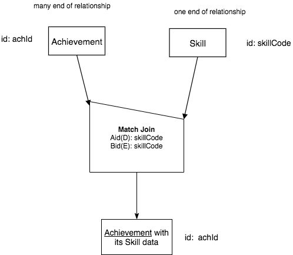
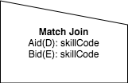

Introduction to Match Join
---------------------------

There is a particular pattern that uses some of the previous operators that is so prevalent in database analyses that it has been abstracted and given its own operator. The operator is called Match Join, and the pattern it uses, given two input relations is **Times followed by a filter using only equality, followed by a reduce or project.**

Times - Filter - Reduce/Project Pattern
~~~~~~~~~~~~~~~~~~~~~~~~~~~~~~~~~~~~~~~~

Let's start with an example from our small creature database, whose conceptual schema looks like this:

|

|

Let's concentrate on a very prevalent 2-entity shape in database schemas, a many-to-one relationship found in the above schema:

|

|

Next let's recall the columns of each of the two relations that were created from these entities. In the following image, we have emphasized the foreign key column in Achievement that matches the identifying column of Skill, namely skillCode, by highlighting it in green. 

|

|

A very useful and common practice when we have a many-one relationship like this is to create a relation where a data row from Achievement is juxtaposed with the one data row from Skill *where Achievement's skillCode in the row exactly matches the skill relation's skillCode.* Each row in the result can be thought of as an Achievement with its matching skillCode Skill data. We desire the result to have these columns:

|

|

Notice that because we are exactly matching on skillCode, we only need to keep one column called skillCode (from Achievement in this case). If we kept both columns, we would need to rename one and it would have the exact same data, so it's not useful to keep both skillCode columns.

To obtain this result using the operators we have explored so far, we can create the next precedence chart that uses Times followed by Filter, then Reduce to remove the extra skillCode column.

|

|

The Match Join Operator: an abstract combination
~~~~~~~~~~~~~~~~~~~~~~~~~~~~~~~~~~~~~~~~~~~~~~~~~

This type of query on this particular set of two relations that form the many-one shape in a conceptual model is so prevalent that we will abstract away the details of the three operators into one new operator called **Match Join**. The new simplified chart for this example is as follows:

|

|

Considering input relations and the columns being matched
~~~~~~~~~~~~~~~~~~~~~~~~~~~~~~~~~~~~~~~~~~~~~~~~~~~~~~~~~~~

There are aspects about the Match Join operator that we must consider if we are going to have a confident understanding of how it works in many different situations. The example above is the most common situation and is therefore often given the name **natural join**. In this situation, here are some things to notice about this case:

1. The two input relations each have a **different base**.
2. The operation is non-symmetric, because the order of the input relations is important. (We will examine why this is in more detail later.) The shape of the operator shows us this, just as it did for the Minus operator earlier.
3. A new notion needs to be considered for each Match Join, namely: what is the nature of the columns from the inputs, A (Achievement) and B (Skill), that are being matched in the Filter of the full chart?

Let's consider the new third point first. We can characterize the columns of each input relation that we are matching over by how much of the input relation's identifying columns are included in the filter. The first example above is only matching on one column, but in many cases we will need to filter by matching on multiple columns. We can devise a scheme that lets us be aware of how the matching columns relate to the identifying columns. This is shown in the following table.

.. table:: **Works-on column possibilities for Match Join**
    :align: left

    +---------+------------+---------------------------------------------+
    | Letter  | Short Name | Input relation's columns being matched      |
    +=========+============+=============================================+
    | E       |Exactly     |exactly its id  (all identifying columns)    |
    +---------+------------+---------------------------------------------+
    | M       |More        |more than its id (id +)                      |
    +---------+------------+---------------------------------------------+
    | S       |Some        |some of its id columns, but not all (fewer)  |
    +---------+------------+---------------------------------------------+
    | O       |Overlapping |some of its id columns, + some non-id columns|
    +---------+------------+---------------------------------------------+
    | D       |Disjoint    |disjoint from id columns (no id columns)     |
    +---------+------------+---------------------------------------------+

We call these combinations the *works on* columns. In any Match Join chart operator, we will indicate which columns of relation A and relation B are being matched, or worked on, and we will use a brief tag before those columns, one for the A relation, and one for the B relation. From the previous example, this was shown in the Match Join operator symbol like this:

|

|

Note the tag **Aid(D):** before the list of columns (one in this case) that are being matched from relation A (Achievement). Since skillCode is not a column in Achievement's set of identifying columns, then we use the letter D for *Disjoint* from the above table. Similarly, since skillCode is the single identifying column from relation B (Skill), we us the tag **Bid(E):** in front of the list of columns from input relation B that are being matched in the second line in the Match Join operator symbol.

.. note:: The two lines of text in the Match Join operator symbol will always begin **Aid(** and **Bid(** and will always have a single letter from the first column of the above table in the parentheses. Notice this with each of the examples that follow in the rest of the sections of this chapter.

.. tip:: The table above with the five letters that become a shortcut in the Match Join operator symbol are extremely important to mastery of your understanding of Match Join. I suggest that you write down this table on a card or in some electronic notebook that you like to use. As you practice new queries, you will want these letters handy until you have managed to memorize them.

In the rest of this chapter, we will examine several different types of Match Join and examine how we consider the symmetry of the operation, which is based on the input relations A and B and the correspondence of rows when they are matched.
