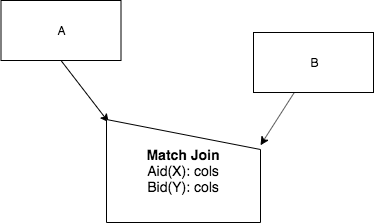

Circumstances For Match Joins
------------------------------------

There are three aspects of completing a Match Join that you need to think about. These three aspects make up a particular circumstance of Match Join.

**Aspect 1: What Bases?**

First, you must know what the bases of the input relations A and B are and which category they fall into, which is one of the following 3.

1. A, B have Different Bases
2. A, B have the Same Base
3. A, B are the Same Relation

**Aspect 2: Symmetry**

Second, you need to understand the symmetry of the Match Join you are attempting. This can be done by considering the columns that you are choosing to match over and which of these is happening:

1. **M - 1** from A to B: for a row in A, when you match over the column, there is one row in B. The matching column's value can occur many times in A. There is a direct correspondence between this and a Many-to-One relationship when using relations from your original database, such as from Achievement to Skill.

2. **1 - 1** from A to B: for a row in A, when you match over the column, there is one row in B. The matching column's value occurs one time in A. There is a direct correspondence between this and a One-to-One relationship when using relations from your original database, such as from TeamSkill to Skill.

3. **M - M** from A to B: for a row in A, when you match over the column, there could be many rows from B. For a row in B, when you match over the column, there could be many rows in A. These cases occur most often from a chicken-feet-out shape from your original database.

The symmetry of the operator follows from these cases:

- **M - 1 indicates Non-Symmetric-A**
- **1 - 1 indicates Symmetric-Either**
- **M - M indicates Symmetric-Pair**

Non-symmetric-A means that you should use the half-house and A should be the many end and go to the peak, and B should be the one end and go to the lower corner of the top, like this:

|

|

Symmetric-either indicates that you should use the half-house and A and B should go to the peak (recall this was the case for Union and Intersect also). For Match Join, it looks like this:

|

.. image:: ../img/MatchJoin/Symmetric_Either_little.png
    :width: 220px
    :align: center
    :alt: Non-Symmetric Match Join piece of a chart

|

Symmetric-Pair indicates that you should use the full house symbol and A and B should go to either side on the lower corners of the 'roof', like this:

|

.. image:: ../img/MatchJoin/SymmetricMJ_little.png
    :width: 220px
    :align: center
    :alt: Non-Symmetric Match Join piece of a chart

|

We will see an example of M - M Symmetric Pair shortly.

**Aspect 3: Works-on Columns**

Third, you should know the nature of the columns from the inputs, A and B, that are being matched. As discussed in the previous section, we must be aware of how the matching columns relate to the identifying columns. This is shown in the following table.

.. table:: **Works-on column possibilities for Match Join**
    :align: left

    +---------+------------+---------------------------------------------+
    | Letter  | Short Name | Input relation's columns being matched      |
    +=========+============+=============================================+
    | E       |Exactly     |exactly its id  (all identifying columns)    |
    +---------+------------+---------------------------------------------+
    | M       |More        |more than its id (id +)                      |
    +---------+------------+---------------------------------------------+
    | S       |Some        |some of its id columns, but not all          |
    +---------+------------+---------------------------------------------+
    | O       |Overlapping |some of its id columns, + some non-id columns|
    +---------+------------+---------------------------------------------+
    | D       |Disjoint    |disjoint from id columns (no id columns)     |
    +---------+------------+---------------------------------------------+

Inside the operator we use the tags Aid(X): and Bid(Y): before the list of columns to be matched, where X and Y are one of the above letters, E, M, S, O, D.

How to consider the Symmetry Aspect
~~~~~~~~~~~~~~~~~~~~~~~~~~~~~~~~~~~~

This is the data in the 2 relations named Creature and Skill.

.. csv-table:: **Creature**
   :file: ../creatureData/creature.csv
   :widths: 10, 25, 25, 20, 20
   :header-rows: 1

.. csv-table:: **Skill**
  :file: ../creatureData/skill.csv
  :widths: 10, 30, 20, 20, 20
  :header-rows: 1

Suppose our goal is to Match Join Creature and Skill on the only column they have in common that can be matched: reside_townId and origin_townId. The difficult part of understanding the circumstance of this Match Join is deciding whether A's relationship to B when doing the match of reside_townId and origin_townId is M-M, M-1, or 1-1.

What we want to know is these two things:

- Is there at least one creature whose reside town is the origin town of more than one skill?

- Is there an origin town of a Skill that is the reside town of more than one creature?

If both of these are true, then we have a M-M situation when matching over reside_townId of Creature and origin_townId of Skill. We can understand this by observing the data.

Try the query in the left tab below, which is a Times of Creature and Skill. Remember that Times is the basis of each Match Join. Look for the creature whose creatureId is 4 in the result, or to make it easier, add this to the query (simply so that we can zero in right now on a few rows):

.. code-block:: SQL

    where creatureId = 4

I've left a line for you to add this clause into the code. Don't forget to leave the semi-colon (;) there.

When you add this restriction, count how many rows have reside_townId = origin_townId. You can verify this by changing the where clause again to this:

.. code-block:: SQL

    where creatureId = 4 and reside_townId = origin_townId

What you should see is that for the one Creature whose creatureId is 4, there is more than one Skill paired to it, because the Town whose skillCode is 'b', where this creature resides, is the origin town of more than one Skill.

Now let's examine whether a particular Skill's origin Town might be the reside Town of more than one creature. I'll give you just what to look for- add this to the times portion of the SQL query, removing the where clause that you used before.

.. code-block:: SQL

    where reside_townId = 'le' and reside_townId = origin_townId

As you can see, the origin town of skill whose skillCode is 'PK' is the reside town of two creatures.

.. tabbed:: MJ_Cr_Skill_1

    .. tab:: SQL Times query

      .. activecode:: creature_skill_times_MJ
         :language: sql
         :include: creature_skill_create_times_MJ

         SELECT creature.*, skill.*
         FROM creature, skill

         ;

    .. tab:: SQL MJ query

      .. activecode:: creature_skill_MJ
         :language: sql
         :include: creature_skill_create_times_MJ

         SELECT creature.*, S.skillCode, S.skillDescription,
                S.maxProficiency, S.minProficiency
         FROM creature, skill S
         WHERE reside_townId = origin_townId
         ;

    .. tab:: SQL data

       .. activecode:: creature_skill_create_times_MJ
          :language: sql

          DROP TABLE IF EXISTS creature;
          CREATE TABLE creature (
          creatureId          INTEGER      NOT NUll PRIMARY KEY,
          creatureName        VARCHAR(20),
          creatureType        VARCHAR(20),
          reside_townId VARCHAR(3) REFERENCES town(townId),     -- foreign key
          idol_creatureId     INTEGER,
          FOREIGN KEY(idol_creatureId) REFERENCES creature(creatureId)
          );

          INSERT INTO creature VALUES (1,'Bannon','person','p',10);
          INSERT INTO creature VALUES (2,'Myers','person','a',9);
          INSERT INTO creature VALUES (3,'Neff','person','be',NULL);
          INSERT INTO creature VALUES (4,'Neff','person','b',3);
          INSERT INTO creature VALUES (5,'Mieska','person','d', 10);
          INSERT INTO creature VALUES (6,'Carlis','person','p',9);
          INSERT INTO creature VALUES (7,'Kermit','frog','g',8);
          INSERT INTO creature VALUES (8,'Godzilla','monster','t',6);
          INSERT INTO creature VALUES (9,'Thor','superhero','as',NULL);
          INSERT INTO creature VALUES (10,'Elastigirl','superhero','mv',13);
          INSERT INTO creature VALUES (11,'David Beckham','person','le',9);
          INSERT INTO creature VALUES (12,'Harry Kane','person','le',11);
          INSERT INTO creature VALUES (13,'Megan Rapinoe','person','sw',10);

          DROP TABLE IF EXISTS skill;

          CREATE TABLE skill (
          skillCode          VARCHAR(3)      NOT NUll PRIMARY KEY,
          skillDescription   VARCHAR(40),
          maxProficiency     INTEGER,     -- max score that can be achieved for this skill
          minProficiency     INTEGER,     -- min score that can be achieved for this skill
          origin_townId      VARCHAR(3)     REFERENCES town(townId)     -- foreign key
          );

          INSERT INTO skill VALUES ('A', 'float', 10, -1,'b');
          INSERT INTO skill VALUES ('E', 'swim', 5, 0,'b');
          INSERT INTO skill VALUES ('O', 'sink', 10, -1,'b');
          INSERT INTO skill VALUES ('U', 'walk on water', 5, 1,'d');
          INSERT INTO skill VALUES ('Z', 'gargle', 5, 1,'a');
          INSERT INTO skill VALUES ('B2', '2-crew bobsledding', 25, 0,'d');
          INSERT INTO skill VALUES ('TR4', '4x100 meter track relay', 100, 0,'be');
          INSERT INTO skill VALUES ('C2', '2-person canoeing', 12, 1,'t');
          INSERT INTO skill VALUES ('THR', 'three-legged race', 10, 0,'g');
          INSERT INTO skill VALUES ('D3', 'Australasia debating', 10, 1,NULL);
          INSERT INTO skill VALUES ('PK', 'soccer penalty kick', 10, 1, 'le');

Now go to the second tab from the left to see the complete Match Join result, whose English query is:

    Find each Creature - Skill Pair where the reside Town of the Creature is the same as the origin Town of the Skill.

The circumstance is that through the common townId found in each relation, there are reside_townId values in Creature with many origin_townId values in Skill, and there are origin_townId values in Skill with many reside_townId values in Creature. This makes the connection between Creature and Skill through matching reside_townId to origin_townId a **Many and Many, or M - M** connection. We will use the full house symbol for this Match Join query.

Luckily, as we look at more cases in the following pages, you will begin to see how the conceptual schema provides you with enough information to decide whether A matched to B is M-1, 1-1, or M-M. Read on to find out how.

The input relations in this case are **Different Base**. The works-on columns are **Aid(D): reside_townId and Bid(D): origin_townId**.

We will next outline the most common good circumstances that are used, followed by examples of each one.
