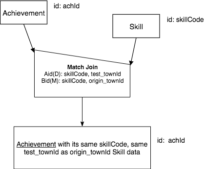

Different Base A and B, M - 1 match over cols Aid(D),Bid(M)
--------------------------------------------------------------

In this example, we still consider this part of the database represented by this fragment of the conceptual schema, but now we take note that there is one other pair of columns that could be matched: test_townID of Achievement and origin_townId of Skill.

|

.. image:: ../img/MatchJoin/Ach_Skill_LDS_frag.png
    :width: 220px
    :align: center
    :alt: Creature database Achievement - Skill many to one shape

|

We can ask an English query that will give us a slightly fewer number of rows (as you might expect it to in most shapes like this).

    Find each Achievement with its Skill data where the Skill was achieved in the same town that it originated in.

Or rephrased to more closely match what will be in the result relation:

    Find each Achievement with its same skillCode, same test_townId as origin_townId Skill data.

The precedence chart is similar to the last example, but the 'works on' columns in the Match Join symbol are different.

|

|

The SQL query examples change in two ways: we eliminate one more column in the reduce, since we are matching over 2 columns, and we add another equality check to the filter portion in the WHERE clause. The traditional and the inner join examples in the first and second tabs are the alternatives (we cannot use natural join syntax any more).

.. tabbed:: Ach_Skill_MJ_2

    .. tab:: SQL Times-Filter-Reduce MJ query

      .. activecode:: ach_skill_MJ_D_M
        :language: sql
        :include: ach_skill_create_MJ_2

        -- Achievement with its Skill data
                    -- reduce by removing B.skillCode, B.origin_townId
        SELECT A.*, B.skillDescription,
                    B.maxProficiency, B.minProficiency
        FROM achievement A, skill B       -- times
        WHERE A.skillCode = B.skillCode   -- equality match filter
        AND   A.test_townId = B.origin_townId
        ;

    .. tab:: SQL Inner Join MJ query

      .. activecode:: ach_skill_InnerJ_D_M
        :language: sql
        :include: ach_skill_create_MJ_2

        -- Achievement with its Skill data
                    -- reduce by removing B.skillCode, B.origin_townId
        SELECT A.*, B.skillDescription,
                    B.maxProficiency, B.minProficiency
        FROM achievement A
        INNER JOIN skill B            -- like MJ operator symbol
        ON A.skillCode = B.skillCode   -- match filter over cols
        AND A.test_townId = B.origin_townId
        ;

    .. tab:: SQL data

      .. activecode:: ach_skill_create_MJ_2
        :language: sql

        DROP TABLE IF EXISTS skill;

        CREATE TABLE skill (
        skillCode          VARCHAR(3)      NOT NULL PRIMARY KEY,
        skillDescription   VARCHAR(40),
        maxProficiency     INTEGER,     -- max score that can be achieved for this skill
        minProficiency     INTEGER,     -- min score that can be achieved for this skill
        origin_townId      VARCHAR(3)     REFERENCES town(townId)     -- foreign key
        );

        INSERT INTO skill VALUES ('A', 'float', 10, -1,'b');
        INSERT INTO skill VALUES ('E', 'swim', 5, 0,'b');
        INSERT INTO skill VALUES ('O', 'sink', 10, -1,'b');
        INSERT INTO skill VALUES ('U', 'walk on water', 5, 1,'d');
        INSERT INTO skill VALUES ('Z', 'gargle', 5, 1,'a');
        INSERT INTO skill VALUES ('B2', '2-crew bobsledding', 25, 0,'d');
        INSERT INTO skill VALUES ('TR4', '4x100 meter track relay', 100, 0,'be');
        INSERT INTO skill VALUES ('C2', '2-person canoeing', 12, 1,'t');
        INSERT INTO skill VALUES ('THR', 'three-legged race', 10, 0,'g');
        INSERT INTO skill VALUES ('D3', 'Australasia debating', 10, 1,NULL);
        INSERT INTO skill VALUES ('PK', 'soccer penalty kick', 10, 1, 'le');

        DROP TABLE IF EXISTS achievement;

        CREATE TABLE achievement (
        achId              INTEGER NOT NULL PRIMARY KEY AUTOINCREMENT,
        creatureId         INTEGER,
        skillCode          VARCHAR(3),
        proficiency        INTEGER,
        achDate            TEXT,
        test_townId VARCHAR(3) REFERENCES town(townId),     -- foreign key
        FOREIGN KEY (creatureId) REFERENCES creature (creatureId),
        FOREIGN KEY (skillCode) REFERENCES skill (skillCode)
        );

        -- Bannon floats in Anoka (where he aspired) [he did not improve]
        INSERT INTO achievement (creatureId, skillCode, proficiency,
                                 achDate, test_townId)
                        VALUES (1, 'A', 3, datetime('now'), 'a');
        -- Bannon floats in Anoka (where he aspired)
        INSERT INTO achievement (creatureId, skillCode, proficiency,
                                 achDate, test_townId)
                        VALUES (1, 'A', 3, datetime('2018-07-14 14:00'), 'a');

        -- Bannon swims in Duluth (he aspired in Bemidji) [he improved]
        INSERT INTO achievement (creatureId, skillCode, proficiency,
                                 achDate, test_townId)
                        VALUES (1, 'E', 4, datetime('now'), 'd');
        -- Bannon swims in Duluth (he aspired in Bemidji)
        INSERT INTO achievement (creatureId, skillCode, proficiency,
                                 achDate, test_townId)
                        VALUES (1, 'E', 3, datetime('2017-09-15 15:35'), 'd');

        -- Neff #3 swims in Bemidji
        INSERT INTO achievement (creatureId, skillCode, proficiency,
                                 achDate, test_townId)
                        VALUES (3, 'E', 5, datetime('now'), 'b');

        -- Kermit floats in Greenville
        INSERT INTO achievement (creatureId, skillCode, proficiency,
                                 achDate, test_townId)
                        VALUES (7, 'A', 5, datetime('now'), 'g');

        -- Bannon doesn't gargle
        -- Mieska gargles in Tokyo (had no aspiration to)
        INSERT INTO achievement (creatureId, skillCode, proficiency,
                                 achDate, test_townId)
                        VALUES (5, 'Z', 6, datetime('2016-04-12 15:42:30'), 't');

        -- Neff #3 gargles in Blue Earth (but not to his aspired proficiency)
        INSERT INTO achievement (creatureId, skillCode, proficiency,
                                 achDate, test_townId)
                        VALUES (3, 'Z', 4, datetime('2018-07-15'), 'be');
        -- Neff #3 gargles in Blue Earth (but not to his aspired proficiency)
        -- on same day at same proficiency, signifying need for arbitrary id
        INSERT INTO achievement (creatureId, skillCode, proficiency,
                                 achDate, test_townId)
                        VALUES (3, 'Z', 4, datetime('2018-07-15'), 'be');

        -- Beckham achieves PK in London
        INSERT INTO achievement (creatureId, skillCode, proficiency,
                                 achDate, test_townId)
                        VALUES (11, 'PK', 10, datetime('1998-08-15'), 'le');
        -- Kane achieves PK in London
        INSERT INTO achievement (creatureId, skillCode, proficiency,
                                 achDate, test_townId)
                        VALUES (12, 'PK', 10, datetime('2016-05-24'), 'le');
        -- Rapinoe achieves PK in London
        INSERT INTO achievement (creatureId, skillCode, proficiency,
                                 achDate, test_townId)
                        VALUES (13, 'PK', 10, datetime('2012-08-06'), 'le');
        -- Godizilla achieves PK in Tokyo poorly with no date
        -- had not aspiration to do so- did it on a dare ;)
        INSERT INTO achievement (creatureId, skillCode, proficiency,
                                 achDate, test_townId)
                        VALUES (8, 'PK', 1, NULL, 't');

        -- Thor achieves three-legged race in Metroville (with Elastigirl)
        INSERT INTO achievement (creatureId, skillCode, proficiency,
                                 achDate, test_townId)
                        VALUES (9, 'THR', 10, datetime('2018-08-12 14:30'), 'mv');
        -- Elastigirl achieves three-legged race in Metroville (with Thor)
        INSERT INTO achievement (creatureId, skillCode, proficiency,
                                 achDate, test_townId)
                        VALUES (10, 'THR', 10, datetime('2018-08-12 14:30'), 'mv');

        -- Kermit 'pilots' 2-person bobsledding  (pilot goes into contribution)
        --       with Thor as brakeman (brakeman goes into contribution) in Duluth,
        --    achieve at 76% of maxProficiency
        INSERT INTO achievement (creatureId, skillCode, proficiency,
                                 achDate, test_townId)
                        VALUES (7, 'B2', 19, datetime('2017-01-10 16:30'), 'd');
        INSERT INTO achievement (creatureId, skillCode, proficiency,
                                 achDate, test_townId)
                        VALUES (9, 'B2', 19, datetime('2017-01-10 16:30'), 'd');

        -- 4 people form track realy team in London:
        --   Neff #4, Mieska, Myers, Bannon
        --    achieve at 85% of maxProficiency
        INSERT INTO achievement (creatureId, skillCode, proficiency,
                                 achDate, test_townId)
                        VALUES (4, 'TR4', 85, datetime('2012-07-30'), 'le');
        INSERT INTO achievement (creatureId, skillCode, proficiency,
                                 achDate, test_townId)
                        VALUES (5, 'TR4', 85, datetime('2012-07-30'), 'le');
        INSERT INTO achievement (creatureId, skillCode, proficiency,
                                 achDate, test_townId)
                        VALUES (2, 'TR4', 85, datetime('2012-07-30'), 'le');
        INSERT INTO achievement (creatureId, skillCode, proficiency,
                                 achDate, test_townId)
                        VALUES (1, 'TR4', 85, datetime('2012-07-30'), 'le');

        -- Thor, Rapinoe, and Kermit form debate team in Seattle, WA and
        -- achieve at 80% of maxProficiency
        INSERT INTO achievement (creatureId, skillCode, proficiency,
                                 achDate, test_townId)
                        VALUES (9, 'D3', 8, datetime('now', 'localtime'), 'sw');
        INSERT INTO achievement (creatureId, skillCode, proficiency,
                                 achDate, test_townId)
                        VALUES (13, 'D3', 8, datetime('now', 'localtime'), 'sw');
        INSERT INTO achievement (creatureId, skillCode, proficiency,
                                 achDate, test_townId)
                        VALUES (7, 'D3', 8, datetime('now', 'localtime'), 'sw');

Considering NULL values
~~~~~~~~~~~~~~~~~~~~~~~

Let's look at the Skill data again:

.. csv-table:: **Skill**
  :file: ../creatureData/skill.csv
  :widths: 10, 30, 20, 20, 20
  :header-rows: 1

Notice that in one row, the origin_townId in Skill is a pesky NULL value. In databases, NULL cannot be matched to anything. It is important to understand that the Skill whose SkillCode is D3, Australasia debating, will never be able to appear in the result relation for this query.  There are not any NULL test_townId values in Achievement in this data, but if there were, those rows would not appear in the result relation either.

|

Exercises:
~~~~~~~~~~~~~~~~~~~~~~~

Try creating the precedence chart for this query.

**English Query:**

  Find each achievement with its same creatureId, same test_townId as reside_townId Creature data.
