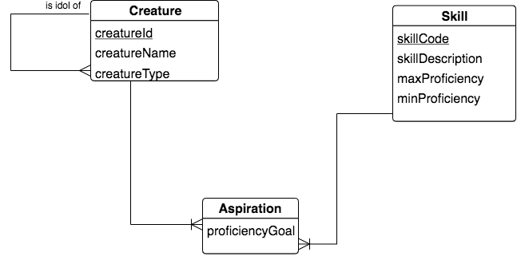
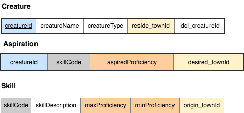
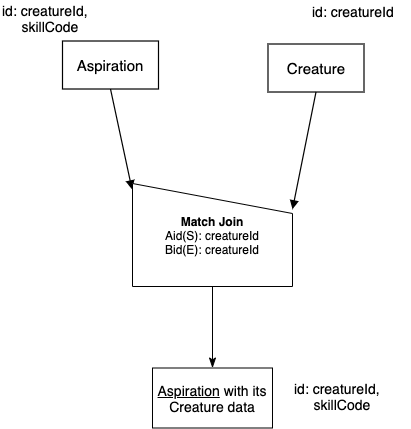

Different Base A and B, M - 1 match over cols Aid(S),Bid(E)
------------------------------------------------------------

English Query:

    Find each Aspiration with its Creature data.

LDS database schema fragment pertaining to this query:

|

|

Columns of the three relations in the fragment:

|

|

**Logic to use in decision-making process for chart formulation:**

The coloring of the columns is to indicate which columns from two of the three relations could be used as the 'works on' columns in the binary Match Join operator. For the above stated English query, we will use Aspiration and Creature as the two input relations. Since the query has no mention of anything like "same reside_townId as origin_towndId", we can decide that the matching will be on creatureId of Creature and its foreign key in Aspiration, also called creatureId. (The phrase 'with its' helps us decide this.) The creatureId column is exactly (E) Creature's identifier, and the creatureId column is some (S), but not all of the columns representing Aspiration's identifier.

The two relations are obviously different base, and the relationship between them, through the creatureId data, is M - 1 from Aspiration to Creature. This is also apparent from the DB schema fragment. This lets us decide to put Aspiration, the many end (A) , at the peak of the half-house non-symmetric Match Join symbol, and Creature at the lower side of the top of the half-house symbol (the B relation). 

This is another *natural join* situation, and the only small difference from the previous natural join case is the 'works on' column matching is on Aid(S), Bid(E). This is another case that you should be comfortable using often in relation databases.

The precedence chart thus becomes:

|

|

Note how in this case, as in the previous few sections, the original English query led us easily to the name of the result relation and its base, and thus its identifier. Knowing that can be the starting point of how you think about this and many of these charts- you can fill in the result relation name first and work backwards.

Next let's look at the SQL, which might be looking familiar by now if you have studied the others. With this one, we are back to a *Natural Join* situation, because we are matching over the foreign key creatureId in Aspiration. Even though creatureId is only 'some' of Aspiration's identifying columns, it is the fact that it is a foreign key to Creature that makes this a natural join and enables the NATURAL JOIN syntax shown in the third tab below.

.. tabbed:: DifferentBase3_MJ_M_1_3

    .. tab:: SQL Times-Filter-Reduce MJ query

      .. activecode:: asp_cr_MJ_S_E
        :language: sql
        :include: all_creature_create

        -- Aspiration with its Creature data
                    -- reduce by removing B.creatureId
        SELECT A.*, B.creatureName, B.creatureType, 
                    B.reside_townId, B.idol_creatureId
        FROM Aspiration A, Creature B       -- times
        WHERE A.creatureId = B.creatureId   -- equality match filter
        ;

    .. tab:: SQL Inner Join MJ query

      .. activecode:: asp_cr_MJ_S_E_inner
        :language: sql
        :include: all_creature_create

        -- Aspiration with its Creature data
                    -- reduce by removing B.creatureId, B.origin_townId
        SELECT A.*, B.creatureName, B.creatureType, 
                    B.reside_townId, B.idol_creatureId
        FROM Aspiration A
        INNER JOIN Creature B            -- like MJ operator symbol
        ON A.creatureId = B.creatureId   -- match filter over cols
        ;

    .. tab:: SQL Natural Join MJ query

      .. activecode:: asp_cr_MJ_S_E_natural
        :language: sql
        :include: all_creature_create

        -- Aspiration with its Creature data
                    -- reduce by removing B.creatureId, B.origin_townId
        SELECT A.*, B.creatureName, B.creatureType, 
                    B.reside_townId, B.idol_creatureId
        FROM Aspiration A
        NATURAL JOIN Creature B            -- like MJ operator symbol
        -- implied match over foreign key column creatureID, 
        --which is same name in each of A and B
        ;
    
    .. tab:: Aspiration data values

        .. csv-table:: **Aspiration**
            :file: ../creatureData/aspiration.csv
            :widths: 25, 25, 25, 25
            :header-rows: 1

.. note::
    Because the above query contains a match only over the foreign key from Aspiration to Creature, the number of rows in the result is the same as the number of rows in Aspiration (though displayed in a slightly different order from the Aspiration data values in the last tab). Make certain that you understand why- it is one of our keys to mastery of Match Join.

Other Queries to try:
~~~~~~~~~~~~~~~~~~~~~

Use the logic above and in the previous sections to practice developing charts for the following queries.

**English Queries:**

    1. Find each Aspiration with its Skill Data.

    2. Find each Aspiration with its creature data where the creature resides in the same town that they desired/aspired to obtain the Skill.

    3. Find each Aspiration with its skill data where the aspiredProficiency is equal to the maxProficiency of that skill.

For these next queries, let's branch out to other relations. Pull out your copy of :download:`the Small Creature Database Schema<smallCreatureDB_LDS.pdf>` to work on these. Practice the steps for decision making with these queries, as was used in the logic described above:

1. These are all different bases for the two input relations.
2. Is it a M-1 relationship, and if so, which relation is the many end?
3. What are the 'works on' columns and which letter (EMSOD) applies to each of the two relations.

**More English Queries:**

    4. Find each AspiredContribution with its Creature data.

    5. Find each AspiredContribution with its Aspiration data.

    6. Find each Contribution with its Achievement data.

    7. Find each Contribution with its Creature data.

There are many more possibilities- can you devise your own?

|
