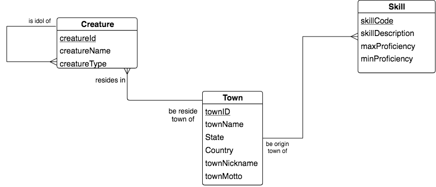
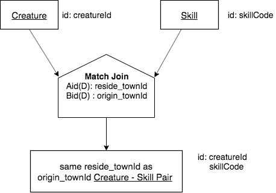

Different Base A and B, M - M match over cols Aid(D),Bid(D)
------------------------------------------------------------

English Query:

    Find each Creature - Skill pair a where the Skill originated in
    the same town that the creature resides in.

LDS fragment pertaining to this query:

|

|

We have previously motivated that this is a M - M case because there can be a Creature whose reside town is the origin town of more that one Skill, and there can be a Skill whose origin town is the reside town for more than one creature.

.. important:: The decision that this is a M - M situation stems from the conceptual model's shape: **the chicken feet out shape with Town at the center tells us that the matching of Creature to Skill on a townId is a potential M - M situation.**

Columns of the three relations in the fragment:

|

.. image:: ../img/MatchJoin/06/Cr_Town_Skill_cols.png

|

Precedence Chart:

|

|

.. image:: https://upload.wikimedia.org/wikipedia/commons/2/2d/Wikidata_logo_under_construction_sign_square.svg
    :width: 100px
    :align: left
    :alt: Under construction
