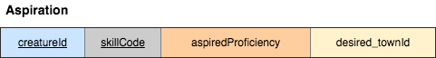
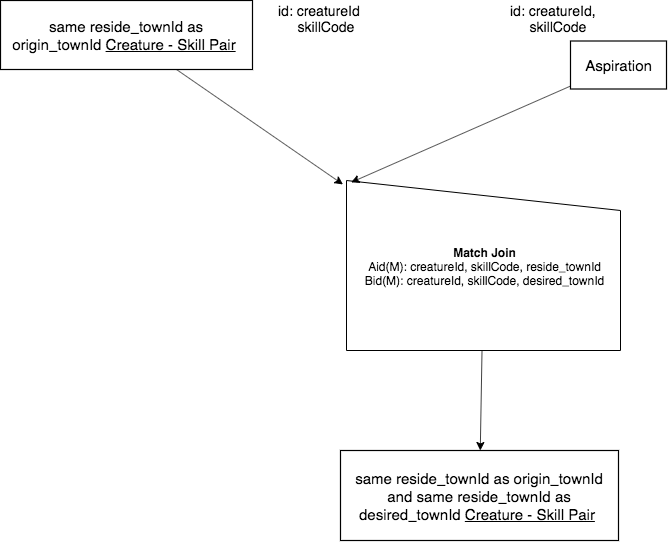

Same Base A and B, 1 - 1 match over cols Aid(M),Bid(M)
------------------------------------------------------------

Now let's start with the previous result relation:

*Same reside_townId as origin_townId and same reside_townId as desired_townId Creature - Skill Pair*

Let's match join this result relation as our A relation (identified by creatureId, SkillCode) with Aspiration as our B relation. Aspiration's columns are:

|

|

There are two key points to understanding this circumstance:

1. Aspiration is also a Creature - Skill Pair, because it is identified by creatureId and skillCode. A and B are therefore the same base.

2. Since each of these are identified by creatureId and skillCode, there is a 1 - 1 correspondence between a row in A and a row in B *if we match over these two columns and any others.*

Here is the English Query:

    Find each Creature - Skill pair where the Creature aspired to a Skill in the same town that the Skill originated in and is the same town that the creature resides in.

The precedence chart:

|

|

The identifier of the result relation is still creatureId, skillCode.

.. image:: https://upload.wikimedia.org/wikipedia/commons/2/2d/Wikidata_logo_under_construction_sign_square.svg
    :width: 100px
    :align: left
    :alt: Under construction
