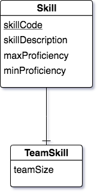
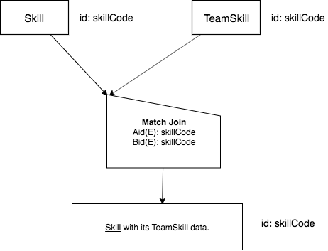

Same Base A and B, 1 - 1 match over cols Aid(E),Bid(E)
------------------------------------------------------------

There are some cases in a conceptual schema where a one-to-one relationship exists between two entities. When mapping to relations, you can choose which relation should have a foreign key into the other. We discussed this earlier in section 3.8 of this book, where we had the following LDS fragment and SQL implementation.

Here is a fragment of the conceptual schema showing the one-to-one relationship in this database.

|

|

The following code shows the SQL to create Skill and Team Skill data. Note how the foreign key is in TeamSkill, referencing back to Skill. An important point about doing Match Joins, however, is that each table contains a skillCode that we can match over, and that there is one skillCode in Skill for one skillCode in TeamSkill. In this one-to-one relationship, the foreign key can be implemented in either direction.

.. activecode:: skill_be_create2
   :language: sql

   DROP TABLE IF EXISTS skill;

   CREATE TABLE skill (
   skillCode          VARCHAR(3)      NOT NULL PRIMARY KEY,
   skillDescription   VARCHAR(20)
   );

   Drop TABLE IF EXISTS TeamSkill;

   CREATE TABLE teamSkill (
   skillCode      VARCHAR(3)  NOT NULL PRIMARY KEY references skill (skillCode),
   teamSize       INTEGER
   );

   INSERT INTO skill VALUES ('A', 'float');
   INSERT INTO skill VALUES ('E', 'swim');
   INSERT INTO skill VALUES ('O', 'sink');
   INSERT INTO skill VALUES ('U', 'walk on water');
   INSERT INTO skill VALUES ('Z', 'gargle');
   INSERT INTO skill VALUES ('B4', '4-person bobsledding');
   INSERT INTO skill VALUES ('TR4', '400 meter track relay');
   INSERT INTO skill VALUES ('C2', '2-person canoeing');
   INSERT INTO skill VALUES ('THR', 'three-legged race');
   INSERT INTO skill VALUES ('D3', 'debate');

   INSERT INTO teamSkill VALUES ('B4', 4);
   INSERT INTO teamSkill VALUES ('TR4', 4);
   INSERT INTO teamSkill VALUES ('C2', 2);
   INSERT INTO teamSkill VALUES ('THR', 2);
   INSERT INTO teamSkill VALUES ('D3', 3);

The type of Match Join between these two relations in this case is quite straightforward. The one-to-one relationship corresponds naturally to a 1 - 1 case of Match Join, working on the foreign key column.

English Query:

    Find each Skill with its TeamSkill data.

or equally correct:

    Find each TeamSkill with its Skill data.

Each of these relations has the same identifier, so they are the same base.

The precedence chart for the Match Join, which is symmetric because the order of A and B produces the same result relation, looks like this:

|

|

Like the M - M example in the previous section, we use the half-house shape and the arrows from A and B both point to the peak of the half-house shape. This is the Symmetric-either case in Match Join, like the Intersect and Union set operators.

SQL for the Match Join:

.. activecode:: skill_be_MJ
   :language: sql
   :include: skill_be_create2

   SELECT S.*, TS.teamSize
   FROM skill S, teamSkill TS
   WHERE S.skillCode = TS.skillCode;
