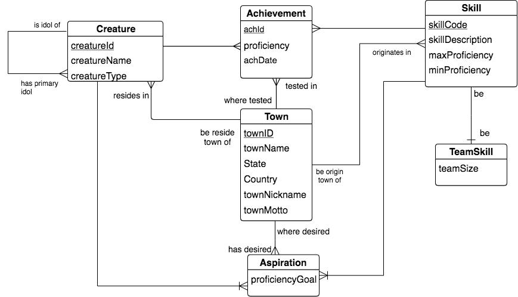
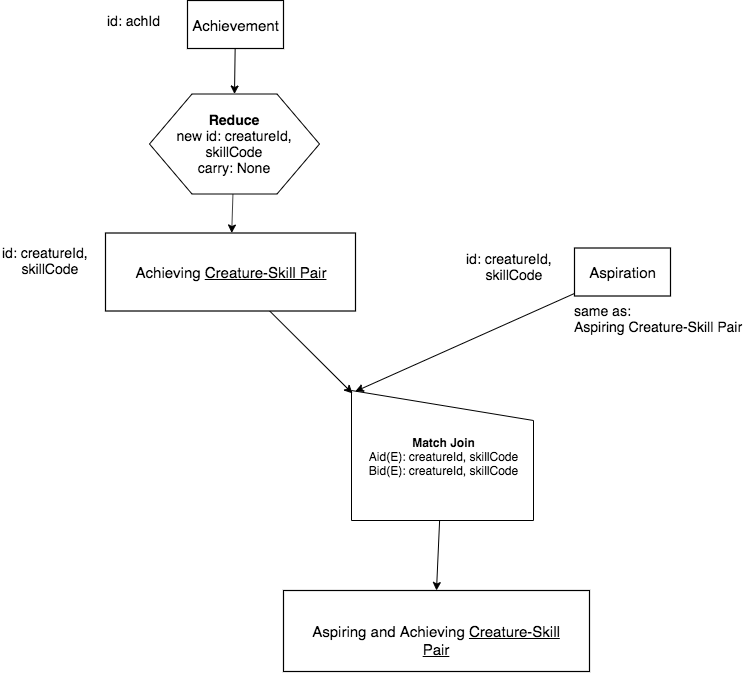

Same Base A and B, 1 - 1 match over cols Aid(E),Bid(E)
------------------------------------------------------------

It is important to realize when relations have the same base. It is because they have the same identifying columns. In many sophisticated databases, it will take a step of using a reduce to create a relation that will have the same base as another relation and can then be Match Joined. For example, let's consider this larger portion of the schema for the database we have been working with:

|

|

Though there are several chicken-feet-out shapes involving Town, what we want to focus on is the *two parallel chicken-feet-in shapes* whose intersection entities are Achievement and Aspiration. This set of two different chicken-feet-in shapes involving entities like Creature and Skill is relatively common in  databases.

In this database, there can be more than one of the same Skill achieved by a creature, i.e. there can be more than one pair of the same creatureId, skillCode data values in Achievement. (A creature can achieve the same skill more than once.) However, the data for Aspiration contains one creatureId, skillCode pair of data values, because those two columns form its identifier.

We might want to ask an English query like this:

    What creatures have achieved and aspired to the same Skill?

One way to interpret this query is to decide that we simply want a single instance of a creature having achieved a skill (creatureId, skillCode) with the creatureId, skillCode of the Aspiration.

To perform this match of Aspiration data with Achievement data we must be careful to make certain that we have a 1 - 1 correspondence between columns we want to match over in the input relations. So with this interpretation, we would perform a Reduce first on Achievement, so that the precedence chart looks like this:

|

|

After the Reduce, the Match Join is a same base (Creature-Skill Pair), 1 - 1 case and therefore Symmetric-either.

A Different Interpretation
~~~~~~~~~~~~~~~~~~~~~~~~~~~

Another way to consider the posed query is to maintain the M - 1 correspondence between Achievement and Aspiration by not first doing the Reduce shown above. In this case we can state that what we want to get back is every Achievement matched to Aspiration through creatureId and skillCode.

.. mchoice:: mc-mj-09a
   :answer_a: Aid(E), Bid(E)
   :answer_b: Aid(S), Bid(E)
   :answer_c: Aid(D), Bid(E)
   :answer_d: Aid(O), Bid(E)
   :correct: c
   :feedback_a: creatureId, skillCode is not exactly Achievement's identifier
   :feedback_b: creatureId, skillCode is not some of Achievement's identifier
   :feedback_c: Yes- creatureId, skillCode is disjoint from Achievement's identifier and exactly Aspiration's identifier.
   :feedback_d: creatureId, skillCode does not overlap with any of Achievement's identifier

   What would the 'works on' columns be in this case?

.. mchoice:: mc-mj-09b
  :answer_a: Non-symmetric-A
  :answer_b: Symmetric-either
  :answer_c: Symmetric-pair
  :correct: a
  :feedback_a: Yes, M - 1 implies Non-symmetric-A
  :feedback_b: 1 - 1 implies Symmetric-either
  :feedback_c: M - M implies Symmetric pair

  What is the symmetry of this proposed M - 1 situation?

.. mchoice:: mc-mj-09c
  :answer_a: Different Base
  :answer_b: Same base
  :answer_c: Same Relation
  :correct: a
  :feedback_a: Yes, the identifiers of Achievement and Aspiration are different.
  :feedback_b: The identifier of Achievement is achId and Aspiration's identifier is creatureId, skillCode.
  :feedback_c: Achievement and Aspiration are not the same relation.

  What is are the bases of A (Achievement) and B (Aspiration) in this situation?

.. image:: https://upload.wikimedia.org/wikipedia/commons/2/2d/Wikidata_logo_under_construction_sign_square.svg
    :width: 100px
    :align: left
    :alt: Under construction
