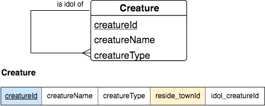
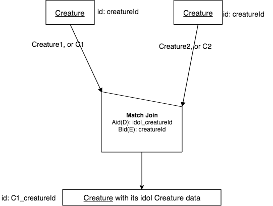

Same Relation A and B, M - 1 match over cols Aid(D),Bid(E)
------------------------------------------------------------

For this case and the next, we will concentrate on a single relation and what we can do with that *same relation* being the A and B input relations of a Match Join.

Let's focus on the Creature relation, whose conceptual schema fragment and columns in its relation are as follows:

|

|

English Query:

    Find each creature with its idol creature data.

Precedence Chart:

For this case, let's look at the reflexive relationship. In this case we know from the shape that a Creature can be the idol of many Creatures, but each Creature has one idol Creature. We therefore have a M - 1 situation when matching over idol_creatureId and creatureId. This means we have this precedence chart for the Match join:

|

|

SQL Syntax for this reflexive query

In the example below, I chose to make the query look similar to the times from the set operator chapter in the first tab. In the second tab it is shortened. Once you see how the query contains the Times, you will probably prefer the second tab's syntax.

.. tabbed:: reflexive_M_1_MJ

    .. tab:: SQL query

        .. activecode:: creature_reflexive_MJ
           :language: sql
           :include: creature_create_MJ_reflexive

            SELECT C1.creatureId AS C1_creatureId,
                   C1.creatureName AS C1_creatureName,
                   C1.creatureType AS C1_creatureType,
                   C1.reside_townId AS C1_reside_townId,
                   C1.idol_creatureId AS C1_idol_creatureId,
                   C2.creatureName AS idol_creatureName,
                   C2.creatureType AS idol_creatureType,
                   C2.reside_townId AS idol_reside_townId,
                   C2.idol_creatureId AS idol_idol_creatureId
            FROM creature C1, creature C2
            WHERE C1.idol_creatureId = C2.creatureId;

    .. tab:: shorter SQL query

        .. activecode:: creature_reflexive_MJ_short
           :language: sql
           :include: creature_create_MJ_reflexive

            SELECT C1.*,
                   C2.creatureName AS idol_creatureName,
                   C2.creatureType AS idol_creatureType,
                   C2.reside_townId AS idol_reside_townId,
                   C2.idol_creatureId AS idol_idol_creatureId
            FROM creature C1, creature C2
            WHERE C1.idol_creatureId = C2.creatureId;

    .. tab:: SQL data

        .. activecode:: creature_create_MJ_reflexive
           :language: sql

            DROP TABLE IF EXISTS creature;
            CREATE TABLE creature (
            creatureId          INTEGER      NOT NULL PRIMARY KEY,
            creatureName        VARCHAR(20),
            creatureType        VARCHAR(20),
            reside_townId VARCHAR(3) REFERENCES town(townId),     -- foreign key
            idol_creatureId     INTEGER,
            FOREIGN KEY(idol_creatureId) REFERENCES creature(creatureId)
            );

            INSERT INTO creature VALUES (1,'Bannon','person','p',10);
            INSERT INTO creature VALUES (2,'Myers','person','a',9);
            INSERT INTO creature VALUES (3,'Neff','person','be',NULL);
            INSERT INTO creature VALUES (4,'Neff','person','b',3);
            INSERT INTO creature VALUES (5,'Mieska','person','d', 10);
            INSERT INTO creature VALUES (6,'Carlis','person','p',9);
            INSERT INTO creature VALUES (7,'Kermit','frog','g',8);
            INSERT INTO creature VALUES (8,'Godzilla','monster','t',6);
            INSERT INTO creature VALUES (9,'Thor','superhero','as',NULL);
            INSERT INTO creature VALUES (10,'Elastigirl','superhero','mv',13);
            INSERT INTO creature VALUES (11,'David Beckham','person','le',9);
            INSERT INTO creature VALUES (12,'Harry Kane','person','le',11);
            INSERT INTO creature VALUES (13,'Megan Rapinoe','person','sw',10);
