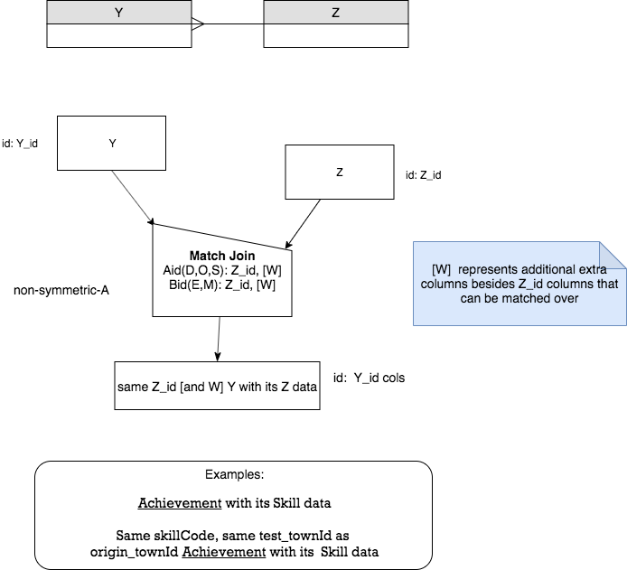
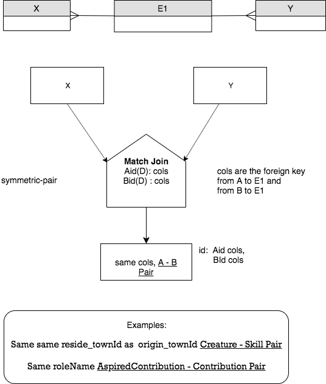
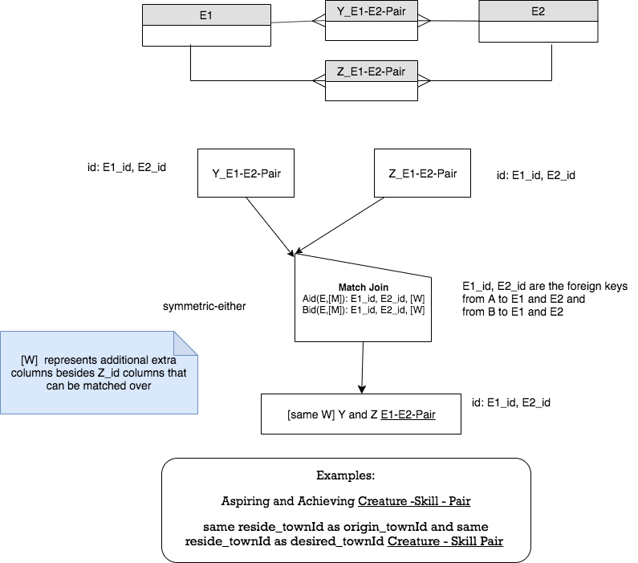
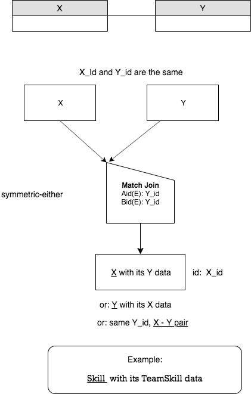
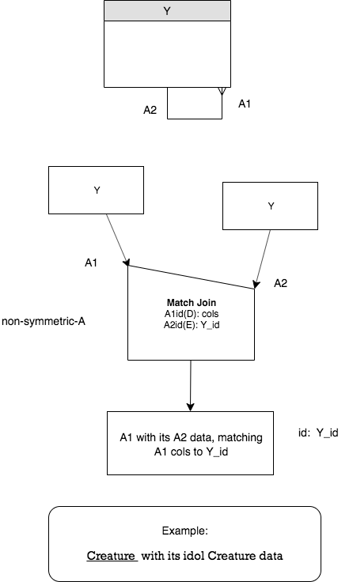
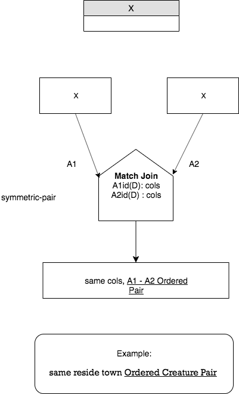

Match Join Framework
----------------------

The general framework for Match Join with two relations A and B include these primary aspects of the circumstances:

1. Whether input relations are:
    - Different Bases
    - Same Base
    - Same Relation

2. What the Symmetry of the Match Join is:
    - Non-Symmetric-A, when the columns being matched have a M - 1 correspondence

    - Symmetric-Either, when the columns being matched have a 1 - 1 correspondence

    - Symmetric-Pair, when the columns being matched have a M - M correspondence

3. What 'works-on' columns are being matched, in terms of A's identifier and B's identifier, as given in the following table:

.. table:: **Works-on column possibilities for Match Join**
    :align: left

    +---------+------------+---------------------------------------------+
    | Letter  | Short Name | Input relation's columns being matched      |
    +=========+============+=============================================+
    | E       |Exactly     |exactly its id  (all identifying columns)    |
    +---------+------------+---------------------------------------------+
    | M       |More        |more than its id (id +)                      |
    +---------+------------+---------------------------------------------+
    | S       |Some        |some of its id columns, but not all          |
    +---------+------------+---------------------------------------------+
    | O       |Overlapping |some of its id columns, + some non-id columns|
    +---------+------------+---------------------------------------------+
    | D       |Disjoint    |disjoint from id columns (no id columns)     |
    +---------+------------+---------------------------------------------+

The nine total examples we presented in detail are as follows in this table:

.. table:: **Circumstances For Match Joins In this Chapter**
    :align: left

    +-----------+-----------------------+----------------+---------------------+
    |Bases of   |A data to B data       |Symmetry        |Input relation       |
    |A, B       |through works-on cols  |for symbol      |columns being matched|
    +===========+=======================+================+=====================+
    |Different  |M-1                    |Non-Symmetric-A |   Aid(D),Bid(E)     |
    |Base,      |                       |                |                     |
    |Achievement|                       |                |                     |
    |Skill      |                       |                |                     |
    +-----------+-----------------------+----------------+---------------------+
    |Different  |M-1                    |Non-Symmetric-A |  Aid(D),Bid(M)      |
    |Base,      |                       |                |                     |
    |Achievement|                       |                |                     |
    |Skill      |                       |                |                     |
    +-----------+-----------------------+----------------+---------------------+
    |Different  |M-1                    |Non-Symmetric-A |  Aid(S),Bid(E)      |
    |Base,      |                       |                |                     |
    |Aspiration |                       |                |                     |
    |Creature   |                       |                |                     |
    +-----------+-----------------------+----------------+---------------------+
    |Different  |M-M                    |Symmetric-Pair  |  Aid(D),Bid(D)      |
    |Base,      |                       |                |                     |
    |Creature   |                       |                |                     |
    |Skill      |                       |                |                     |
    +-----------+-----------------------+----------------+---------------------+
    |Same       |1-1                    |Symmetric-Either|  Aid(M),Bid(M)      |
    |Base,      |                       |                |                     |
    |Aspiration |                       |                |                     |
    |Creature-  |                       |                |                     |
    |Skill Pair |                       |                |                     |
    +-----------+-----------------------+----------------+---------------------+
    |Same       |1-1                    |Symmetric-Either|  Aid(E),Bid(E)      |
    |Base,      |                       |                |                     |
    |TeamSkill  |                       |                |                     |
    |Skill      |                       |                |                     |
    +-----------+-----------------------+----------------+---------------------+
    |Same       |1-1                    |Symmetric-Either|  Aid(E),Bid(E)      |
    |Base,      |                       |                |                     |
    |Achievement|                       |                |                     |
    |Aspiration |                       |                |                     |
    +-----------+-----------------------+----------------+---------------------+
    |Same       |M-1                    |Non-Symmetric-A |  Aid(D),Bid(E)      |
    |Relation,  |                       |                |                     |
    |Creature   |                       |                |                     |
    |Creature   |                       |                |                     |
    +-----------+-----------------------+----------------+---------------------+
    |Same       |M-M                    |Symmetric-Pair  |  Aid(D),Bid(D)      |
    |Relation,  |                       |                |                     |
    |Creature   |                       |                |                     |
    |Creature   |                       |                |                     |
    +-----------+-----------------------+----------------+---------------------+

The first three are the Different Base, M -1, but the works-on columns are different. The generic conceptual schema fragment and precedence charts for these 3 cases looks the same. There were 3 Same Base, 1 - 1 cases presented, two of which use the same generic form of precedence chart. Overall, there are 6 generic circumstances with precedence charts shown below, as a means to orient you to these common cases and be able to apply them to other situations.

M - 1 match over cols between Different Base A and B
~~~~~~~~~~~~~~~~~~~~~~~~~~~~~~~~~~~~~~~~~~~~~~~~~~~~~~

|

|

M - M match over cols between Different Base A, B
~~~~~~~~~~~~~~~~~~~~~~~~~~~~~~~~~~~~~~~~~~~~~~~~~~

|

|

1 - 1 match over cols between Same Base A, B: chicken feet in
~~~~~~~~~~~~~~~~~~~~~~~~~~~~~~~~~~~~~~~~~~~~~~~~~~~~~~~~~~~~~~~

|

|

1 - 1 match over cols between Same Base A and B
~~~~~~~~~~~~~~~~~~~~~~~~~~~~~~~~~~~~~~~~~~~~~~~~~

|

|

M - 1 match over cols between A and itself (Same Relation)
~~~~~~~~~~~~~~~~~~~~~~~~~~~~~~~~~~~~~~~~~~~~~~~~~~~~~~~~~~~

|

|

M - M match over cols between A and itself (Same Relation)
~~~~~~~~~~~~~~~~~~~~~~~~~~~~~~~~~~~~~~~~~~~~~~~~~~~~~~~~~~~~

|

|

.. image:: https://upload.wikimedia.org/wikipedia/commons/2/2d/Wikidata_logo_under_construction_sign_square.svg
    :width: 100px
    :align: left
    :alt: Under construction
