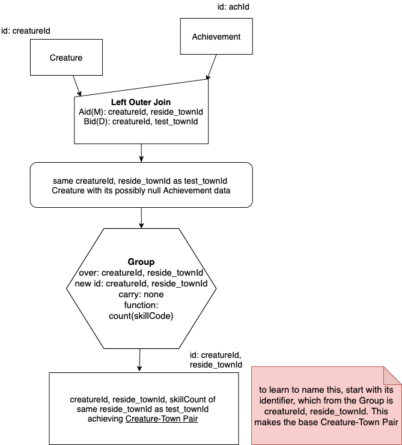
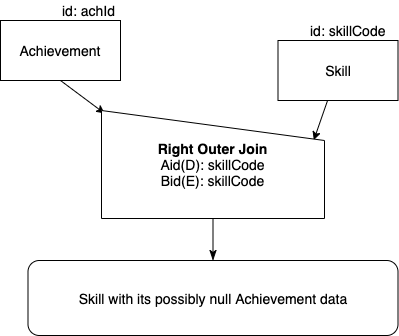
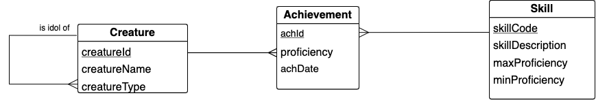
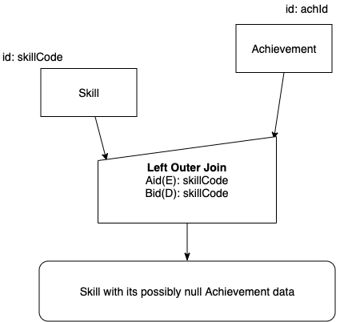

Outer Join by Examples
=========================

As you hopefully now realize, the many-to-one shape is by far the most common shape in what is called a 'normalized' conceptual schema in relational database theory. To be precise, however, the chicken feet on a conceptual schema like an LDS shape such as the following precisely means "zero or many".

|

.. image:: ../img/OuterJoin/Creature_Ach_LDS_frag.png
    :width: 520px
    :align: center
    :alt: Creature database Creature - Achievement one to many shape

|

What this means is that there can be, and very often are in most databases, instances on the one end, such as Creature above, that are **not** found at all in the relation on the many end, such as Achievement above. In the case of the example data we have been using, the person creature named Carlis has no achievements yet. When we perform a natural join, he is missing from the result relation. Let's verify that with the following code. (I've used the inner join syntax so you can see the similarity to the outer join example below.)

.. activecode:: creature_ach_nj
   :language: sql
   :include: all_creature_create
   :showlastsql:

   DROP TABLE IF EXISTS CreatureNJAchievement;

   CREATE TABLE CreatureNJAchievement AS
   SELECT C.*, A.proficiency, A.skillCode, A.achDate
   FROM creature C
   INNER JOIN achievement A 
   ON C.creatureId = A.creatureId;

   SELECT * FROM CreatureNJAchievement
   ORDER BY creatureId;

Note the convenience for display purposes of the ORDER BY keywords in SQL. The result relation called CreatureNJAchievement is not stored in the order being displayed- there is no guarantee of order of the rows in a relation in databases. This clause just lets us display the results in a convenient way. It can never be used when creating the relation in the first place, when using the CREATE TABLE ... AS nomenclature.

Indeed, when you run this code above you see that Carlis, who is the creature whose creatureId is 6, is missing. If we wanted to count the skills of each creature using this result relation from the natural join, also called inner join, we would be unable to easily add a zero count for him.

Our first Example: Outer Join to the Rescue
~~~~~~~~~~~~~~~~~~~~~~~~~~~~~~~~~~~~~~~~~~~~

There is another operation that will keep Carlis in the result so that we can count his skills as zero later. What we want to do is use what is called outer join, where we will keep Carlis and put null values in the columns coming from Achievement (since his creatureId is not there).

Here is the properly worded English query:

    Find each Creature with its possibly null Achievement data.

To study the precedence chart for Outer Join, let's look at the natural Match Join next to the Left Outer Join. Study this carefully:

|

.. image:: ../img/OuterJoin/Cr_Ach_MJ_OJ.png
    :align: center
    :alt: Creature - Achievement natural join next to left outer join

|

We use an extra qualifier for the Outer Join, namely 'Left'. This is because when you look at the chart on the right, notice that we will be keeping the data from the relation of the left (Creature in this case), and inserting NULL values for missing data from the relation on the right (Achievement in this case).

Important things to note:

- The operator symbol has flipped, yet the relation on the 'one' end of the relationship still goes to the lower end of that flipped operator roof shape, and the 'many or zero' end goes to the upper corner.

- The 'works on' letters in Left Outer Join, Aid(E) and Bid(D), are swapped from the Natural Match Join counterpart.

- The result is a *table*, not a relation, because the included NULL values make it impossible to have a reasonable set of identifying columns. (Make certain you see this by looking at the result of the query below.)

- The result table name for Left Outer Join is also 'flipped' from the Natural Match Join counterpart.

Now let's look at the SQL code in action. First, create the result table:

.. activecode:: creature_ach_oj
   :language: sql
   :include: all_creature_create
   :showlastsql:

   DROP TABLE IF EXISTS CreatureLOJAchievement;

   CREATE TABLE CreatureLOJAchievement AS
   SELECT C.*, A.proficiency, A.skillCode, A.achDate
   FROM creature C
   LEFT OUTER JOIN achievement A 
   ON C.creatureId = A.creatureId;
   -- creature is the left relation whose rows will be kept
   -- when the 'on' condition is not satisfied

Now display what is in the result table:

.. activecode:: creature_ach_oj_display
  :language: sql
  :include: all_creature_create, creature_ach_oj
  :showlastsql:

  select * from CreatureLOJAchievement
  ORDER BY creatureId;

Note how Carlis is now in this result table. This table can now be used to count the number of achievements per each creatureId. The NULL values for columns from Achievement are now an indictor that a count of zero should be used in the case of creaureId 6.

.. activecode:: creature_ach_oj_count
  :language: sql
  :include: all_creature_create, creature_ach_oj
  :showlastsql:

  SELECT creatureId, count(skillCode)
  FROM CreatureLOJAchievement
  GROUP BY creatureId;
  
Note in the above code there is no ORDER BY clause. A consequence of the GROUP BY clause on most systems is that the results are ordered by the column(s) that are grouped over.

Suppose we want distinct skill code counts per creature, not counting every time they tried to achieve. It turns out to be quite easy to add after the outer join is performed. Note the addition of just one keyword to accomplish this in this next example.

.. activecode:: creature_ach_oj_count_distinct
  :language: sql
  :include: all_creature_create, creature_ach_oj
  :showlastsql:

  SELECT creatureId, count( distinct skillCode)
  FROM CreatureLOJAchievement
  GROUP BY creatureId;

A second Example: over extra columns
~~~~~~~~~~~~~~~~~~~~~~~~~~~~~~~~~~~~

Outer Join works over more columns than the foreign key columns. Here is another related, but different query:

    Find each same creatureId and same reside_townId as test_townId Creature with its possibly null Achievement data.

And the precedence chart:

|

.. image:: ../img/OuterJoin/Creature_Ach_OJ_w.png
    :align: center
    :alt: Creature - Achievement natural join next to left outer join

|

Here is the SQL code to create the result table:

.. activecode:: creature_ach_oj_w
   :language: sql
   :include: all_creature_create
   :showlastsql:

   DROP TABLE IF EXISTS CreatureLOJAchievement_w;

   CREATE TABLE CreatureLOJAchievement_w AS
   SELECT C.*, A.proficiency, A.skillCode, A.achDate
   FROM creature C
   LEFT OUTER JOIN achievement A 
   ON
   (C.creatureId = A.creatureId and C.reside_townId = A.test_townId)
   ;
   -- creature is the left relation whose rows will be kept
   -- when the 'on' condition is not satisfied

And to display the result table:

.. activecode:: creature_ach_oj_w_display
   :language: sql
   :include: all_creature_create, creature_ach_oj_w
   :showlastsql:

   SELECT * 
   FROM CreatureLOJAchievement_w
   ORDER BY creatureId;

Notice in the above result table how many more null values there are for achievement data, representing when a creature resides in a different town than the town the achievement was tested in. What we often really want to do with this table is ask this:

    How many skills have been achieved by a creature in the same achievement test town as the reside town of the creature?

Here is how we get this result: Group over creatureId and reside_townId and count the Achievements:

.. activecode:: creature_ach_oj_count_w
  :language: sql
  :include: all_creature_create, creature_ach_oj_w
  :showlastsql:

  SELECT creatureId, reside_townId, count(skillCode) AS skillcount
  FROM CreatureLOJAchievement_w
  GROUP BY creatureId, reside_townId;

.. note:: 
    Notice how we keep the intermediate table from the outer join, in this case we called it CreatureLOJAchievement_w. Then we used it to get the result we were after by doing a Group operation on it. This follows the precedence chart for this, which is shown next. This is an unusual case with Outer Join that we can perform the Group operator on an input table instead of a relation. This is what we were doing in the examples above also.

|

|

Hopefully you can see the utility of the Outer Join operation, especially when we would like to count how many are on the many end of a relationship, including if there are zero.

Right Outer Join
~~~~~~~~~~~~~~~~

Many database systems will support an operator called right outer join as a convenience. SQLite does not provide this. If it was available, we could for convenience draw a chart that looked like the following, where it is the relation on the right, Skill, whose values are kept even if no creature has achieved that skill.

|

|

This chart matches the way this fragment of the schema appears:

|

|

However, this is simply happenstance that the schema has Skill to the right of Achievement and Creature to its left. Because of this, we still could and in SQLite must convert it to look like this:

|

|

Both Outer Join
~~~~~~~~~~~~~~~~~~~~~~~~

Where the vision of a Right Outer Join and a Left Outer Join become useful is when we consider using these together to perform what I am calling Both Outer Join. (This is different from another operation often found in database systems literature called Full Outer Join, which I am not covering in this book. This both outer join is essentially 2 full outer joins.)

To consider how this should work, we have seen how we can obtain the following two tables:

1. Creature with its possibly null achievement data.
2. Skill with its possibly null achievement data.

What we might want to do is combine this information so that we have this:

Creature with its possibly null achievement and skill data or Skill with its possibly null achievement and creature data.

The following shows how we might do this special outer join on both sides of an intersection entity. In this case, including not only creatures who have not yet achieved, but skills that have not yet been achieved all in one result table.

Study the following example and note what columns are kept from the two separate outer joins so that each of the two result tables can be unioned together. Then run it and study the result to see that columns of information from creature and skill are missing.

.. activecode:: creature_ach_skill_oj
   :language: sql
   :include: all_creature_create
   :showlastsql:

   -- This version is possible in SQLite, using 
   -- only LEFT OUTER JOIN and UNION ALL
    SELECT C.creatureId,
        A.achId, A.skillCode, A.proficiency, A.test_townid
    FROM creature C LEFT JOIN achievement A
    ON C.creatureId=A.creatureId
    UNION ALL
    SELECT A.creatureId,
           A.achId, B.skillCode, A.proficiency, A.test_townId
    FROM  skill B LEFT JOIN achievement A
    ON A.skillCode = B.skillCode
    ;
    

In this example, we use the special UNION ALL keywords of SQL to keep all rows of the two tables, not eliminating any duplicates. The result is an interesting table that is combining the left and right outer joins involving an intersection entity (Achievement in this case) in the middle of a chicken-feet-in shape. Since this intersection entity shape is so common, this type of query is something you should consider when you see this shape.

.. note::
    Be sure to keep in mind here that in this chapter most of the results we were creating were tables, not relations. We showed how a table could be an input to the Group operator, but there are very few other cases where tables, as opposed to relations, can be used further as inputs in subsequent precedence charts.

What might be available in other systems, including other versions of SQlite, is this different way of doing it, which also keeps all columns from creature and skill:

.. code-block:: sql

    -- not available in this book, but usually in SQLite
    select C.*, A.proficiency, S.skillCode, S.skillDescription
    from creature C
    full outer join achievement A on C.creatureId = A.creatureId
    full outer join skill S on A.skillCode = S.skillCode;

As an exercise if you are curious, you can look up what the full outer join between two input relations gives you. 