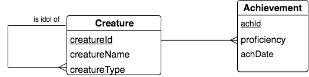
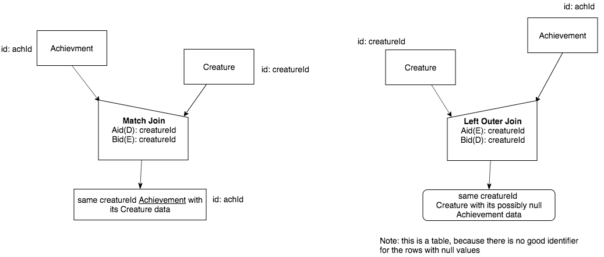
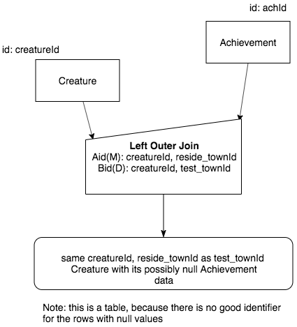

Outer Join by Examples
=========================

As you hopefully now realize, the many-to-one shape is by far the most common shape in what is called a 'normalized' conceptual schema in relational database theory. To be precise, however, the chicken feet on a conceptual schema like an LDS shape such as the following precisely means "zero or many".

|

|

What this means is that there can be, and very often are in most databases, instances on the one end, such as Creature above, that are **not** found at all in the relation on the many end, such as Achievement above. In the case of the example data we have been using, the person creature named Carlis has no achievements yet. When we perform a natural join, he is missing from the result relation. Let's verify that with the following code. (I've used the inner join syntax so you can see the similarity to the outer join example below.)

.. activecode:: creature_ach_nj
   :language: sql
   :include: all_creature_create_oj

   DROP TABLE IF EXISTS CreatureNJAchievement;

   CREATE TABLE CreatureNJAchievement AS
   select C.*, A.proficiency, A.skillCode, A.achDate
   from creature C
   inner join achievement A on C.creatureId = A.creatureId;

   SELECT * FROM CreatureNJAchievement;

Indeed, Carlis, who is the creature whose creatureId is 6, is missing. If we wanted to count the skills of each creature using this result relation from the natural join, also called inner join, we would be unable to easily add a zero count for him.

Our first Example: Outer Join to the Rescue
~~~~~~~~~~~~~~~~~~~~~~~~~~~~~~~~~~~~~~~~~~~~

There is another operation that will keep Carlis in the result so that we can count his skills as zero later. What we want to do is use what is called outer join, where we will keep Carlis and put null values in the columns coming from Achievement (since his creatureId is not there).

Here is the properly worded English query:

    Find each Creature with its possibly null Achievement data.

To study the precedence chart for Outer Join, let's look at the natural Match Join next to the Left Outer Join. Study this carefully:

|

|

We use an extra qualifier for the Outer Join, namely 'Left'. This is because when you look at the chart on the right, notice that we will be keeping the data from the relation of the left (Creature in this case), and inserting NULL values for missing data from the relation on the right (Achievement in this case).

Important things to note:

- The operator symbol has flipped, yet the relation on the 'one' end of the relationship still goes to the lower end of that flipped operator roof shape, and the 'many or zero' end goes to the upper corner.

- The 'works on' letters in Left Outer Join, Aid(E) and Bid(D), are swapped from the Natural Match Join counterpart.

- The result is a *table*, not a relation, because the included NULL values make it impossible to have a reasonable set of identifying columns. (Make certain you see this by looking at the result of the query below.)

- The result table name for Left Outer Join is also 'flipped' from the Natural Match Join counterpart.

Now let's look at the SQL code in action. First, create the result table:

.. activecode:: creature_ach_oj
   :language: sql
   :include: all_creature_create_oj

   DROP TABLE IF EXISTS CreatureLOJAchievement;

   CREATE TABLE CreatureLOJAchievement AS
   select C.*, A.proficiency, A.skillCode, A.achDate
   from creature C
   left outer join achievement A on C.creatureId = A.creatureId;
   -- creature is the left relation whose rows will be kept
   -- when the 'on' condition is not satisfied

Now display what is in the result table:

.. activecode:: creature_ach_oj_display
  :language: sql
  :include: all_creature_create_oj, creature_ach_oj

  select * from CreatureLOJAchievement;

Note how Carlis is now in this result table. This table can now be used to count the number of achievements per each creatureId. The NULL values for columns from Achievement are now an indictor that a count of zero should be used in the case of creaureId 6.

.. activecode:: creature_ach_oj_count
  :language: sql
  :include: all_creature_create_oj, creature_ach_oj

  select creatureId, count(skillCode)
  from CreatureLOJAchievement
  group by creatureId;

Suppose we want distinct skill code counts per creature, not counting every time they tried to achieve. It turns out to be quite easy to add after the outer join is performed. Note the addition of just one keyword to accomplish this in this next example.

.. activecode:: creature_ach_oj_count_distinct
  :language: sql
  :include: all_creature_create_oj, creature_ach_oj

  select creatureId, count( distinct skillCode)
  from CreatureLOJAchievement
  group by creatureId;

A second Example: over extra columns
~~~~~~~~~~~~~~~~~~~~~~~~~~~~~~~~~~~~

Outer Join works over more columns than the foreign key columns. Here is another related, but different query:

    Find each same creatureId and same reside_townId as test_townId Creature with its possibly null Achievement data.

And the precedence chart:

|

|

Here is the SQL code to create the result table:

.. activecode:: creature_ach_oj_w
   :language: sql
   :include: all_creature_create_oj

   DROP TABLE IF EXISTS CreatureLOJAchievement_w;

   CREATE TABLE CreatureLOJAchievement_w AS
   select C.*, A.proficiency, A.skillCode, A.achDate
   from creature C
   left outer join achievement A on
   (C.creatureId = A.creatureId and C.reside_townId = A.test_townId)
   ;
   -- creature is the left relation whose rows will be kept
   -- when the 'on' condition is not satisfied

And to display the result table:

.. activecode:: creature_ach_oj_w_display
   :language: sql
   :include: all_creature_create_oj, creature_ach_oj_w

   select * from CreatureLOJAchievement_w;

What we often really want to do with this table is ask this:

    How many skills have been achieved by a creature in the same achievement test town as the reside town of the creature?

Here is how we get this result: Group over creatureId and reside_townId and count the Achievements:

.. activecode:: creature_ach_oj_count_w
  :language: sql
  :include: all_creature_create_oj, creature_ach_oj_w

  select creatureId, reside_townId, count(skillCode)
  from CreatureLOJAchievement_w
  group by creatureId, reside_townId;

Hopefully you can see the utility of the Outer Join operation, especially when we would like to count how many are on the many end of a relationship, including if there are zero.

Both Outer Join
~~~~~~~~~~~~~~~

The following shows how we might do an outer join on both sides of an intersection entity. In this case, including not only creatures who have not yet achieved, but skills that have not yet been achieved.

.. activecode:: creature_ach_skill_oj
   :language: sql
   :include: all_creature_create_oj

   -- not available in this book, but usually in SQLite
   -- select C.*, A.proficiency, S.skillCode, S.skillDescription
   -- from creature C
   -- full outer join achievement A on C.creatureId = A.creatureId
   -- full outer join skill S on A.skillCode = S.skillCode;

   -- This version is possible, using only LEFT OUTER JOIN and UNION ALL
    SELECT C.creatureId,
        A.achId, A.skillCode, A.proficiency, A.test_townid
    FROM creature C LEFT JOIN achievement A
    ON C.creatureId=A.creatureId
    UNION ALL
    select A.creatureId,
           A.achId, B.skillCode, A.proficiency, A.test_townId
    from  skill B LEFT JOIN achievement A
    on A.skillCode = B.skillCode
    ;

Data Used for these examples
~~~~~~~~~~~~~~~~~~~~~~~~~~~~

The following code was used to create the data relations used as input relations for this example. It is the same as what has been used in the other examples in this book. It is hidden, but you can show it if you want to.

.. activecode:: all_creature_create_oj
   :language: sql
   :hidecode:

    -- ------------------   town -- -------------------------------

    DROP TABLE IF EXISTS town;

    CREATE TABLE town (
    townId          VARCHAR(3)      NOT NULL PRIMARY KEY,
    townName        VARCHAR(20),
    State           VARCHAR(20),
    Country         VARCHAR(20),
    townNickname    VARCHAR(80),
    townMotto       VARCHAR(80)
    );

    -- order matches table creation:
    -- id    name          state   country
    -- nickname   motto
    INSERT INTO town VALUES ('p', 'Philadelphia', 'PA', 'United States',
                             'Philly', 'Let brotherly love endure');
    INSERT INTO town VALUES ('a', 'Anoka', 'MN', 'United States',
                             'Halloween Capital of the world', NULL);
    INSERT INTO town VALUES ('be', 'Blue Earth', 'MN', 'United States',
                             'Beyond the Valley of the Jolly Green Giant',
                             'Earth so rich the city grows!');
    INSERT INTO town VALUES ('b', 'Bemidji', 'MN', 'United States',
                             'B-town', 'The first city on the Mississippi');
    INSERT INTO town VALUES ('d', 'Duluth', 'MN', 'United States',
                            'Zenith City', NULL);
    INSERT INTO town VALUES ('g', 'Greenville', 'MS', 'United States',
                             'The Heart & Soul of the Delta',
                             'The Best Food, Shopping, & Entertainment In The South');
    INSERT INTO town VALUES ('t', 'Tokyo', 'Kanto', 'Japan', NULL, NULL);
    INSERT INTO town VALUES ('as', 'Asgard', NULL, NULL,
                             'Home of Odin''s vault',
                             'Where magic and science are one in the same');
    INSERT INTO town VALUES ('mv', 'Metroville', NULL, NULL,
                            'Home of the Incredibles',
                            'Still Standing');
    INSERT INTO town VALUES ('le', 'London', 'England', 'United Kingdom',
                            'The Smoke',
                            'Domine dirige nos');
    INSERT INTO town VALUES ('sw', 'Seattle', 'Washington', 'United States',
                            'The Emerald City',
                            'The City of Goodwill');

    -- ------------------   creature -- -------------------------------
    DROP TABLE IF EXISTS creature;

    CREATE TABLE creature (
    creatureId          INTEGER      NOT NULL PRIMARY KEY,
    creatureName        VARCHAR(20),
    creatureType        VARCHAR(20),
    reside_townId VARCHAR(3) REFERENCES town(townId),     -- foreign key
    idol_creatureId     INTEGER,
    FOREIGN KEY(idol_creatureId) REFERENCES creature(creatureId)
    );

    INSERT INTO creature VALUES (1,'Bannon','person','p',10);
    INSERT INTO creature VALUES (2,'Myers','person','a',9);
    INSERT INTO creature VALUES (3,'Neff','person','be',NULL);
    INSERT INTO creature VALUES (4,'Neff','person','b',3);
    INSERT INTO creature VALUES (5,'Mieska','person','d', 10);
    INSERT INTO creature VALUES (6,'Carlis','person','p',9);
    INSERT INTO creature VALUES (7,'Kermit','frog','g',8);
    INSERT INTO creature VALUES (8,'Godzilla','monster','t',6);
    INSERT INTO creature VALUES (9,'Thor','superhero','as',NULL);
    INSERT INTO creature VALUES (10,'Elastigirl','superhero','mv',13);
    INSERT INTO creature VALUES (11,'David Beckham','person','le',9);
    INSERT INTO creature VALUES (12,'Harry Kane','person','le',11);
    INSERT INTO creature VALUES (13,'Megan Rapinoe','person','sw',10);

    -- ------------------   skill -- -------------------------------
    DROP TABLE IF EXISTS skill;

    CREATE TABLE skill (
    skillCode          VARCHAR(3)      NOT NULL PRIMARY KEY,
    skillDescription   VARCHAR(40),
    maxProficiency     INTEGER,     -- max score that can be achieved for this skill
    minProficiency     INTEGER,     -- min score that can be achieved for this skill
    origin_townId      VARCHAR(3)     REFERENCES town(townId)     -- foreign key
    );

    INSERT INTO skill VALUES ('A', 'float', 10, -1,'b');
    INSERT INTO skill VALUES ('E', 'swim', 5, 0,'b');
    INSERT INTO skill VALUES ('O', 'sink', 10, -1,'b');
    INSERT INTO skill VALUES ('U', 'walk on water', 5, 1,'d');
    INSERT INTO skill VALUES ('Z', 'gargle', 5, 1,'a');
    INSERT INTO skill VALUES ('B2', '2-crew bobsledding', 25, 0,'d');
    INSERT INTO skill VALUES ('TR4', '4x100 meter track relay', 100, 0,'be');
    INSERT INTO skill VALUES ('C2', '2-person canoeing', 12, 1,'t');
    INSERT INTO skill VALUES ('THR', 'three-legged race', 10, 0,'g');
    INSERT INTO skill VALUES ('D3', 'Australasia debating', 10, 1,NULL);
    INSERT INTO skill VALUES ('PK', 'soccer penalty kick', 10, 1, 'le');
    -- Note that no skill originates in Philly or Metroville or Asgaard

    -- ------------------  teamSkill  -- -------------------------------
    DROP TABLE IF EXISTS teamSkill;

    CREATE TABLE teamSkill (
    skillCode      VARCHAR(3)  NOT NULL PRIMARY KEY references skill (skillCode),
    teamSize       INTEGER
    );

    INSERT INTO teamSkill VALUES ('B2', 2);
    INSERT INTO teamSkill VALUES ('TR4', 4);
    INSERT INTO teamSkill VALUES ('C2', 2);
    INSERT INTO teamSkill VALUES ('THR', 2);
    INSERT INTO teamSkill VALUES ('D3', 3);

    -- ------------------  achievement  -- -------------------------------
    DROP TABLE IF EXISTS achievement;

    CREATE TABLE achievement (
    achId              INTEGER NOT NULL PRIMARY KEY AUTOINCREMENT,
    creatureId         INTEGER,
    skillCode          VARCHAR(3),
    proficiency        INTEGER,
    achDate            TEXT,
    test_townId VARCHAR(3) REFERENCES town(townId),     -- foreign key
    FOREIGN KEY (creatureId) REFERENCES creature (creatureId),
    FOREIGN KEY (skillCode) REFERENCES skill (skillCode)
    );

    -- Bannon floats in Anoka (where he aspired)
    INSERT INTO achievement (creatureId, skillCode, proficiency,
                             achDate, test_townId)
                    VALUES (1, 'A', 3, datetime('now'), 'a');

    -- Bannon swims in Duluth (he aspired in Bemidji)
    INSERT INTO achievement (creatureId, skillCode, proficiency,
                             achDate, test_townId)
                    VALUES (1, 'E', 3, datetime('2017-09-15 15:35'), 'd');
    -- Bannon floats in Anoka (where he aspired)
    INSERT INTO achievement (creatureId, skillCode, proficiency,
                             achDate, test_townId)
                    VALUES (1, 'A', 3, datetime('2018-07-14 14:00'), 'a');

    -- Bannon swims in Duluth (he aspired in Bemidji)
    INSERT INTO achievement (creatureId, skillCode, proficiency,
                             achDate, test_townId)
                    VALUES (1, 'E', 3, datetime('now'), 'd');
    -- Bannon doesn't gargle
    -- Mieska gargles in Tokyo (had no aspiration to)
    INSERT INTO achievement (creatureId, skillCode, proficiency,
                             achDate, test_townId)
                    VALUES (5, 'Z', 6, datetime('2016-04-12 15:42:30'), 't');

    -- Neff #3 gargles in Blue Earth (but not to his aspired proficiency)
    INSERT INTO achievement (creatureId, skillCode, proficiency,
                             achDate, test_townId)
                    VALUES (3, 'Z', 4, datetime('2018-07-15'), 'be');
    -- Neff #3 gargles in Blue Earth (but not to his aspired proficiency)
    -- on same day at same proficiency, signifying need for arbitrary id
    INSERT INTO achievement (creatureId, skillCode, proficiency,
                             achDate, test_townId)
                    VALUES (3, 'Z', 4, datetime('2018-07-15'), 'be');

    -- Beckham achieves PK in London
    INSERT INTO achievement (creatureId, skillCode, proficiency,
                             achDate, test_townId)
                    VALUES (11, 'PK', 10, datetime('1998-08-15'), 'le');
    -- Kane achieves PK in London
    INSERT INTO achievement (creatureId, skillCode, proficiency,
                             achDate, test_townId)
                    VALUES (12, 'PK', 10, datetime('2016-05-24'), 'le');
    -- Rapinoe achieves PK in London
    INSERT INTO achievement (creatureId, skillCode, proficiency,
                             achDate, test_townId)
                    VALUES (13, 'PK', 10, datetime('2012-08-06'), 'le');
    -- Godizilla achieves PK in Tokyo poorly with no date
    -- had not aspiration to do so- did it on a dare ;)
    INSERT INTO achievement (creatureId, skillCode, proficiency,
                             achDate, test_townId)
                    VALUES (8, 'PK', 1, NULL, 't');

    -- -------------------- -------------------- -------------------
    -- Thor achieves three-legged race in Metroville (with Elastigirl)
    INSERT INTO achievement (creatureId, skillCode, proficiency,
                             achDate, test_townId)
                    VALUES (9, 'THR', 10, datetime('2018-08-12 14:30'), 'mv');
    -- Elastigirl achieves three-legged race in Metroville (with Thor)
    INSERT INTO achievement (creatureId, skillCode, proficiency,
                             achDate, test_townId)
                    VALUES (10, 'THR', 10, datetime('2018-08-12 14:30'), 'mv');

    -- Kermit 'pilots' 2-person bobsledding  (pilot goes into contribution)
    --       with Thor as brakeman (brakeman goes into contribution) in Duluth,
    --    achieve at 76% of maxProficiency
    INSERT INTO achievement (creatureId, skillCode, proficiency,
                             achDate, test_townId)
                    VALUES (7, 'B2', 19, datetime('2017-01-10 16:30'), 'd');
    INSERT INTO achievement (creatureId, skillCode, proficiency,
                             achDate, test_townId)
                    VALUES (9, 'B2', 19, datetime('2017-01-10 16:30'), 'd');

    -- 4 people form track realy team in London:
    --   Neff #4, Mieska, Myers, Bannon
    --    achieve at 85% of maxProficiency
    INSERT INTO achievement (creatureId, skillCode, proficiency,
                             achDate, test_townId)
                    VALUES (4, 'TR4', 85, datetime('2012-07-30'), 'le');
    INSERT INTO achievement (creatureId, skillCode, proficiency,
                             achDate, test_townId)
                    VALUES (5, 'TR4', 85, datetime('2012-07-30'), 'le');
    INSERT INTO achievement (creatureId, skillCode, proficiency,
                             achDate, test_townId)
                    VALUES (2, 'TR4', 85, datetime('2012-07-30'), 'le');
    INSERT INTO achievement (creatureId, skillCode, proficiency,
                             achDate, test_townId)
                    VALUES (1, 'TR4', 85, datetime('2012-07-30'), 'le');

    -- Thor, Rapinoe, and Kermit form debate team in Seattle, WA and
    -- achieve at 80% of maxProficiency
    INSERT INTO achievement (creatureId, skillCode, proficiency,
                             achDate, test_townId)
                    VALUES (9, 'D3', 8, datetime('now', 'localtime'), 'sw');
    INSERT INTO achievement (creatureId, skillCode, proficiency,
                             achDate, test_townId)
                    VALUES (13, 'D3', 8, datetime('now', 'localtime'), 'sw');
    INSERT INTO achievement (creatureId, skillCode, proficiency,
                             achDate, test_townId)
                    VALUES (7, 'D3', 8, datetime('now', 'localtime'), 'sw');

    -- no 2-person canoeing achievements, but some have aspirations

Other Queries to try:
~~~~~~~~~~~~~~~~~~~~~

Try charts for these as practice:

    Find each Skill with its possibly null Achievement data.

    Find each same skillCode and same reside_townId as origin_townId Skill with its possibly null Achievement data.

    Creature with its possibly null contribution data

    Creature with its possibly null aspiration data

    Town with its possibly null Skill data (Find each town that are not origin towns of any skills)
