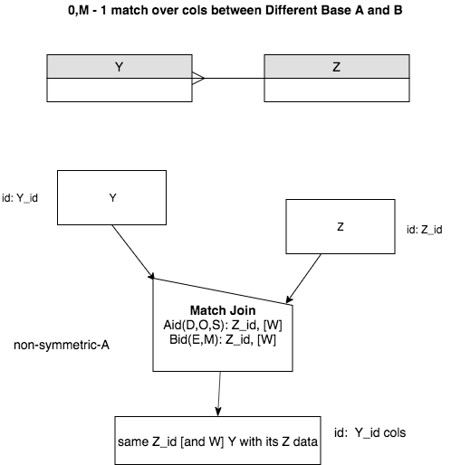
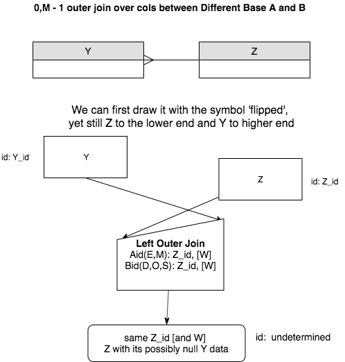
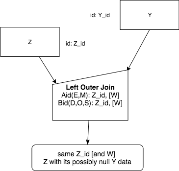

A Generic Version of OuterJoin
===============================

Outer Join is used in the case where we have a 1 - M relationship and the many end relation (B) can have zero related foreign key data values from the relation on the one end (A). (Note A, B are swapped from the natural join case.)

Here are some generic versions of the precedence charts. First, the normal natural join.

|

|

Now, when joining over at least the foreign key, but keeping all elements from the one-end A relation and adding NULL values from the many end B relation, we perform a Left Outer Join like this as an intermediate step:

|

|

Then we finish by fully flipping the A (1 end) and B (0, M end) in the diagram like this:

|

|

As we saw in the examples in the previous section, we can include added columns besides the identifier of the A relation, which we have called Z in these generic charts. This is shown with the [W] for additional column names.

.. note:: The Aid(...) and Bid(...) possible values have flipped from the natural match join to the left outer join. This is because the one-end relation is now the A relation and the zero or many end relation is now the B relation, *but we match over the same columns that we did for the natural join*.
