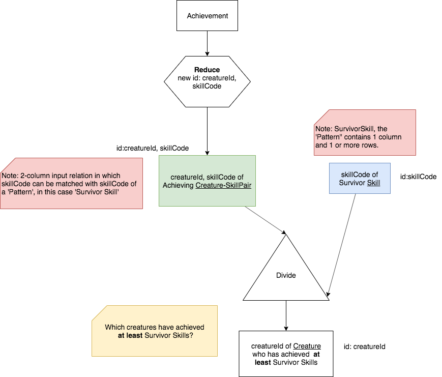

Divide Operator: two types
===========================

Divide is an original relational algebra operation [#]_ defined by Edgar F. "Ted" Codd, the inventor of the relational model of data [#]_ , [#]_. As we come close to the end of our adventure with the relational model, it seems only fitting to give deference to its creator for one of the outstanding contributions to computer science that has stood the test of time. Here are a few references about his work.

**References**

.. [#] https://en.wikipedia.org/wiki/Relational_algebra

.. [#] Codd, E. F. (1970). "A relational model of data for large shared data banks". Communications of the ACM. 13 (6): 377–387. doi:10.1145/362384.362685. https://www.seas.upenn.edu/~zives/03f/cis550/codd.pdf

.. [#] https://en.wikipedia.org/wiki/Edgar_F._Codd

Along with what we have already studied (project and reduce, filter, which Codd called selection, the set operations, times, and the various joins), Codd also described an operation called Divide, which is slightly more complicated to understand and which does not have a direct implementation in SQL, but can nonetheless be performed in SQL with a series of the other operations. We will describe and provide examples of Codd's original version, and later look at another version that is also quite useful.

Divide, originally: "matches at least"
~~~~~~~~~~~~~~~~~~~~~~~~~~~~~~~~~~~~~~~

The basic principle of the original Divide is very powerful, and is worth learning. Knowing how to use it can enable you to perform some very interesting analyses. The idea of this **binary** operation is as follows:

- First create an *Input Relation* **A** from your data that contains 2 columns. Some, usually not all, of the values in the first column is what will ultimately be returned. The second column contains values that will be compared to relation **B**. (for example: creatureId, skillCode of Achievement)

- Next define a **brand new** *Pattern Relation* **B** that contains a single column of values in the universe of the second column of *Input Relation* **A**. This is a relation you typically make up on your own because it represents a pattern of values you would like to match to rows in input relation A. (for example: skillCode of Survivor Skills)

- After performing the operation A Divide B, the result relation contains values from the first column of input relation A that satisfy this concept: For a given value in column 1 of A, among its rows of A, each column 2 of A matches **at least** all of the rows in the pattern relation B. (for example, creatureId of creature who as **at least** achieved Survivor Skills)

This definition is still possibly obtuse and hard to follow, so a full small example is the best way to see what this means. Let's start by recalling what is in the Achievement relation, which looks like this:

.. csv-table:: **Achievement**
   :file: ../creatureData/achievement.csv
   :widths: 10, 10, 10, 20, 30, 20
   :header-rows: 1

Note that creatures with particular creatureId values have achieved skills with particular skillCode values, sometimes more than once. The concept of using divide on this type of intersection entity is that we can define a minimum set of skills that, if achieved, constitute having met some criteria.

Suppose we have this basic English narrative:

    Find each Creature who is a survivor because they can **at least** float and swim.

The skillCode for float is 'A' and for swim is 'E'.

.. fillintheblank:: divide_fillin_1

   Given the Achievement relation above, the creature whose creatureId is |blank| is the creature who has achieved at least swim ('A') and float ('E').

   - :1: Yes- this is the only creatureId that has achieved at least these skills.
     :x: there is only one creature who has a float and swim achievement.

The precedence chart using the Divide operator symbol we have chosen (a triangle) looks like this:

|

|

.. note:: One key point to understanding Divide is the words that have been bolded several times so far to emphasize this point: **at least**. The name of the result relation should contain this phrase, because it is a good way to understand what is in the result.

We will start with a compact, yet somewhat complex version of the SQL code. Run the following to see which creatureId identifies the survivor creature because they have achieved at least swim and float skills.

.. activecode:: survivor
   :language: sql
   :include: all_creature_create_divide

   drop table if exists skillCode_of_survivor_Skill;

   -- This is our pattern relation B
   --
   CREATE TABLE skillCode_of_survivor_Skill AS
   SELECT skillCode from skill
   WHERE skillDescription = 'float' OR skillDescription = 'swim'
   ;

   -- This is the Divide operation using available SQL,
   -- including two 'nested' queries.
   --
   SELECT DISTINCT creatureId
   FROM achievement AS IN1
   WHERE NOT EXISTS
       (SELECT *
          FROM skillCode_of_survivor_Skill P
         WHERE NOT EXISTS
               (SELECT *
                  FROM achievement AS IN2
                 WHERE (IN1.creatureId = IN2.creatureId)
                   AND (IN2.skillCode = P.skillCode)));

Shortly we will break this down into all of its parts using a much longer process with intermediate relations. But first note that when you feel comfortable with the nested query shown above, the generic form of it that you can use to devise your own queries looks like the following. *Study this carefully and use it as a template when you try your own new queries*.

.. code-block:: SQL

    -- A divide "at least" method made popular by C. Date in his textbooks.
    --
    -- [input]  should be replaced by relation to match pattern with (A).
    -- [Pattern] should be replaced by relation containing pattern rows (B).
    -- [col1_of_input] should be replaced by column of values to be returned
    --                that fulfill or match all the pattern row values.
    -- [col_of_pattern] should be replaced by column name in Pattern relation.
    --                  Note that this same column name should exist in [input],
    --                  which should have both [col1_of_input] and
    --                  [col_of_pattern] in it.

    SELECT DISTINCT [col1_of_input]
    FROM [input] AS IN1
    WHERE NOT EXISTS
        (SELECT *
         FROM [Pattern]
         WHERE NOT EXISTS
              (SELECT *
               FROM [input] AS IN2
               WHERE (IN1.[col_of_input] = IN2.[col1_of_input])
                 AND (IN2.[col_of_pattern] = [Pattern].[col_of_pattern])
              )
        );

Let's unpack this convenient fill-in-the blank version, using our original query, "Find each Creature who is a survivor because they can float and swim."

Here is a longer precedence chart showing how we can complete the divide operation. When you work, you don't have to use a chart like this, you can use the simple one above. However, we will present the details here one so that you can see how it gets done. Note how this chart below has two minus operations, which can be accomplished in SQL using 'NOT EXISTS'; this is why the above template has two uses of this.

|

.. image:: ../img/Divide/LongDivideSurvivor.png
    :align: center
    :height: 1000px
    :alt: Survivor Divide chart

|

Next we can look at a translation of the above chart into a long version of SQL that uses several intermediate relations. Each tab completes part of the above chart. Run the last one to see that it gets the same result.

.. tabbed:: long_divide

    .. tab:: Input, Pattern

      .. activecode:: survivor_input
        :language: sql
        :include: all_creature_create_divide

        -- First create the PATTERN relation (B) of survivor skill
        drop table if exists skillCode_of_survivor_Skill;

        CREATE TABLE skillCode_of_survivor_Skill AS
        SELECT skillCode from skill
        WHERE skillDescription = 'float' OR skillDescription = 'swim'
        ;

        --------------------------------------------------------
        -- Reduce to creatureId, skillCode columns of achievement
        -- (relation A)
        --
        drop table if exists crId_s_code_of_Achievement;

        CREATE TABLE crId_s_code_of_Achievement AS
        select distinct creatureId, skillCode
        from achievement
        ;

    .. tab:: Times

      .. activecode:: survivor_times
        :language: sql
        :include: all_creature_create_divide, survivor_input

        --------------------------------------------------------
        -- The times
        --

        drop table if exists achievingCr_survivorSkill_pair;
        drop table if exists achieving_creature;

        create table achieving_creature as
        SELECT distinct creatureId
        FROM crId_s_code_of_Achievement;

        create table achievingCr_survivorSkill_pair as
        SELECT achieving_creature.creatureId,
               skillCode_of_survivor_Skill.skillCode
        FROM skillCode_of_survivor_Skill,
             achieving_creature
        ;

    .. tab:: Minus: missing survivor skills

      .. activecode:: survivor_missing
        :language: sql
        :include: all_creature_create_divide, survivor_input, survivor_times

        --------------------------------------------------------
        -- The minus to get missing survivor skills
        --
        drop table if exists creatureId_skillCode_missing_cr_sur_skill;

        -- This is how we demonstrated minus before in the book, using 'except'
        --
        -- create table creatureId_skillCode_missing_cr_sur_skill as
        -- SELECT creatureId, skillCode
        -- FROM achievingCr_survivorSkill_pair
        -- EXCEPT
        -- SELECT creatureId, skillCode FROM crId_s_code_of_Achievement
        -- ;

        -- However, not all systems have except, and to help match the
        -- nested query example, let's see how we do a minus with NOT EXISTS
        --

        create table creatureId_skillCode_missing_cr_sur_skill as
        SELECT creatureId, skillCode
        FROM achievingCr_survivorSkill_pair A
        WHERE NOT EXISTS (
          SELECT creatureId, skillCode
          FROM crId_s_code_of_Achievement B
          WHERE A.creatureId = B.creatureId
                and A.skillCode = B.skillCode
        )
        ;

    .. tab:: Minus: at least survivor skills

      .. activecode:: survivor_at_least
        :language: sql
        :include: all_creature_create_divide, survivor_input, survivor_times, survivor_missing

        --------------------------------------------------------
        -- The second minus at the bottom of the chart
        --
        drop table if exists creatureId_of_survivor_Creature;

        --  Using except, it would be like this
        --
        -- CREATE TABLE creatureId_of_survivor_Creature AS
        -- SELECT distinct creatureId
        -- FROM crId_s_code_of_Achievement
        -- EXCEPT
        -- SELECT distinct creatureId
        -- FROM creatureId_skillCode_missing_cr_sur_skill
        -- ;

        -- using NOT EXISTS, such as in MySQL, it would look like this
        --
        CREATE TABLE creatureId_of_survivor_Creature AS
        SELECT distinct creatureId
        FROM crId_s_code_of_Achievement IN1
        WHERE NOT EXISTS
          (SELECT creatureId
           FROM creatureId_skillCode_missing_cr_sur_skill MISSING
           WHERE IN1.creatureId = MISSING.creatureId
           )
        ;

        select * from creatureId_of_survivor_Creature;

The above was simply an illustration of all the steps, so you get a sense of how the NOT EXISTS syntax can be used for the minus operator. Perhaps you can see how this long version translates into the much more compact, nested query version that we presented first, repeated as follows:

.. code-block:: SQL

    -- A divide "at least" method made popular by C. Date in his textbooks.
    --
    -- [input]  should be replaced by relation to match pattern with (A)
    -- [Pattern] should be replaced by relation containing pattern rows (B)
    -- [col1_of_input] should be replaced by column of values to be returned
    --                that fulfill or match all the pattern row values
    -- [col_of_pattern] should be replaced by column name in Pattern relation
    --                  Note that this same column name should exist in [input],
    --                  which should have both [col1_of_input] and
    --                  [col_of_pattern] in it.

    SELECT DISTINCT [col1_of_input]
    FROM [input] AS IN1
    WHERE NOT EXISTS
        (SELECT *
         FROM [Pattern]
         WHERE NOT EXISTS
              (SELECT *
               FROM [input] AS IN2
               WHERE (IN1.[col_of_input] = IN2.[col1_of_input])
                 AND (IN2.[col_of_pattern] = [Pattern].[col_of_pattern])
              )
        );

The first minus tab in the long version corresponds to the second 'WHERE NOT EXISTS' in the compact version, and the second minus tab in the long version corresponds to the first 'WHERE NOT EXISTS' in the compact version.

.. important:: To use the compact version, you will need to create the input and Pattern relations first. In many cases you can use a relation like Achievement as is for the input, but it's just as well to create the 2-column version instead. You always have to create the Pattern to match against.

Exactly Divide: matching the pattern exactly (no more, no less)
~~~~~~~~~~~~~~~~~~~~~~~~~~~~~~~~~~~~~~~~~~~~~~~~~~~~~~~~~~~~~~~

Another useful version of Divide has a slightly different meaning. We still have a 'Pattern' relation B and an input relation A, but this time we wish to return those in A that match exactly, no more or no less, what is in the Pattern B.

Let's examine this by comparing it to the previous "at least" version. Here are two different English queries:

    Find each creature who has achieved at least the skill whose description is 'three-legged race'.

    Find each creature who has achieved exactly the skill whose description is 'three-legged race'.

.. note:: When it is one skill such as this example, we might have also said "find each creature who has achieved only the skill whose description is 'three-legged race'."

First, we need to make the 'pattern' relation with one column (and in this simple case one skill).

.. activecode:: THR_Skill
   :language: sql
   :include: all_creature_create_divide

   drop table if exists ThreeLeggedRaceSkill;
   -- 'the pattern' to look for
   CREATE TABLE ThreeLeggedRaceSkill AS
   SELECT skillCode from skill
   WHERE skillCode = 'THR'
   ;

Now the at least divide as we presented before:

.. activecode:: THR_Skill_divide
  :language: sql
  :include: all_creature_create_divide, THR_Skill

  SELECT DISTINCT creatureId
  FROM Achievement AS IN1
  WHERE NOT EXISTS
      (SELECT *
         FROM ThreeLeggedRaceSkill
        WHERE NOT EXISTS
              (SELECT *
                 FROM Achievement AS IN2
                WHERE (IN1.creatureId = IN2.creatureId)
                  AND (IN2.skillCode = ThreeLeggedRaceSkill.skillCode)));

And next the 'exactly' three-legged race, no more no less.

.. activecode:: THR_Skill_divide_exact
  :language: sql
  :include: all_creature_create_divide, THR_Skill

    SELECT IN1.creatureId
      FROM Achievement AS IN1
           LEFT OUTER JOIN
           ThreeLeggedRaceSkill AS P1
           ON IN1.skillCode = P1.skillCode
      GROUP BY IN1.creatureId
    HAVING COUNT(IN1.skillCode) =
            (SELECT COUNT(skillCode) FROM ThreeLeggedRaceSkill)
       AND COUNT(P1.skillCode) =
            (SELECT COUNT(skillCode) FROM ThreeLeggedRaceSkill);

As you might have thought, determining whether achievements per creature matches a pattern exactly needs to involve counting the number of skills in the pattern, the number of skills corresponding to the pattern that have been achieved per creature, and the number of skills total that have been achieved by the creature. This above query accomplishes this in yet another compact, yet complicated form. This is the most complicated query you will see in this book. Exact pattern match is the hardest type of query to perform, but when you can do it using the following general for as a guide, you can feel like you have mastered an important part of relational data analysis.

As an exercise, you could try to work out a long form chart for the query above.

**General form for Divide exactly.** Here is a general form of the above query for any input A and Pattern B. You can use this as you practice and create queries of your own.

.. code-block:: SQL

    -- This one is the generic form of "exactly divide", or exactly the
    -- number of values in the 1-column rows in pattern relation Pattern.
    --
    -- [input]  should be replaced by relation to match pattern with.
    -- [Pattern] should be replaced by relation containing pattern rows.
    -- [col_of_input] should be replaced by column of values to be returned
    --                that fulfill or match all the pattern row values.
    -- [col_of_pattern] should be replaced by column name in Pattern relation.
    --                  Note that this same column name should exist in [input],
    --                  which should have both [col_of_input] and
    --                  [col_of_pattern] in it.

    SELECT IN1.[col_of_input]
      FROM [input] AS IN1
           LEFT OUTER JOIN
           [Pattern] AS P1
           ON IN1.[col_of_pattern] = P1.[col_of_pattern]
      GROUP BY IN1.[col_of_input]
    HAVING COUNT(IN1.[col_of_pattern]) =
            (SELECT COUNT([col_of_pattern]) FROM [Pattern])
       AND COUNT(P1.[col_of_pattern]) =
            (SELECT COUNT([col_of_pattern]) FROM [Pattern]);

Try yourself
~~~~~~~~~~~~

Suppose it is useful to have debating skills along with being accomplished as a soccer player if you want to be a spokesperson for your club. Yet it is best if the spokesperson is not encumbered with any other achievements not associated with soccer. We might ask this:

    Who has achieved exactly 'soccer penalty kick' and 'Australasia debating' skills?

.. activecode:: exactly_PK_debate
   :language: sql
   :include: all_creature_create_divide

   drop table if exists PK_debate;
   -- 'the pattern' to look for
   CREATE TABLE PK_debat AS
   SELECT skillCode from skill
   WHERE skillCode = 'PK' or skillCode = "D3"
   ;

   -- Finish the code here for finding out who has achieved
   -- exactly penalty kick and debate.
   --
   drop table if exists creature_exactly_debate_pk;

   create table creature_exactly_debate_pk as
   -- fill here

   select * from creature_exactly_debate_pk;  -- leave this to display result

More ideas to try:

- Who has achieved in at least Duluth ('d') and Metroville ('mv') towns?
- What has been achieved by at least 'Kermit' and 'Thor'?

Note that things change more for these- the first still returns creatureId from Achievement, but the Pattern column is different (townId instead of skillCode). The second uses creatureId values as the Pattern, and returns skillCode values.

**Another Reference**

If you are enjoying the complexity of this Divide operation, you might find `this article by Joe Celko about divide <https://www.red-gate.com/simple-talk/sql/t-sql-programming/divided-we-stand-the-sql-of-relational-division/>`_ quite interesting. He describes a few even more complex examples, along with an explanation of what I have shown here with a different example.

----------------------------------------------------------------------

If you are curious or need a refresher, the following code block contains the data creation statements for part of the small creature database. This was used for these examples.

.. activecode:: all_creature_create_divide
   :language: sql

   -- ------------------   town -- -------------------------------

   DROP TABLE IF EXISTS town;

   CREATE TABLE town (
   townId          VARCHAR(3)      NOT NUll PRIMARY KEY,
   townName        VARCHAR(20),
   State           VARCHAR(20),
   Country         VARCHAR(20),
   townNickname    VARCHAR(80),
   townMotto       VARCHAR(80)
   );

   -- order matches table creation:
   -- id    name          state   country
   -- nickname   motto
   INSERT INTO town VALUES ('p', 'Philadelphia', 'PA', 'United States',
                            'Philly', 'Let brotherly love endure');
   INSERT INTO town VALUES ('a', 'Anoka', 'MN', 'United States',
                            'Halloween Capital of the world', NULL);
   INSERT INTO town VALUES ('be', 'Blue Earth', 'MN', 'United States',
                            'Beyond the Valley of the Jolly Green Giant',
                            'Earth so rich the city grows!');
   INSERT INTO town VALUES ('b', 'Bemidji', 'MN', 'United States',
                            'B-town', 'The first city on the Mississippi');
   INSERT INTO town VALUES ('d', 'Duluth', 'MN', 'United States',
                           'Zenith City', NULL);
   INSERT INTO town VALUES ('g', 'Greenville', 'MS', 'United States',
                            'The Heart & Soul of the Delta',
                            'The Best Food, Shopping, & Entertainment In The South');
   INSERT INTO town VALUES ('t', 'Tokyo', 'Kanto', 'Japan', NULL, NULL);
   INSERT INTO town VALUES ('as', 'Asgard', NULL, NULL,
                            'Home of Odin''s vault',
                            'Where magic and science are one in the same');
   INSERT INTO town VALUES ('mv', 'Metroville', NULL, NULL,
                           'Home of the Incredibles',
                           'Still Standing');
   INSERT INTO town VALUES ('le', 'London', 'England', 'United Kingdom',
                           'The Smoke',
                           'Domine dirige nos');
   INSERT INTO town VALUES ('sw', 'Seattle', 'Washington', 'United States',
                           'The Emerald City',
                           'The City of Goodwill');

   -- ------------------   creature -- -------------------------------
   DROP TABLE IF EXISTS creature;

   CREATE TABLE creature (
   creatureId          INTEGER      NOT NUll PRIMARY KEY,
   creatureName        VARCHAR(20),
   creatureType        VARCHAR(20),
   reside_townId VARCHAR(3) REFERENCES town(townId),     -- foreign key
   idol_creatureId     INTEGER,
   FOREIGN KEY(idol_creatureId) REFERENCES creature(creatureId)
   );

   INSERT INTO creature VALUES (1,'Bannon','person','p',10);
   INSERT INTO creature VALUES (2,'Myers','person','a',9);
   INSERT INTO creature VALUES (3,'Neff','person','be',NULL);
   INSERT INTO creature VALUES (4,'Neff','person','b',3);
   INSERT INTO creature VALUES (5,'Mieska','person','d', 10);
   INSERT INTO creature VALUES (6,'Carlis','person','p',9);
   INSERT INTO creature VALUES (7,'Kermit','frog','g',8);
   INSERT INTO creature VALUES (8,'Godzilla','monster','t',6);
   INSERT INTO creature VALUES (9,'Thor','superhero','as',NULL);
   INSERT INTO creature VALUES (10,'Elastigirl','superhero','mv',13);
   INSERT INTO creature VALUES (11,'David Beckham','person','le',9);
   INSERT INTO creature VALUES (12,'Harry Kane','person','le',11);
   INSERT INTO creature VALUES (13,'Megan Rapinoe','person','sw',10);

   -- ------------------   skill -- -------------------------------
   DROP TABLE IF EXISTS skill;

   CREATE TABLE skill (
   skillCode          VARCHAR(3)      NOT NUll PRIMARY KEY,
   skillDescription   VARCHAR(40),
   maxProficiency     INTEGER,     -- max score that can be achieved for this skill
   minProficiency     INTEGER,     -- min score that can be achieved for this skill
   origin_townId      VARCHAR(3)     REFERENCES town(townId)     -- foreign key
   );

   INSERT INTO skill VALUES ('A', 'float', 10, -1,'b');
   INSERT INTO skill VALUES ('E', 'swim', 5, 0,'b');
   INSERT INTO skill VALUES ('O', 'sink', 10, -1,'b');
   INSERT INTO skill VALUES ('U', 'walk on water', 5, 1,'d');
   INSERT INTO skill VALUES ('Z', 'gargle', 5, 1,'a');
   INSERT INTO skill VALUES ('B2', '2-crew bobsledding', 25, 0,'d');
   INSERT INTO skill VALUES ('TR4', '4x100 meter track relay', 100, 0,'be');
   INSERT INTO skill VALUES ('C2', '2-person canoeing', 12, 1,'t');
   INSERT INTO skill VALUES ('THR', 'three-legged race', 10, 0,'g');
   INSERT INTO skill VALUES ('D3', 'Australasia debating', 10, 1,NULL);
   INSERT INTO skill VALUES ('PK', 'soccer penalty kick', 10, 1, 'le');
   -- Note that no skill originates in Philly or Metroville or Asgaard

   -- ------------------  teamSkill  -- -------------------------------
   DROP TABLE IF EXISTS teamSkill;

   CREATE TABLE teamSkill (
   skillCode      VARCHAR(3)  NOT NUll PRIMARY KEY references skill (skillCode),
   teamSize       INTEGER
   );

   INSERT INTO teamSkill VALUES ('B2', 2);
   INSERT INTO teamSkill VALUES ('TR4', 4);
   INSERT INTO teamSkill VALUES ('C2', 2);
   INSERT INTO teamSkill VALUES ('THR', 2);
   INSERT INTO teamSkill VALUES ('D3', 3);

   -- ------------------  achievement  -- -------------------------------
   DROP TABLE IF EXISTS achievement;

   CREATE TABLE achievement (
   achId              INTEGER NOT NUll PRIMARY KEY AUTOINCREMENT,
   creatureId         INTEGER,
   skillCode          VARCHAR(3),
   proficiency        INTEGER,
   achDate            TEXT,
   test_townId VARCHAR(3) REFERENCES town(townId),     -- foreign key
   FOREIGN KEY (creatureId) REFERENCES creature (creatureId),
   FOREIGN KEY (skillCode) REFERENCES skill (skillCode)
   );

   -- Bannon floats in Anoka (where he aspired)
   INSERT INTO achievement (creatureId, skillCode, proficiency,
                            achDate, test_townId)
                   VALUES (1, 'A', 3, datetime('now'), 'a');

   -- Bannon swims in Duluth (he aspired in Bemidji)
   INSERT INTO achievement (creatureId, skillCode, proficiency,
                            achDate, test_townId)
                   VALUES (1, 'E', 3, datetime('2017-09-15 15:35'), 'd');
   -- Bannon floats in Anoka (where he aspired)
   INSERT INTO achievement (creatureId, skillCode, proficiency,
                            achDate, test_townId)
                   VALUES (1, 'A', 3, datetime('2018-07-14 14:00'), 'a');

   -- Bannon swims in Duluth (he aspired in Bemidji)
   INSERT INTO achievement (creatureId, skillCode, proficiency,
                            achDate, test_townId)
                   VALUES (1, 'E', 3, datetime('now'), 'd');
   -- Bannon doesn't gargle
   -- Mieska gargles in Tokyo (had no aspiration to)
   INSERT INTO achievement (creatureId, skillCode, proficiency,
                            achDate, test_townId)
                   VALUES (5, 'Z', 6, datetime('2016-04-12 15:42:30'), 't');

   -- Neff #3 gargles in Blue Earth (but not to his aspired proficiency)
   INSERT INTO achievement (creatureId, skillCode, proficiency,
                            achDate, test_townId)
                   VALUES (3, 'Z', 4, datetime('2018-07-15'), 'be');
   -- Neff #3 gargles in Blue Earth (but not to his aspired proficiency)
   -- on same day at same proficiency, signifying need for arbitrary id
   INSERT INTO achievement (creatureId, skillCode, proficiency,
                            achDate, test_townId)
                   VALUES (3, 'Z', 4, datetime('2018-07-15'), 'be');

   -- Beckham achieves PK in London
   INSERT INTO achievement (creatureId, skillCode, proficiency,
                            achDate, test_townId)
                   VALUES (11, 'PK', 10, datetime('1998-08-15'), 'le');
   -- Kane achieves PK in London
   INSERT INTO achievement (creatureId, skillCode, proficiency,
                            achDate, test_townId)
                   VALUES (12, 'PK', 10, datetime('2016-05-24'), 'le');
   -- Rapinoe achieves PK in London
   INSERT INTO achievement (creatureId, skillCode, proficiency,
                            achDate, test_townId)
                   VALUES (13, 'PK', 10, datetime('2012-08-06'), 'le');
   -- Godizilla achieves PK in Tokyo poorly with no date
   -- had not aspiration to do so- did it on a dare ;)
   INSERT INTO achievement (creatureId, skillCode, proficiency,
                            achDate, test_townId)
                   VALUES (8, 'PK', 1, NULL, 't');

   -- -------------------- -------------------- -------------------
   -- Thor achieves three-legged race in Metroville (with Elastigirl)
   INSERT INTO achievement (creatureId, skillCode, proficiency,
                            achDate, test_townId)
                   VALUES (9, 'THR', 10, datetime('2018-08-12 14:30'), 'mv');
   -- Elastigirl achieves three-legged race in Metroville (with Thor)
   INSERT INTO achievement (creatureId, skillCode, proficiency,
                            achDate, test_townId)
                   VALUES (10, 'THR', 10, datetime('2018-08-12 14:30'), 'mv');

   -- Kermit 'pilots' 2-person bobsledding  (pilot goes into contribution)
   --       with Thor as brakeman (brakeman goes into contribution) in Duluth,
   --    achieve at 76% of maxProficiency
   INSERT INTO achievement (creatureId, skillCode, proficiency,
                            achDate, test_townId)
                   VALUES (7, 'B2', 19, datetime('2017-01-10 16:30'), 'd');
   INSERT INTO achievement (creatureId, skillCode, proficiency,
                            achDate, test_townId)
                   VALUES (9, 'B2', 19, datetime('2017-01-10 16:30'), 'd');

   -- 4 people form track realy team in London:
   --   Neff #4, Mieska, Myers, Bannon
   --    achieve at 85% of maxProficiency
   INSERT INTO achievement (creatureId, skillCode, proficiency,
                            achDate, test_townId)
                   VALUES (4, 'TR4', 85, datetime('2012-07-30'), 'le');
   INSERT INTO achievement (creatureId, skillCode, proficiency,
                            achDate, test_townId)
                   VALUES (5, 'TR4', 85, datetime('2012-07-30'), 'le');
   INSERT INTO achievement (creatureId, skillCode, proficiency,
                            achDate, test_townId)
                   VALUES (2, 'TR4', 85, datetime('2012-07-30'), 'le');
   INSERT INTO achievement (creatureId, skillCode, proficiency,
                            achDate, test_townId)
                   VALUES (1, 'TR4', 85, datetime('2012-07-30'), 'le');

   -- Thor, Rapinoe, and Kermit form debate team in Seattle, WA and
   -- achieve at 80% of maxProficiency
   INSERT INTO achievement (creatureId, skillCode, proficiency,
                            achDate, test_townId)
                   VALUES (9, 'D3', 8, datetime('now', 'localtime'), 'sw');
   INSERT INTO achievement (creatureId, skillCode, proficiency,
                            achDate, test_townId)
                   VALUES (13, 'D3', 8, datetime('now', 'localtime'), 'sw');
   INSERT INTO achievement (creatureId, skillCode, proficiency,
                            achDate, test_townId)
                   VALUES (7, 'D3', 8, datetime('now', 'localtime'), 'sw');

   -- no 2-person canoeing achievements, but some have aspirations
