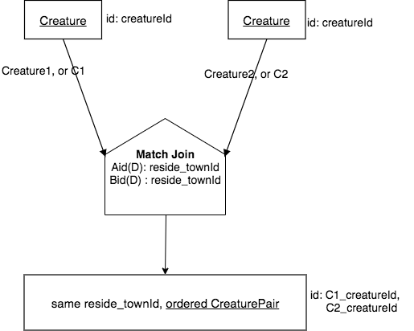
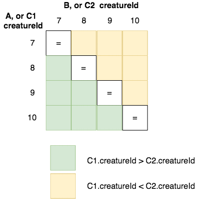
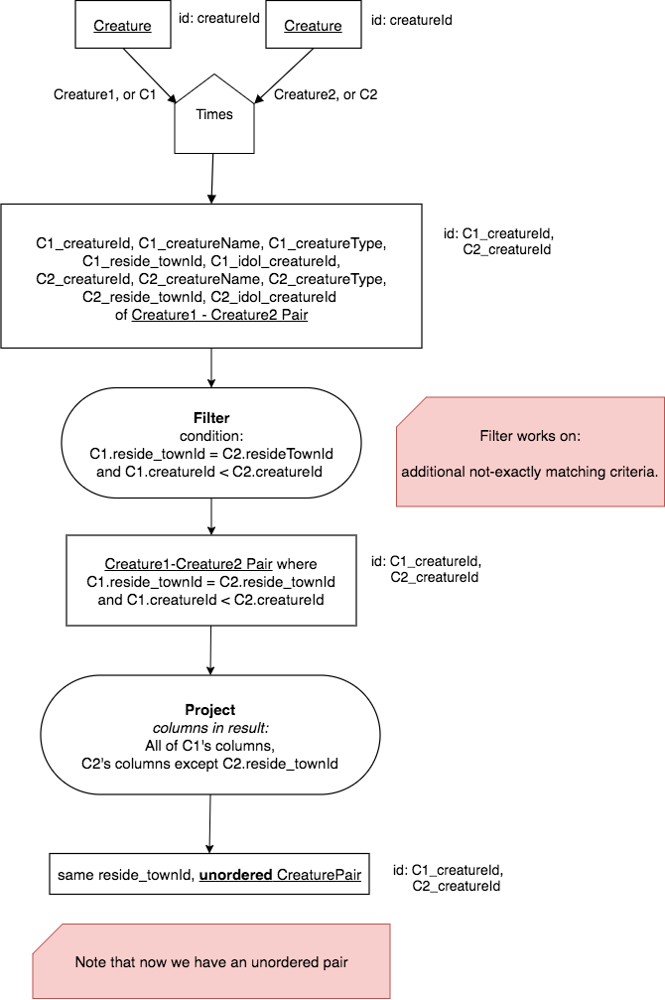

A Variation: Compare Join
==========================

The Match Join binary operator chapter was the largest in this book because there are some many different circumstances when it can be used. Thus, it takes some practice to master its use. Hopefully you have been doing some practice with it outside of this book, using another RDBMS. When you are comfortable with exactly matching columns after doing a times, you can now start thinking about cases in which we might use non-exact matching instead.

What can we do after a Times?
~~~~~~~~~~~~~~~~~~~~~~~~~~~~~~

Recall that the basis of the Match Join operator was to first complete a Times, then follow it with an exact match filter, and a Reduce or Project. One of the Match Join cases that was slightly unsettling and not particularly satisfying is the circumstance of same relation. Here was the example we had from the Match Join chapter:

|

|

The slightly unsatisfactory aspect of this example is that the result relation contains an ordered pair of creatures, and even contains the same creature paired with itself. This is a result of the underlying Times operation. To see this more clearly, let's use a slightly smaller example, by starting with non-person creature as the input relation, then complete a times. Run the following:

.. activecode:: cr1_cr2_times
   :language: sql
   :include: all_creature_create_compare

   DROP TABLE IF EXISTS non_person_creature;
   CREATE TABLE non_person_creature AS
   SELECT * from creature
   WHERE creatureType != 'person';

   SELECT C1.creatureId C1_creatureId,
          C1.creatureName C1_creatureName,
          C1.reside_townId C1_reside_townId,
          C2.creatureId C2_creatureId,
          C2.creatureName C2_creatureName,
          C2.reside_townId C2_reside_townId
   FROM non_person_creature C1, non_person_creature C2
   ;

In this example, we left out the exact match of the reside_townId for now. Notice how the non-person creatures are each paired with themselves and the pairs of creatures without the same creatureId appear twice, with the creatureId values in both possible orders. What we truly may want is unordered pairs of creatures where the creatureId is not the same.

To see this in a different way, let's try to visualize each of the entries in the result of the above times operation, looking only at the creatureId values. There are four non-person creatures, and their creatureId values are 7, 8, 9, and 10 respectively. There are three groups of pairs of these creatureId values that result from the times, which are shown in the following matrix:

|

|

Here is some SQL where we are projecting to get simply the pairs of creatureId values, as depicted above.

.. activecode:: cr1_cr2_times_2
   :language: sql
   :include: all_creature_create_compare

   DROP TABLE IF EXISTS non_person_creature;
   CREATE TABLE non_person_creature AS
   SELECT * from creature
   WHERE creatureType != 'person'
   ;

   SELECT C1.creatureId C1_creatureId,
          C2.creatureId C2_creatureId
   FROM non_person_creature C1, non_person_creature C2
   ;

When you run this, note all of the pairs an where they fall in the matrix visualization of them. Now here is that code again below. What where clause can you add to the second SELECT statement to get the yellow boxes only, which depict an **unordered pair** that does not include a non-person creature paired with itself?

.. activecode:: cr1_cr2_times_3
   :language: sql
   :include: all_creature_create_compare

   DROP TABLE IF EXISTS non_person_creature;
   CREATE TABLE non_person_creature AS
   SELECT * from creature
   WHERE creatureType != 'person'
   ;

   SELECT C1.creatureId C1_creatureId,
          C2.creatureId C2_creatureId
   FROM non_person_creature C1, non_person_creature C2
   -- add WHERE clause here
   ;

You can also try getting the lower half of the matrix (the green boxes) as an equally valid unordered pair.

Now let's return to the original Match Join example of each ordered pair of creatures (including person creatures) that live in the same town. Except now let's use what we have just visualized with the smaller set on non-person creatures to get the following:

    Find each unordered pair of creatures who reside in the same town.

Here is the SQL for this query:

.. activecode:: cr1_cr2_unordered
   :language: sql
   :include: all_creature_create_compare

   SELECT C1.creatureId C1_creatureId,
          C1.creatureName C1_creatureName,
          C1.reside_townId C1_reside_townId,
          C2.creatureId C2_creatureId,
          C2.creatureName C2_creatureName,
          C2.reside_townId C2_reside_townId
   FROM creature C1, creature C2
   WHERE C1_reside_townId = C2_reside_townId
   AND C1_creatureId < C2_creatureId   -- this is the 'compare'
   ;

This particular result is so much more useful and satisfying when your goal is to try to find potential training partners or mentors for a mentee who live in the same town. This is the power of realizing what you can perform after a times operation.

Here is a long precedence chart for this, where there is an extra Project to eliminate the duplicated same reside_townId.

|

|

Because we can have almost any clauses that we want in the filter and we may or may not have the last project/reduce, each of which does change the result, we typically draw out Compare Join in this way, rather than using an operator symbol to compact it. Note that in the following example, we would want to keep each reside_townId and eliminate the Project.

You can change the above SQL slightly (and chart a bit more to remove the Project) to also answer this question:

    Find each unordered pair of creatures that do not live in the same town.

Other Circumstances also Apply
~~~~~~~~~~~~~~~~~~~~~~~~~~~~~~

We showed a same-relation example, but other circumstances also can be used in a similar way. Here are a couple of example result queries that are reasonably precise. Try to devise the chart for them.

1. Find each same-SkillCode, but not same test_townId as origin_townId, (achievement with its skill data)

2. Find each creature who aspires to contribute and contributed the same skillCode to a team where their contributed roleName is not the same as their aspired roleName.

The first query is a different base example, following from the straightforward Match Join, or natural join.

The second query is a same base example, because each is in essence a creature-skill pair, in this case referring to contributing to a team contribution as special case of achievement and aspiration to achieve a team contribution. Here is the current data for these two relations:

.. csv-table:: **Contribution**
   :file: ../creatureData/contribution.csv
   :widths: 20, 20, 30, 30
   :header-rows: 1

.. csv-table:: **AspiredContribution**
  :file: ../creatureData/aspiredContribution.csv
  :widths: 20, 40, 40
  :header-rows: 1

Here is some SQL code for the second query:

.. activecode:: asp_contrib_not_same_role
   :language: sql
   :include: all_creature_create_compare

   -- Find each creature who aspires to contribute and
   -- contributed the same skillCode to a team where
   -- their contributed roleName is not the same as their aspired roleName.
   --
   SELECT C.*, A.skillCode aspContrib_skillCode, A.roleName aspContrib_roleName
   FROM contribution C, aspiredContribution A
   WHERE C.creatureId = A.creatureId
   AND   C.skillCode = A.skillCode
   AND C.roleName != A.roleName   -- this is the 'compare'
   ;

Note that you would not need to include the skillCode twice in this case, but I did it so that you could see that a contribution is for the same skill as aspired, but that the roleName is different.

Here is a place for you to try the first query above for practice.

.. activecode:: ach_skill_not_same_town
   :language: sql
   :include: all_creature_create_compare

   -- Find each same-SkillCode, but not same test_townId as origin_townId,
   --  (achievement with its skill data)
   SELECT

   ;

Data Used for these examples
~~~~~~~~~~~~~~~~~~~~~~~~~~~~

The following code was used to create the data relations used as input relations for this example. It is the same as what has been used in the other examples in this book. It is hidden, but you can show it if you want to.

.. activecode:: all_creature_create_compare
  :language: sql
  :hidecode:

   -- ------------------   town -- -------------------------------

   DROP TABLE IF EXISTS town;

   CREATE TABLE town (
   townId          VARCHAR(3)      NOT NUll PRIMARY KEY,
   townName        VARCHAR(20),
   State           VARCHAR(20),
   Country         VARCHAR(20),
   townNickname    VARCHAR(80),
   townMotto       VARCHAR(80)
   );

   -- order matches table creation:
   -- id    name          state   country
   -- nickname   motto
   INSERT INTO town VALUES ('p', 'Philadelphia', 'PA', 'United States',
                            'Philly', 'Let brotherly love endure');
   INSERT INTO town VALUES ('a', 'Anoka', 'MN', 'United States',
                            'Halloween Capital of the world', NULL);
   INSERT INTO town VALUES ('be', 'Blue Earth', 'MN', 'United States',
                            'Beyond the Valley of the Jolly Green Giant',
                            'Earth so rich the city grows!');
   INSERT INTO town VALUES ('b', 'Bemidji', 'MN', 'United States',
                            'B-town', 'The first city on the Mississippi');
   INSERT INTO town VALUES ('d', 'Duluth', 'MN', 'United States',
                           'Zenith City', NULL);
   INSERT INTO town VALUES ('g', 'Greenville', 'MS', 'United States',
                            'The Heart & Soul of the Delta',
                            'The Best Food, Shopping, & Entertainment In The South');
   INSERT INTO town VALUES ('t', 'Tokyo', 'Kanto', 'Japan', NULL, NULL);
   INSERT INTO town VALUES ('as', 'Asgard', NULL, NULL,
                            'Home of Odin''s vault',
                            'Where magic and science are one in the same');
   INSERT INTO town VALUES ('mv', 'Metroville', NULL, NULL,
                           'Home of the Incredibles',
                           'Still Standing');
   INSERT INTO town VALUES ('le', 'London', 'England', 'United Kingdom',
                           'The Smoke',
                           'Domine dirige nos');
   INSERT INTO town VALUES ('sw', 'Seattle', 'Washington', 'United States',
                           'The Emerald City',
                           'The City of Goodwill');

   -- ------------------   creature -- -------------------------------
   DROP TABLE IF EXISTS creature;

   CREATE TABLE creature (
   creatureId          INTEGER      NOT NUll PRIMARY KEY,
   creatureName        VARCHAR(20),
   creatureType        VARCHAR(20),
   reside_townId VARCHAR(3) REFERENCES town(townId),     -- foreign key
   idol_creatureId     INTEGER,
   FOREIGN KEY(idol_creatureId) REFERENCES creature(creatureId)
   );

   INSERT INTO creature VALUES (1,'Bannon','person','p',10);
   INSERT INTO creature VALUES (2,'Myers','person','a',9);
   INSERT INTO creature VALUES (3,'Neff','person','be',NULL);
   INSERT INTO creature VALUES (4,'Neff','person','b',3);
   INSERT INTO creature VALUES (5,'Mieska','person','d', 10);
   INSERT INTO creature VALUES (6,'Carlis','person','p',9);
   INSERT INTO creature VALUES (7,'Kermit','frog','g',8);
   INSERT INTO creature VALUES (8,'Godzilla','monster','t',6);
   INSERT INTO creature VALUES (9,'Thor','superhero','as',NULL);
   INSERT INTO creature VALUES (10,'Elastigirl','superhero','mv',13);
   INSERT INTO creature VALUES (11,'David Beckham','person','le',9);
   INSERT INTO creature VALUES (12,'Harry Kane','person','le',11);
   INSERT INTO creature VALUES (13,'Megan Rapinoe','person','sw',10);

   -- ------------------   skill -- -------------------------------
   DROP TABLE IF EXISTS skill;

   CREATE TABLE skill (
   skillCode          VARCHAR(3)      NOT NUll PRIMARY KEY,
   skillDescription   VARCHAR(40),
   maxProficiency     INTEGER,     -- max score that can be achieved for this skill
   minProficiency     INTEGER,     -- min score that can be achieved for this skill
   origin_townId      VARCHAR(3)     REFERENCES town(townId)     -- foreign key
   );

   INSERT INTO skill VALUES ('A', 'float', 10, -1,'b');
   INSERT INTO skill VALUES ('E', 'swim', 5, 0,'b');
   INSERT INTO skill VALUES ('O', 'sink', 10, -1,'b');
   INSERT INTO skill VALUES ('U', 'walk on water', 5, 1,'d');
   INSERT INTO skill VALUES ('Z', 'gargle', 5, 1,'a');
   INSERT INTO skill VALUES ('B2', '2-crew bobsledding', 25, 0,'d');
   INSERT INTO skill VALUES ('TR4', '4x100 meter track relay', 100, 0,'be');
   INSERT INTO skill VALUES ('C2', '2-person canoeing', 12, 1,'t');
   INSERT INTO skill VALUES ('THR', 'three-legged race', 10, 0,'g');
   INSERT INTO skill VALUES ('D3', 'Australasia debating', 10, 1,NULL);
   INSERT INTO skill VALUES ('PK', 'soccer penalty kick', 10, 1, 'le');
   -- Note that no skill originates in Philly or Metroville or Asgaard

   -- ------------------  teamSkill  -- -------------------------------
   DROP TABLE IF EXISTS teamSkill;

   CREATE TABLE teamSkill (
   skillCode      VARCHAR(3)  NOT NUll PRIMARY KEY references skill (skillCode),
   teamSize       INTEGER
   );

   INSERT INTO teamSkill VALUES ('B2', 2);
   INSERT INTO teamSkill VALUES ('TR4', 4);
   INSERT INTO teamSkill VALUES ('C2', 2);
   INSERT INTO teamSkill VALUES ('THR', 2);
   INSERT INTO teamSkill VALUES ('D3', 3);

   -- ------------------  achievement  -- -------------------------------
   DROP TABLE IF EXISTS achievement;

   CREATE TABLE achievement (
   achId              INTEGER NOT NUll PRIMARY KEY AUTOINCREMENT,
   creatureId         INTEGER,
   skillCode          VARCHAR(3),
   proficiency        INTEGER,
   achDate            TEXT,
   test_townId VARCHAR(3) REFERENCES town(townId),     -- foreign key
   FOREIGN KEY (creatureId) REFERENCES creature (creatureId),
   FOREIGN KEY (skillCode) REFERENCES skill (skillCode)
   );

   -- Bannon floats in Anoka (where he aspired)
   INSERT INTO achievement (creatureId, skillCode, proficiency,
                            achDate, test_townId)
                   VALUES (1, 'A', 3, datetime('now'), 'a');

   -- Bannon swims in Duluth (he aspired in Bemidji)
   INSERT INTO achievement (creatureId, skillCode, proficiency,
                            achDate, test_townId)
                   VALUES (1, 'E', 3, datetime('2017-09-15 15:35'), 'd');
   -- Bannon floats in Anoka (where he aspired)
   INSERT INTO achievement (creatureId, skillCode, proficiency,
                            achDate, test_townId)
                   VALUES (1, 'A', 3, datetime('2018-07-14 14:00'), 'a');

   -- Bannon swims in Duluth (he aspired in Bemidji)
   INSERT INTO achievement (creatureId, skillCode, proficiency,
                            achDate, test_townId)
                   VALUES (1, 'E', 3, datetime('now'), 'd');
   -- Bannon doesn't gargle
   -- Mieska gargles in Tokyo (had no aspiration to)
   INSERT INTO achievement (creatureId, skillCode, proficiency,
                            achDate, test_townId)
                   VALUES (5, 'Z', 6, datetime('2016-04-12 15:42:30'), 't');

   -- Neff #3 gargles in Blue Earth (but not to his aspired proficiency)
   INSERT INTO achievement (creatureId, skillCode, proficiency,
                            achDate, test_townId)
                   VALUES (3, 'Z', 4, datetime('2018-07-15'), 'be');
   -- Neff #3 gargles in Blue Earth (but not to his aspired proficiency)
   -- on same day at same proficiency, signifying need for arbitrary id
   INSERT INTO achievement (creatureId, skillCode, proficiency,
                            achDate, test_townId)
                   VALUES (3, 'Z', 4, datetime('2018-07-15'), 'be');

   -- Beckham achieves PK in London
   INSERT INTO achievement (creatureId, skillCode, proficiency,
                            achDate, test_townId)
                   VALUES (11, 'PK', 10, datetime('1998-08-15'), 'le');
   -- Kane achieves PK in London
   INSERT INTO achievement (creatureId, skillCode, proficiency,
                            achDate, test_townId)
                   VALUES (12, 'PK', 10, datetime('2016-05-24'), 'le');
   -- Rapinoe achieves PK in London
   INSERT INTO achievement (creatureId, skillCode, proficiency,
                            achDate, test_townId)
                   VALUES (13, 'PK', 10, datetime('2012-08-06'), 'le');
   -- Godizilla achieves PK in Tokyo poorly with no date
   -- had not aspiration to do so- did it on a dare ;)
   INSERT INTO achievement (creatureId, skillCode, proficiency,
                            achDate, test_townId)
                   VALUES (8, 'PK', 1, NULL, 't');

   -- -------------------- -------------------- -------------------
   -- Thor achieves three-legged race in Metroville (with Elastigirl)
   INSERT INTO achievement (creatureId, skillCode, proficiency,
                            achDate, test_townId)
                   VALUES (9, 'THR', 10, datetime('2018-08-12 14:30'), 'mv');
   -- Elastigirl achieves three-legged race in Metroville (with Thor)
   INSERT INTO achievement (creatureId, skillCode, proficiency,
                            achDate, test_townId)
                   VALUES (10, 'THR', 10, datetime('2018-08-12 14:30'), 'mv');

   -- Kermit 'pilots' 2-person bobsledding  (pilot goes into contribution)
   --       with Thor as brakeman (brakeman goes into contribution) in Duluth,
   --    achieve at 76% of maxProficiency
   INSERT INTO achievement (creatureId, skillCode, proficiency,
                            achDate, test_townId)
                   VALUES (7, 'B2', 19, datetime('2017-01-10 16:30'), 'd');
   INSERT INTO achievement (creatureId, skillCode, proficiency,
                            achDate, test_townId)
                   VALUES (9, 'B2', 19, datetime('2017-01-10 16:30'), 'd');

   -- 4 people form track realy team in London:
   --   Neff #4, Mieska, Myers, Bannon
   --    achieve at 85% of maxProficiency
   INSERT INTO achievement (creatureId, skillCode, proficiency,
                            achDate, test_townId)
                   VALUES (4, 'TR4', 85, datetime('2012-07-30'), 'le');
   INSERT INTO achievement (creatureId, skillCode, proficiency,
                            achDate, test_townId)
                   VALUES (5, 'TR4', 85, datetime('2012-07-30'), 'le');
   INSERT INTO achievement (creatureId, skillCode, proficiency,
                            achDate, test_townId)
                   VALUES (2, 'TR4', 85, datetime('2012-07-30'), 'le');
   INSERT INTO achievement (creatureId, skillCode, proficiency,
                            achDate, test_townId)
                   VALUES (1, 'TR4', 85, datetime('2012-07-30'), 'le');

   -- Thor, Rapinoe, and Kermit form debate team in Seattle, WA and
   -- achieve at 80% of maxProficiency
   INSERT INTO achievement (creatureId, skillCode, proficiency,
                            achDate, test_townId)
                   VALUES (9, 'D3', 8, datetime('now', 'localtime'), 'sw');
   INSERT INTO achievement (creatureId, skillCode, proficiency,
                            achDate, test_townId)
                   VALUES (13, 'D3', 8, datetime('now', 'localtime'), 'sw');
   INSERT INTO achievement (creatureId, skillCode, proficiency,
                            achDate, test_townId)
                   VALUES (7, 'D3', 8, datetime('now', 'localtime'), 'sw');

   -- no 2-person canoeing achievements, but some have aspirations

   -- ------------------  role  -- -------------------------------
   DROP TABLE IF EXISTS role;
   CREATE TABLE role
   (
     roleName VARCHAR(20)   NOT NUll PRIMARY KEY
   );

   INSERT INTO role VALUES ('first leg');   -- 4x100 track
   INSERT INTO role VALUES ('second leg');  -- 4x100 track
   INSERT INTO role VALUES ('third leg');   -- 4x100 track
   INSERT INTO role VALUES ('anchor leg');  -- 4x100 track
   INSERT INTO role VALUES ('pilot');       -- 2-crew bobsled
   INSERT INTO role VALUES ('brakeman');    -- 2-crew bobsled
   INSERT INTO role VALUES ('right leg');   -- 3-legged race
   INSERT INTO role VALUES ('left leg');    -- 3-legged race
   INSERT INTO role VALUES ('stern paddler'); -- 2-person canoeing
   INSERT INTO role VALUES ('bow paddler');   -- 2-person canoeing
   INSERT INTO role VALUES ('first speaker'); -- Australasia debating
   INSERT INTO role VALUES ('second speaker');-- Australasia debating
   INSERT INTO role VALUES ('team captain');  -- Australasia debating

   -- ------------------  contribution  -- -------------------------------
   DROP TABLE IF EXISTS contribution;
   CREATE TABLE contribution (
       creatureId         INTEGER     NOT NULL REFERENCES creature(creatureId),
       achId              INTEGER     NOT NUll REFERENCES achievement(achId),
       skillCode          VARCHAR(3)  NOT NUll REFERENCES skill(skillCode),
       roleName           VARCHAR(20) REFERENCES role(roleName),
       PRIMARY KEY (creatureId, achId)
   );

   -- Thor (right leg) achieves three-legged race in Metroville (with Elastigirl (left leg))
   INSERT INTO contribution VALUES (9, 12, 'THR', 'right leg');
   INSERT INTO contribution VALUES (10, 13, 'THR', 'left leg');
   -- Kermit 'pilots' 2-crew bobsledding
   --       with Thor as brakeman
   INSERT INTO contribution VALUES (7, 14, 'B2', 'pilot');
   INSERT INTO contribution VALUES (9, 15, 'B2', 'brakeman');
   --
   -- keep track relay, have 4 people:
   --   Neff #4 (first leg), Mieska(second leg), Myers (third leg), Bannon (anchor leg)
   INSERT INTO contribution VALUES (4, 16, 'TR4', 'first leg');
   INSERT INTO contribution VALUES (5, 17, 'TR4', 'second leg');
   INSERT INTO contribution VALUES (2, 18, 'TR4', 'third leg');
   INSERT INTO contribution VALUES (1, 19, 'TR4', 'anchor leg');
   -- Thor (second speaker), Rapinoe (team captain), and Kermit (first speaker) form debate team
   INSERT INTO contribution VALUES (7, 22, 'D3', 'first speaker');
   INSERT INTO contribution VALUES (9, 20, 'D3', 'second speaker');
   INSERT INTO contribution VALUES (13, 21, 'D3', 'team captain');

   --
   -- no 2-person canoeing contributions, but some have aspirations

   -- ------------------  aspiredContribution  -- -------------------------------
   DROP TABLE IF EXISTS aspiredContribution;
   CREATE TABLE aspiredContribution (
       creatureId         INTEGER     NOT NULL REFERENCES creature(creatureId),
       skillCode          VARCHAR(3)  NOT NUll REFERENCES skill(skillCode),
       roleName           VARCHAR(20) REFERENCES role(roleName),
       PRIMARY KEY (creatureId, skillCode)
   );

   -- no 2-person canoeing contributions, but Carlis and Bannon have aspirations
   INSERT INTO aspiredContribution VALUES (6, 'C2', 'stern paddler');
   INSERT INTO aspiredContribution VALUES (1, 'C2', 'bow paddler');

   -- Bannon and Mieska aspire to contribute to achieve 4x100 meter track relay
   -- Bannon contributed in his aspired to role, Mieska had a different
   -- aspired to role than he ultimately contributed to
   INSERT INTO aspiredContribution VALUES (1, 'TR4', 'anchor leg');
   INSERT INTO aspiredContribution VALUES (5, 'TR4', 'third leg');

   -- Kermit aspires to contribute to piloting bobsled
   INSERT INTO aspiredContribution VALUES (7, 'B2', 'pilot');

   -- Thor, Rapinoe and Kermit aspire to contribute to debate
   INSERT INTO aspiredContribution VALUES (7, 'D3', 'first speaker');
   INSERT INTO aspiredContribution VALUES (9, 'D3', 'second speaker');
   INSERT INTO aspiredContribution VALUES (13, 'D3', 'team captain');

   -- Elastigirl, others not aspiring to contribute to anything

Queries to try
~~~~~~~~~~~~~~

Try creating the precedence charts for these queries. Use a drawing tool such as draw.io.

**English Query:**

   Find each unordered pair of skills that resides in the same town.
   Find each unordered pair of achievements that tested in the same town.
