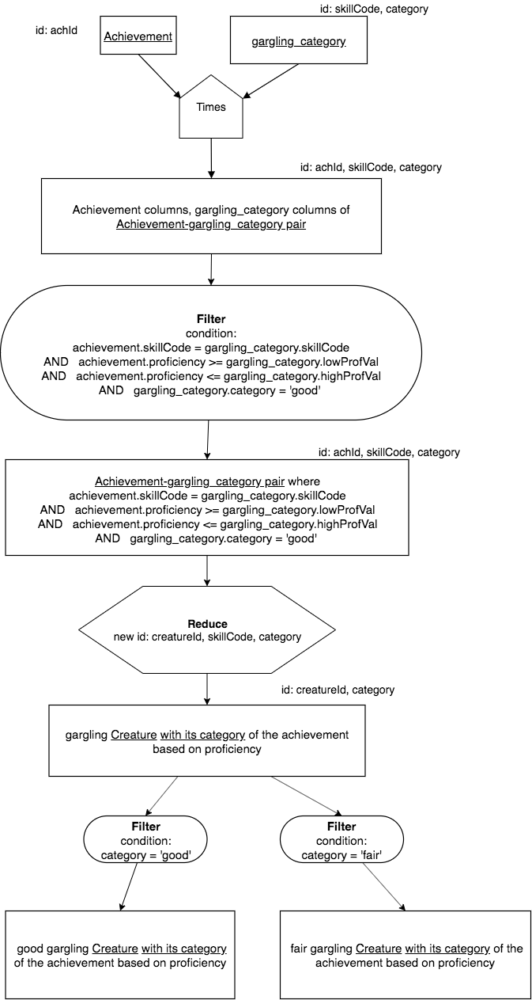

Category Relations
===================

In the chapter describing the Divide operator, we introduced the idea of creating a new relation, called the Pattern relation, that would assist us in performing a powerful analysis. In this chapter we will once again use this concept of creating new relations that can help us perform analyses. In this case, we are going to create relations that keep knowledge about the domain of the data in the database as new data of its own. This is a very powerful concept that you can use in many ways once you understand how it is done.

Making missing information new data
~~~~~~~~~~~~~~~~~~~~~~~~~~~~~~~~~~~~

In many cases with data in databases, we find ourselves wanting to ask queries like this:

    Find each creature who is a fair swimmer.

In this type of query, our client must explain to us just what constitutes poor in swimming. In addition, this query opens up many more very similar queries, asking about poor 2-man bobsledding, good swimming, fair swimming, good debating, excellent penalty kicking, etc. The general concept at work here is that a **range of values of proficiency** constitutes a category of performance.

What we will show is that we can create a new relation that will codify into data what is meant by poor swimming, fair swimming, good swimming, and other categories of the other skills in this database. Let's start by first examining the skill relation, which has some information in it about the range of values that proficiency can take on per skill. Noticing in this relation the maxProficiency and minProficiency data values:

.. csv-table:: **Skill**
   :file: ../creatureData/skill.csv
   :widths: 10, 30, 20, 20, 20
   :header-rows: 1

Given this information, and in consultation with a client, we might be able to decide that for the 'swim' skill, the various categories of swimming achievement might be something like this:

+-----------+----------------+-----------------------+-----------------------+
| SkillCode |  Category      | low proficiency value | high proficiency value|
+-----------+----------------+-----------------------+-----------------------+
|  E        | poor           | 0                     | 1                     |
+-----------+----------------+-----------------------+-----------------------+
|  E        | fair           | 2                     | 3                     |
+-----------+----------------+-----------------------+-----------------------+
|  E        | good           | 4                     | 5                     |
+-----------+----------------+-----------------------+-----------------------+

Because the full range of possible values of swim proficiency in the skill table is 0 to 5, we could develop the above categories, or levels of performance. This assumes that proficiency values are integers and can be interpreted as the following: if an achievement is performed at a proficiency equal to or greater than 0, and less than or equal to 1, the swim achievement is poor.

Different categories can be developed for each skill- we will see another example below.

We can take the above categories and **create a new table** containing this information as new data.

.. activecode:: swim_category
   :language: sql

   DROP TABLE IF EXISTS swim_category;

   CREATE TABLE swim_category (
   skillCode          VARCHAR(3)      NOT NUll,
   category           VARCHAR(20)     NOT NULL,
   lowProfVal         INTEGER         NOT NULL,
   highProfVal        INTEGER         NOT NULL
   );

   INSERT INTO swim_category VALUES ('E', 'poor', 0, 1);
   INSERT INTO swim_category VALUES ('E', 'fair', 2, 3);
   INSERT INTO swim_category VALUES ('E', 'good', 4, 5);

Once we have this new relation, now we can use Compare Join to match achievements of this particular skill and determine whether the proficiency falls into the range. In this query, we report all swim categories, but it turns out there is only one creature who has achieved swimming.

.. activecode:: swim_category_compare
   :language: sql
   :include: all_creature_create_category, swim_category

   SELECT distinct achievement.creatureId, swim_category.category
   FROM achievement, swim_category
   WHERE achievement.skillCode = swim_category.skillCode
   AND   achievement.proficiency >= swim_category.lowProfVal
   AND   achievement.proficiency <= swim_category.highProfVal
   ;

In this case, there was only one creature who swims, and the proficiency he happens to have achieved makes it fall into the poor category. A far more normal occurrence with large databases is that multiple creatures might fall into multiple categories. We can see a brief glimpse of this if we examine the gargling skill. Here is a very similar distribution of skill categories in another new table:

.. activecode:: gargling_category
  :language: sql
  :include: all_creature_create_category

  DROP TABLE IF EXISTS gargling_category;

  CREATE TABLE gargling_category (
  skillCode          VARCHAR(3)      NOT NUll,
  category           VARCHAR(20)     NOT NULL,
  lowProfVal         INTEGER         NOT NULL,
  highProfVal        INTEGER         NOT NULL
  );

  INSERT INTO gargling_category VALUES ('Z', 'poor', 0, 1);
  INSERT INTO gargling_category VALUES ('Z', 'fair', 2, 3);
  INSERT INTO gargling_category VALUES ('Z', 'good', 4, 5);

.. note:: It is important to see that these category tables are tables until we decide what columns might be sufficient to identify them. In this example and in most cases you might develop, the combination of skillCode and category serves to identify the gargling_category relation.

Now here is the Compare Join between achievement and this new gargling_category, along with a Reduce to two columns (which will identify the new result relation):

.. activecode:: gargling_category_compare
  :language: sql
  :include: all_creature_create_category, gargling_category

  SELECT distinct achievement.creatureId, gargling_category.category
  FROM achievement, gargling_category
  WHERE achievement.skillCode = gargling_category.skillCode
  AND   achievement.proficiency >= gargling_category.lowProfVal
  AND   achievement.proficiency <= gargling_category.highProfVal
  ;

What we have now is each gargling creature and the category their proficiency score falls into. Since creatures achieve the same skill more than once, it is likely helpful to add the date of the achievement along with its category, like this:

.. activecode:: gargling_category_compare_good_date
  :language: sql
  :include: all_creature_create_category, gargling_category

  SELECT distinct achievement.creatureId,
                  gargling_category.category, achievement.achDate
  FROM achievement, gargling_category
  WHERE achievement.skillCode = gargling_category.skillCode
  AND   achievement.proficiency >= gargling_category.lowProfVal
  AND   achievement.proficiency <= gargling_category.highProfVal
  ;

.. important:: The above query results in a relation where all three columns identify it. You might be tempted to think that we can simply carry the date as an additional column, but there actually are 2 good gargling achievements by the creature whose creatureId is 3 on exactly the same date in the underlying data. Below is a check of that. Thus we are reducing, making all three columns the identifier of the result relation.

Here is SQL for a **table** of the creatureId, skillCode, proficiency, and achDate of gargling achievements, so you can see the ones by creatureId 3.

.. activecode:: gargling_ach
  :language: sql
  :include: all_creature_create_category

  SELECT creatureId, skillCode, proficiency, achDate
  FROM   achievement
  WHERE  skillCode = 'Z';

We can go one step further with the category relation and ask specifically about the good gargling creatures.

.. activecode:: gargling_category_compare_good
  :language: sql
  :include: all_creature_create_category, gargling_category

  SELECT distinct achievement.creatureId,
                  gargling_category.category, achievement.achDate
  FROM achievement, gargling_category
  WHERE achievement.skillCode = gargling_category.skillCode
  AND   achievement.proficiency >= gargling_category.lowProfVal
  AND   achievement.proficiency <= gargling_category.highProfVal
  AND   gargling_category.category = 'good'
  ;

Notice how we can very easily change this to ask for the fair gargling creatures with their category and date achieved. Here is a precedence chart that shows how if we perform the last filter late, we can reuse the compare join to get either result.

|

|

Data Used for these examples
~~~~~~~~~~~~~~~~~~~~~~~~~~~~

The following code was used to create the data relations used as input relations for this example. It is slightly different than what has been used in the other examples in this book, in that there are two more gargling achievements by creature Neff #3 in order to illustrate the points made above. It is hidden, but you can show it if you want to.

.. activecode:: all_creature_create_category
   :language: sql
   :hidecode:

    -- ------------------   town -- -------------------------------

    DROP TABLE IF EXISTS town;

    CREATE TABLE town (
    townId          VARCHAR(3)      NOT NUll PRIMARY KEY,
    townName        VARCHAR(20),
    State           VARCHAR(20),
    Country         VARCHAR(20),
    townNickname    VARCHAR(80),
    townMotto       VARCHAR(80)
    );

    -- order matches table creation:
    -- id    name          state   country
    -- nickname   motto
    INSERT INTO town VALUES ('p', 'Philadelphia', 'PA', 'United States',
                             'Philly', 'Let brotherly love endure');
    INSERT INTO town VALUES ('a', 'Anoka', 'MN', 'United States',
                             'Halloween Capital of the world', NULL);
    INSERT INTO town VALUES ('be', 'Blue Earth', 'MN', 'United States',
                             'Beyond the Valley of the Jolly Green Giant',
                             'Earth so rich the city grows!');
    INSERT INTO town VALUES ('b', 'Bemidji', 'MN', 'United States',
                             'B-town', 'The first city on the Mississippi');
    INSERT INTO town VALUES ('d', 'Duluth', 'MN', 'United States',
                            'Zenith City', NULL);
    INSERT INTO town VALUES ('g', 'Greenville', 'MS', 'United States',
                             'The Heart & Soul of the Delta',
                             'The Best Food, Shopping, & Entertainment In The South');
    INSERT INTO town VALUES ('t', 'Tokyo', 'Kanto', 'Japan', NULL, NULL);
    INSERT INTO town VALUES ('as', 'Asgard', NULL, NULL,
                             'Home of Odin''s vault',
                             'Where magic and science are one in the same');
    INSERT INTO town VALUES ('mv', 'Metroville', NULL, NULL,
                            'Home of the Incredibles',
                            'Still Standing');
    INSERT INTO town VALUES ('le', 'London', 'England', 'United Kingdom',
                            'The Smoke',
                            'Domine dirige nos');
    INSERT INTO town VALUES ('sw', 'Seattle', 'Washington', 'United States',
                            'The Emerald City',
                            'The City of Goodwill');

    -- ------------------   creature -- -------------------------------
    DROP TABLE IF EXISTS creature;

    CREATE TABLE creature (
    creatureId          INTEGER      NOT NUll PRIMARY KEY,
    creatureName        VARCHAR(20),
    creatureType        VARCHAR(20),
    reside_townId VARCHAR(3) REFERENCES town(townId),     -- foreign key
    idol_creatureId     INTEGER,
    FOREIGN KEY(idol_creatureId) REFERENCES creature(creatureId)
    );

    INSERT INTO creature VALUES (1,'Bannon','person','p',10);
    INSERT INTO creature VALUES (2,'Myers','person','a',9);
    INSERT INTO creature VALUES (3,'Neff','person','be',NULL);
    INSERT INTO creature VALUES (4,'Neff','person','b',3);
    INSERT INTO creature VALUES (5,'Mieska','person','d', 10);
    INSERT INTO creature VALUES (6,'Carlis','person','p',9);
    INSERT INTO creature VALUES (7,'Kermit','frog','g',8);
    INSERT INTO creature VALUES (8,'Godzilla','monster','t',6);
    INSERT INTO creature VALUES (9,'Thor','superhero','as',NULL);
    INSERT INTO creature VALUES (10,'Elastigirl','superhero','mv',13);
    INSERT INTO creature VALUES (11,'David Beckham','person','le',9);
    INSERT INTO creature VALUES (12,'Harry Kane','person','le',11);
    INSERT INTO creature VALUES (13,'Megan Rapinoe','person','sw',10);

    -- ------------------   skill -- -------------------------------
    DROP TABLE IF EXISTS skill;

    CREATE TABLE skill (
    skillCode          VARCHAR(3)      NOT NUll PRIMARY KEY,
    skillDescription   VARCHAR(40),
    maxProficiency     INTEGER,     -- max score that can be achieved for this skill
    minProficiency     INTEGER,     -- min score that can be achieved for this skill
    origin_townId      VARCHAR(3)     REFERENCES town(townId)     -- foreign key
    );

    INSERT INTO skill VALUES ('A', 'float', 10, -1,'b');
    INSERT INTO skill VALUES ('E', 'swim', 5, 0,'b');
    INSERT INTO skill VALUES ('O', 'sink', 10, -1,'b');
    INSERT INTO skill VALUES ('U', 'walk on water', 5, 1,'d');
    INSERT INTO skill VALUES ('Z', 'gargle', 5, 1,'a');
    INSERT INTO skill VALUES ('B2', '2-crew bobsledding', 25, 0,'d');
    INSERT INTO skill VALUES ('TR4', '4x100 meter track relay', 100, 0,'be');
    INSERT INTO skill VALUES ('C2', '2-person canoeing', 12, 1,'t');
    INSERT INTO skill VALUES ('THR', 'three-legged race', 10, 0,'g');
    INSERT INTO skill VALUES ('D3', 'Australasia debating', 10, 1,NULL);
    INSERT INTO skill VALUES ('PK', 'soccer penalty kick', 10, 1, 'le');
    -- Note that no skill originates in Philly or Metroville or Asgaard

    -- ------------------  teamSkill  -- -------------------------------
    DROP TABLE IF EXISTS teamSkill;

    CREATE TABLE teamSkill (
    skillCode      VARCHAR(3)  NOT NUll PRIMARY KEY references skill (skillCode),
    teamSize       INTEGER
    );

    INSERT INTO teamSkill VALUES ('B2', 2);
    INSERT INTO teamSkill VALUES ('TR4', 4);
    INSERT INTO teamSkill VALUES ('C2', 2);
    INSERT INTO teamSkill VALUES ('THR', 2);
    INSERT INTO teamSkill VALUES ('D3', 3);

    -- ------------------  achievement  -- -------------------------------
    DROP TABLE IF EXISTS achievement;

    CREATE TABLE achievement (
    achId              INTEGER NOT NUll PRIMARY KEY AUTOINCREMENT,
    creatureId         INTEGER,
    skillCode          VARCHAR(3),
    proficiency        INTEGER,
    achDate            TEXT,
    test_townId VARCHAR(3) REFERENCES town(townId),     -- foreign key
    FOREIGN KEY (creatureId) REFERENCES creature (creatureId),
    FOREIGN KEY (skillCode) REFERENCES skill (skillCode)
    );

    -- Bannon floats in Anoka (where he aspired)
    INSERT INTO achievement (creatureId, skillCode, proficiency,
                             achDate, test_townId)
                    VALUES (1, 'A', 3, datetime('now'), 'a');

    -- Bannon swims in Duluth (he aspired in Bemidji)
    INSERT INTO achievement (creatureId, skillCode, proficiency,
                             achDate, test_townId)
                    VALUES (1, 'E', 3, datetime('2017-09-15 15:35'), 'd');
    -- Bannon floats in Anoka (where he aspired)
    INSERT INTO achievement (creatureId, skillCode, proficiency,
                             achDate, test_townId)
                    VALUES (1, 'A', 3, datetime('2018-07-14 14:00'), 'a');

    -- Bannon swims in Duluth (he aspired in Bemidji)
    INSERT INTO achievement (creatureId, skillCode, proficiency,
                             achDate, test_townId)
                    VALUES (1, 'E', 3, datetime('now'), 'd');
    -- Bannon doesn't gargle
    -- Mieska gargles in Tokyo (had no aspiration to)
    INSERT INTO achievement (creatureId, skillCode, proficiency,
                             achDate, test_townId)
                    VALUES (5, 'Z', 5, datetime('2016-04-12 15:42:30'), 't');

    -- Neff #3 gargles in Blue Earth (but not to his aspired proficiency)
    INSERT INTO achievement (creatureId, skillCode, proficiency,
                             achDate, test_townId)
                    VALUES (3, 'Z', 4, datetime('2018-07-15'), 'be');
    -- Neff #3 gargles in Blue Earth (but not to his aspired proficiency)
    -- on same day at same proficiency, signifying need for arbitrary id
    INSERT INTO achievement (creatureId, skillCode, proficiency,
                             achDate, test_townId)
                    VALUES (3, 'Z', 3, datetime('2018-07-15'), 'be');
    -- Neff #3 keeps trying to gargle on the same day, with varying results
    INSERT INTO achievement (creatureId, skillCode, proficiency,
                             achDate, test_townId)
                    VALUES (3, 'Z', 4, datetime('2018-07-15'), 'be');

    -- Neff #4 gargles in Anoka
    INSERT INTO achievement (creatureId, skillCode, proficiency,
                             achDate, test_townId)
                    VALUES (4, 'Z', 3, datetime('2018-06-10'), 'a');

    -- Beckham achieves PK in London
    INSERT INTO achievement (creatureId, skillCode, proficiency,
                             achDate, test_townId)
                    VALUES (11, 'PK', 10, datetime('1998-08-15'), 'le');
    -- Kane achieves PK in London
    INSERT INTO achievement (creatureId, skillCode, proficiency,
                             achDate, test_townId)
                    VALUES (12, 'PK', 10, datetime('2016-05-24'), 'le');
    -- Rapinoe achieves PK in London
    INSERT INTO achievement (creatureId, skillCode, proficiency,
                             achDate, test_townId)
                    VALUES (13, 'PK', 10, datetime('2012-08-06'), 'le');
    -- Godizilla achieves PK in Tokyo poorly with no date
    -- had not aspiration to do so- did it on a dare ;)
    INSERT INTO achievement (creatureId, skillCode, proficiency,
                             achDate, test_townId)
                    VALUES (8, 'PK', 1, NULL, 't');

    -- -------------------- -------------------- -------------------
    -- Thor achieves three-legged race in Metroville (with Elastigirl)
    INSERT INTO achievement (creatureId, skillCode, proficiency,
                             achDate, test_townId)
                    VALUES (9, 'THR', 10, datetime('2018-08-12 14:30'), 'mv');
    -- Elastigirl achieves three-legged race in Metroville (with Thor)
    INSERT INTO achievement (creatureId, skillCode, proficiency,
                             achDate, test_townId)
                    VALUES (10, 'THR', 10, datetime('2018-08-12 14:30'), 'mv');

    -- Kermit 'pilots' 2-person bobsledding  (pilot goes into contribution)
    --       with Thor as brakeman (brakeman goes into contribution) in Duluth,
    --    achieve at 76% of maxProficiency
    INSERT INTO achievement (creatureId, skillCode, proficiency,
                             achDate, test_townId)
                    VALUES (7, 'B2', 19, datetime('2017-01-10 16:30'), 'd');
    INSERT INTO achievement (creatureId, skillCode, proficiency,
                             achDate, test_townId)
                    VALUES (9, 'B2', 19, datetime('2017-01-10 16:30'), 'd');

    -- 4 people form track realy team in London:
    --   Neff #4, Mieska, Myers, Bannon
    --    achieve at 85% of maxProficiency
    INSERT INTO achievement (creatureId, skillCode, proficiency,
                             achDate, test_townId)
                    VALUES (4, 'TR4', 85, datetime('2012-07-30'), 'le');
    INSERT INTO achievement (creatureId, skillCode, proficiency,
                             achDate, test_townId)
                    VALUES (5, 'TR4', 85, datetime('2012-07-30'), 'le');
    INSERT INTO achievement (creatureId, skillCode, proficiency,
                             achDate, test_townId)
                    VALUES (2, 'TR4', 85, datetime('2012-07-30'), 'le');
    INSERT INTO achievement (creatureId, skillCode, proficiency,
                             achDate, test_townId)
                    VALUES (1, 'TR4', 85, datetime('2012-07-30'), 'le');

    -- Thor, Rapinoe, and Kermit form debate team in Seattle, WA and
    -- achieve at 80% of maxProficiency
    INSERT INTO achievement (creatureId, skillCode, proficiency,
                             achDate, test_townId)
                    VALUES (9, 'D3', 8, datetime('now', 'localtime'), 'sw');
    INSERT INTO achievement (creatureId, skillCode, proficiency,
                             achDate, test_townId)
                    VALUES (13, 'D3', 8, datetime('now', 'localtime'), 'sw');
    INSERT INTO achievement (creatureId, skillCode, proficiency,
                             achDate, test_townId)
                    VALUES (7, 'D3', 8, datetime('now', 'localtime'), 'sw');

    -- no 2-person canoeing achievements, but some have aspirations

Other Queries to try:
~~~~~~~~~~~~~~~~~~~~~~

    Find each good swimmer (A proficiency achieved of >= 0 or <= 1 is a poor swim proficiency)

    Find each {good, fair, poor} gargling creature (A proficiency achieved of >= 0 or <= 1 is a poor gargle proficiency)
